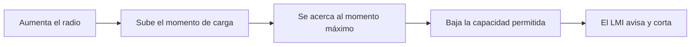

<!-- clase-meta
tipo_documento: clase
clase: 10
codigo: GRUAS-10
curso: gruas
titulo: "Recursos de la grúa"
modalidad: "taller documental"
duracion_minutos: 45
nivel: introductorio
prerrequisito: GRUAS-09
competencia: "alfabetizacion_tecnica"
resultados_aprendizaje:
  - "Explicar glosario, esquemas y trazabilidad de fuentes con vocabulario propio de Grúas."
  - "Aplicar esos conceptos a una decisión segura o a un escenario de simulación de Grúas."
evidencia: "Glosario aplicado y ficha breve de trazabilidad."
criterio_aprobacion: "Los términos permiten interpretar el curso y las fuentes se distinguen por autoridad, alcance y vigencia."
fuentes: manuales/fuentes.md
ultima_revision: 2026-09-10
-->

# 🧰 Recursos de la grúa

[🏠 Inicio](../../../README.md) · [🏗️ Curso: Grúas](../README.md) · 🧰 Recursos

Glosario específico, enlaces y diagramas de apoyo del curso de grúas. Amplia el
[glosario general](../../../docs/05-glosario-general.md).

---

## 📖 Glosario específico

| Término | Definición |
| --- | --- |
| Momento de carga | Producto del peso por el radio; mide el efecto de vuelco. |
| Radio de trabajo | Distancia horizontal del eje de giro al gancho. |
| LMI | Indicador de momento de carga; vigila el límite y corta movimientos. |
| Tabla de carga | Documento que define la capacidad según radio, ángulo y longitud. |
| Reeving | Enhebrado del cable por las poleas; sus partes de línea reparten la carga. |
| Outrigger | Estabilizador extensible que amplia la base de apoyo. |
| Contrapeso | Masa trasera que equilibra el momento de la carga. |
| Cuadrante de trabajo | Sector de giro donde la capacidad puede variar. |
| Pluma telescópica | Pluma de secciones que se extienden por cilindros hidráulicos. |
| Swing | Giro de la superestructura sobre el eje de la grúa. |
| Momento resistente | Momento que se opone al vuelco, dado por peso y contrapeso. |
| Factor de seguridad | Margen entre la carga de rotura del cable y la de trabajo. |

---

## 🗺️ Diagrama de la relación radio-capacidad

```mermaid
flowchart LR
    Radio[Aumenta el radio] --> Momento[Sube el momento de carga]
    Momento --> Limite[Se acerca al momento máximo]
    Limite --> Capacidad[Baja la capacidad permitida]
    Capacidad --> LMI[El LMI avisa y corta]
```

---

## 🔗 Enlaces y fuentes

- Marco legal: [⚖️ docs/07-marco-legal-chile.md](../../../docs/07-marco-legal-chile.md)
- Registro de fuentes: [📚 manuales/fuentes.md](../../../manuales/fuentes.md)
- Manuales del fabricante y tablas de carga oficiales: ver el registro de fuentes.

Registrar cada recurso nuevo con su origen y licencia, siguiendo
[`recursos/README.md`](../../../recursos/README.md).

## 🧭 Guía de estudio aplicada

### Pregunta guía

¿Cómo ayuda **Glosario específico, Diagrama de la relación radio-capacidad, Enlaces y fuentes y Guía de estudio aplicada** a **explicar con fuentes los términos motor, bombas hidráulicas, cabrestante y pluma y gancho y carga**?

### Explicación razonada

El vocabulario técnico organiza relaciones: motor, bombas hidráulicas, cabrestante y pluma y gancho y carga nombran partes distintas de una misma cadena funcional. Una fuente se usa para sostener una afirmación concreta —principio, límite, procedimiento o contexto— y debe distinguirse del manual particular de un fabricante o de una regla narrativa.

Esta clase se conecta con el resto del curso mediante **momento de vuelco igual a carga por radio, condicionado por apoyos y configuración**. El hilo de
seguridad consiste en reconocer a tiempo **exceder la tabla de carga o perder estabilidad del apoyo** y poder justificar la decisión
**confirmar peso, radio, configuración y suelo antes de levantar**; en clases posteriores cambiará el ángulo de análisis, no esa relación causal.
La lectura funcional común sigue **motor → bombas hidráulicas → cabrestante y pluma → gancho y carga**, de modo que cada concepto pueda
ubicarse dentro del funcionamiento completo y no quede como un dato aislado.

**Apoyo documental:** [Crane, Derrick and Hoist Safety](https://www.osha.gov/cranes-derricks) aporta izaje, riesgos y controles;
[Ley de Tránsito 18.290](https://www.bcn.cl/leychile/navegar?idNorma=29708) se usa para marco legal chileno. Estas fuentes
se contrastan con el alcance de la clase y no sustituyen un manual de equipo concreto.

### Caso resuelto: de la observación a la decisión

1. **Definir en contexto:** explica **motor**, **bombas hidráulicas**, **cabrestante y pluma** y **gancho y carga** por su función y relación.
2. **Respaldar:** enlaza cada afirmación importante con una fuente identificable y declara su alcance.
3. **Contrastar:** separa principios generales, requisitos locales, manual de fabricante y —si aplica— canon ficticio.
4. **Reformular:** convierte una definición copiada en una explicación propia con un ejemplo de **Grúas**.

### Comprueba tu comprensión

1. Explica la diferencia funcional entre **bombas hidráulicas** y **cabrestante y pluma** sin copiar una definición.
2. ¿Qué fuente respalda el principio «momento de vuelco igual a carga por radio, condicionado por apoyos y configuración» y cuál es su alcance?
3. ¿Qué dato exigiría un manual de fabricante en vez de una fuente general?

Orientación para revisar tus respuestas

- La primera respuesta debe relacionar el eslabón elegido con un efecto posterior, no solo nombrarlo.
- La segunda debe proponer una señal medible u observable y explicar qué tendencia sería preocupante.
- La tercera debe cambiar al menos una variable de capacidad, mando, entorno o margen de seguridad.

## 🎓 Cierre de clase

- **Actividad:** Selecciona términos de glosario, esquemas y trazabilidad de fuentes, explícalos en contexto de Grúas y verifica la procedencia de las fuentes utilizadas.
- **Evidencia:** Glosario aplicado y ficha breve de trazabilidad.
- **Criterio de aprobación:** Los términos permiten interpretar el curso y las fuentes se distinguen por autoridad, alcance y vigencia.
- **Transferencia:** explica qué cambiaría al pasar a otra variante de esta máquina.

### Fuentes de esta clase

- [OSHA-CRANES](https://www.osha.gov/cranes-derricks): Crane, Derrick and Hoist Safety, OSHA. Uso: izaje, riesgos y controles.
- [CL-LEY-18290](https://www.bcn.cl/leychile/navegar?idNorma=29708): Ley de Tránsito 18.290, BCN Chile. Uso: marco legal chileno.

> Las fuentes sostienen el marco conceptual y normativo; esta clase no reemplaza el manual
> del fabricante, la formación certificada ni la habilitación exigida para operar equipos reales.

---

[🎓 Portada del curso](../README.md) · [⬅️ Anterior: Diseño de simulación](../simulacion/diseno-simulador-grua.md) · [➡️ Siguiente: Ejercicios](../ejercicios/ejercicios-grua.md)
