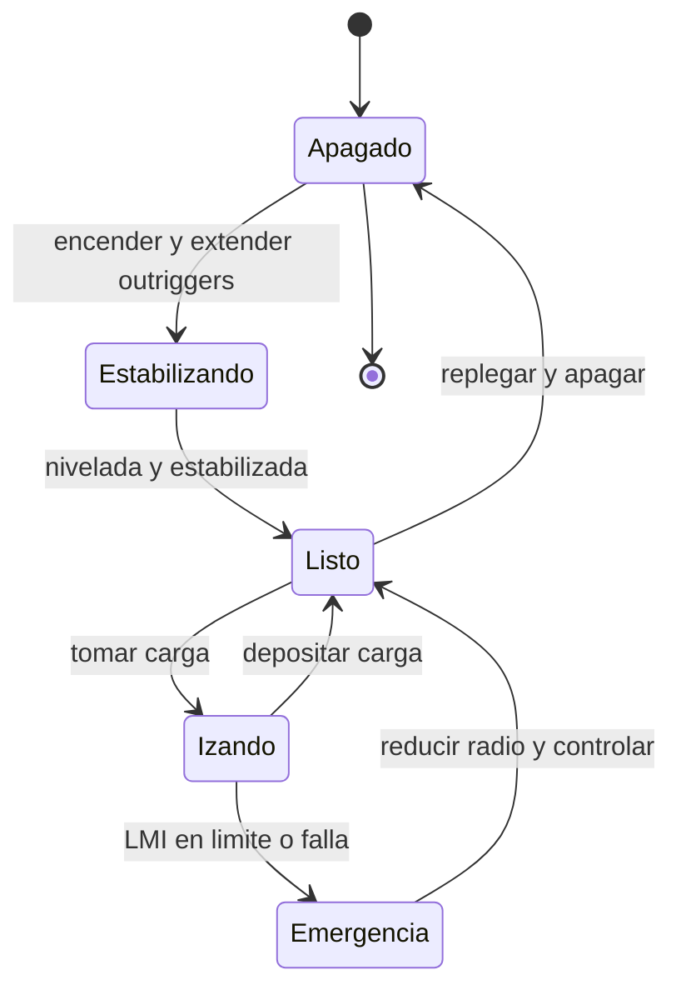

# 🎮 Diseño de simulación de la grúa

[🏠 Inicio](../../../README.md) · [🏗️ Curso: Grúas](../README.md) · 🎮 Simulación

## Objetivo de la simulación

Que el usuario aprenda a planificar y ejecutar un izaje seguro: estabilizar la
grúa, leer la tabla de carga, respetar el LMI, controlar el radio y trasladar la
carga sin volcar ni balancearla, de forma progresiva.

## Nivel de realismo

- Nivel elegido: se ofrece del 1 al 3 (ver `docs/03-niveles-de-realismo.md`).
- Justificación: la grúa es un vehículo avanzado cuyo núcleo educativo es la
  **estabilidad**. La dificultad no está en desplazarse, sino en manejar el
  momento de carga, por lo que el modelo se centra en radio, peso y capacidad.

## Variables principales

| Variable | Tipo | Rango | Afecta a | Comentarios |
| --- | --- | --- | --- | --- |
| Radio | numérica | 3-24 m | Momento y capacidad | Distancia del eje al gancho. |
| Ángulo de pluma | numérica | 0-82 grados | Radio y altura | Subir el ángulo reduce el radio. |
| Longitud de pluma | numérica | 10-40 m | Alcance y tabla | Define la tabla de carga aplicable. |
| Peso de carga | numérica | 0-50 t | Momento de carga | Debe caber en la tabla. |
| Momento | numérica | 0-max t·m | Estabilidad | Peso por radio. |
| Capacidad / LMI | numérica | 0-100% | Alarma y corte | Momento actual vs máximo. |
| Viento | numérica | 0-60 km/h | Balanceo y límite | Sobre umbral, suspende izaje. |
| Estabilizadores | discreta | nulo/medio/completo | Base y tabla | Cambian el límite de capacidad. |

## Ciclo básico

1. Leer entrada del usuario (pluma, giro, telescópico, cabrestante, estabilizadores).
2. Actualizar la geometría de la grúa (radio, ángulo, longitud, altura de gancho).
3. Calcular el momento de carga (peso por radio) y el porcentaje de capacidad.
4. Aplicar restricciones del entorno (viento, capacidad del terreno, obstáculos).
5. Actualizar la posición de la carga y el estado de estabilidad.
6. Refrescar instrumentos y retroalimentación (LMI, alarmas, balanceo).

## Modos de juego futuros

- Tutorial guiado de estabilización y mandos.
- Práctica libre de izaje en obra cerrada.
- Misiones de montaje con radios y pesos definidos.
- Desafíos de lectura de tabla de carga.
- Situaciones de riesgo controladas (viento, suelo blando) sin contenido sensible.

## Elementos fuera de alcance

- Maniobras de izaje inseguras presentadas como recomendables.
- Reproducción de operación temeraria como objetivo del juego.
- Datos técnicos que permitan alterar sistemas de seguridad reales de una grúa.

## Pendientes

- [ ] Definir tablas de carga por defecto para cada tipo de grúa.
- [ ] Prototipar el cálculo de momento y el LMI en un motor simple.
- [ ] Ajustar el modelo de viento y balanceo de la carga.
- [ ] Agregar fuentes técnicas públicas a [`manuales/fuentes.md`](../../../manuales/fuentes.md).

---

[⬅️ Anterior: Reglamentos](../reglamentos/reglamentos-grua.md) · [➡️ Siguiente: Recursos](../recursos/recursos-grua.md)
