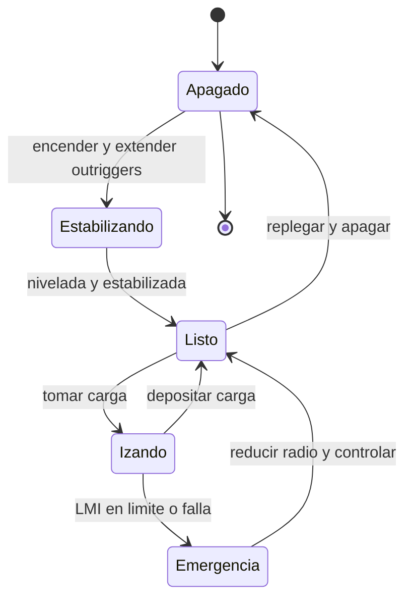

# 🎮 Diseno de simulacion de la grua

[🏠 Inicio](../../../README.md) · [🏗️ Curso: Gruas](../README.md) · 🎮 Simulacion

## Objetivo de la simulacion

Que el usuario aprenda a planificar y ejecutar un izaje seguro: estabilizar la
grua, leer la tabla de carga, respetar el LMI, controlar el radio y trasladar la
carga sin volcar ni balancearla, de forma progresiva.

## Nivel de realismo

- Nivel elegido: se ofrece del 1 al 3 (ver `docs/03-niveles-de-realismo.md`).
- Justificacion: la grua es un vehiculo avanzado cuyo nucleo educativo es la
  **estabilidad**. La dificultad no esta en desplazarse, sino en manejar el
  momento de carga, por lo que el modelo se centra en radio, peso y capacidad.

## Variables principales

| Variable | Tipo | Rango | Afecta a | Comentarios |
| --- | --- | --- | --- | --- |
| Radio | numerica | 3-24 m | Momento y capacidad | Distancia del eje al gancho. |
| Angulo de pluma | numerica | 0-82 grados | Radio y altura | Subir el angulo reduce el radio. |
| Longitud de pluma | numerica | 10-40 m | Alcance y tabla | Define la tabla de carga aplicable. |
| Peso de carga | numerica | 0-50 t | Momento de carga | Debe caber en la tabla. |
| Momento | numerica | 0-max t·m | Estabilidad | Peso por radio. |
| Capacidad / LMI | numerica | 0-100% | Alarma y corte | Momento actual vs maximo. |
| Viento | numerica | 0-60 km/h | Balanceo y limite | Sobre umbral, suspende izaje. |
| Estabilizadores | discreta | nulo/medio/completo | Base y tabla | Cambian el limite de capacidad. |

## Ciclo basico

1. Leer entrada del usuario (pluma, giro, telescopico, cabrestante, estabilizadores).
2. Actualizar la geometria de la grua (radio, angulo, longitud, altura de gancho).
3. Calcular el momento de carga (peso por radio) y el porcentaje de capacidad.
4. Aplicar restricciones del entorno (viento, capacidad del terreno, obstaculos).
5. Actualizar la posicion de la carga y el estado de estabilidad.
6. Refrescar instrumentos y retroalimentacion (LMI, alarmas, balanceo).

## Modos de juego futuros

- Tutorial guiado de estabilizacion y mandos.
- Practica libre de izaje en obra cerrada.
- Misiones de montaje con radios y pesos definidos.
- Desafios de lectura de tabla de carga.
- Situaciones de riesgo controladas (viento, suelo blando) sin contenido sensible.

## Elementos fuera de alcance

- Maniobras de izaje inseguras presentadas como recomendables.
- Reproduccion de operacion temeraria como objetivo del juego.
- Datos tecnicos que permitan alterar sistemas de seguridad reales de una grua.

## Pendientes

- [ ] Definir tablas de carga por defecto para cada tipo de grua.
- [ ] Prototipar el calculo de momento y el LMI en un motor simple.
- [ ] Ajustar el modelo de viento y balanceo de la carga.
- [ ] Agregar fuentes tecnicas publicas a [`manuales/fuentes.md`](../../../manuales/fuentes.md).

---

[⬅️ Anterior: Reglamentos](../reglamentos/reglamentos-grua.md) · [➡️ Siguiente: Recursos](../recursos/recursos-grua.md)
