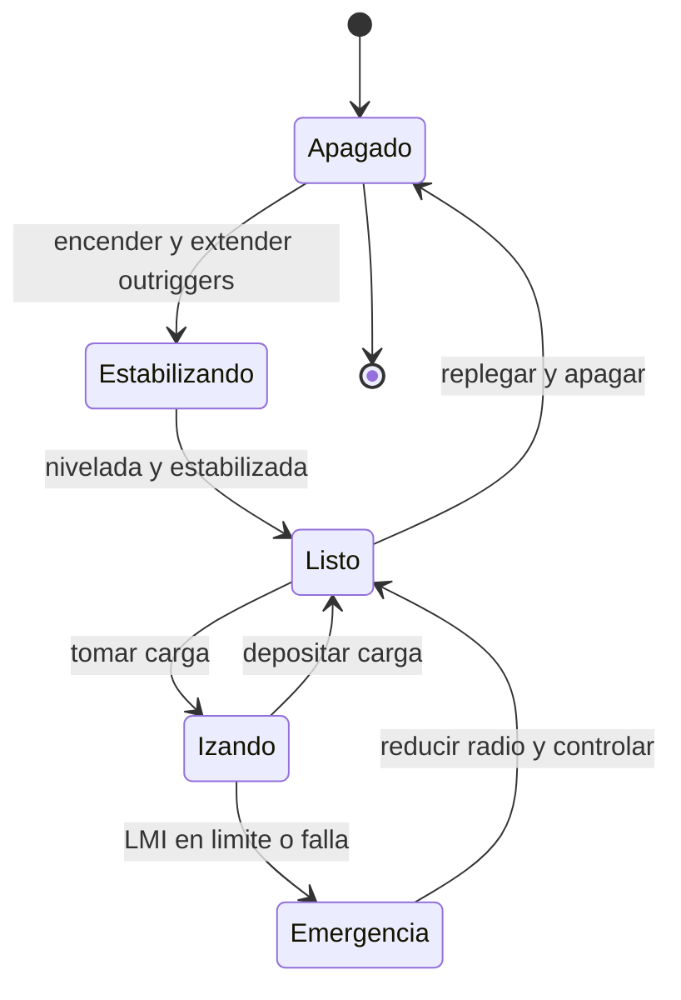
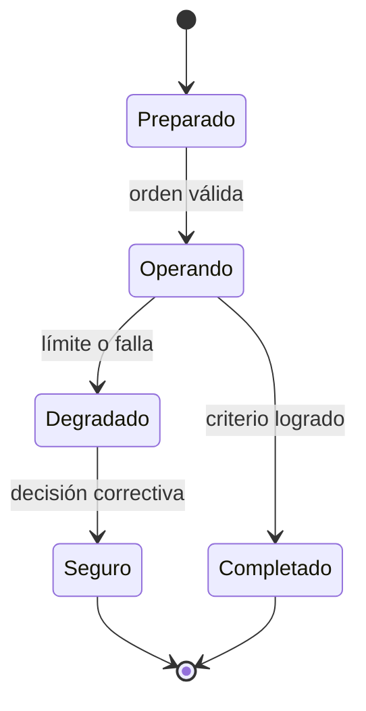

<!-- clase-meta
tipo_documento: clase
clase: 9
codigo: GRUAS-09
curso: gruas
titulo: "Diseño de simulación de la grúa"
modalidad: "laboratorio de diseño"
duracion_minutos: 90
nivel: introductorio
prerrequisito: GRUAS-08
competencia: "modelado_de_simulacion"
resultados_aprendizaje:
  - "Explicar objetivo, variables, estados, ciclo y escenarios de simulación con vocabulario propio de Grúas."
  - "Aplicar esos conceptos a una decisión segura o a un escenario de simulación de Grúas."
evidencia: "Ficha de escenario y diagrama de estados."
criterio_aprobacion: "El modelo es específico de la máquina, medible, seguro y trazable a clases anteriores."
fuentes: manuales/fuentes.md
ultima_revision: 2026-09-10
-->

# 🎮 Diseño de simulación de la grúa

[🏠 Inicio](../../../README.md) · [🏗️ Curso: Grúas](../README.md) · 🎮 Simulación

```mermaid
stateDiagram-v2
    [*] --> Apagado
    Apagado --> Estabilizando: encender y extender outriggers
    Estabilizando --> Listo: nivelada y estabilizada
    Listo --> Izando: tomar carga
    Izando --> Listo: depositar carga
    Izando --> Emergencia: LMI en limite o falla
    Emergencia --> Listo: reducir radio y controlar
    Listo --> Apagado: replegar y apagar
    Apagado --> [*]
```

## Objetivo de la simulación

Que el usuario aprenda a planificar y ejecutar un izaje seguro: estabilizar la
grúa, leer la tabla de carga, respetar el LMI, controlar el radio y trasladar la
carga sin volcar ni balancearla, de forma progresiva.

## Nivel de realismo

- Nivel elegido: se ofrece del 1 al 3 (ver `docs/03-niveles-de-realismo.md`).
- Justificación: la grúa es un vehículo avanzado cuyo núcleo educativo es la
  **estabilidad**. La dificultad no está en desplazarse, sino en manejar el
  momento de carga, por lo que el modelo se centra en radio, peso y capacidad.

## Variables principales

| Variable | Tipo | Rango | Afecta a | Comentarios |
| --- | --- | --- | --- | --- |
| Radio | numérica | 3-24 m | Momento y capacidad | Distancia del eje al gancho. |
| Ángulo de pluma | numérica | 0-82 grados | Radio y altura | Subir el ángulo reduce el radio. |
| Longitud de pluma | numérica | 10-40 m | Alcance y tabla | Define la tabla de carga aplicable. |
| Peso de carga | numérica | 0-50 t | Momento de carga | Debe caber en la tabla. |
| Momento | numérica | 0-max t·m | Estabilidad | Peso por radio. |
| Capacidad / LMI | numérica | 0-100% | Alarma y corte | Momento actual vs máximo. |
| Viento | numérica | 0-60 km/h | Balanceo y límite | Sobre umbral, suspende izaje. |
| Estabilizadores | discreta | nulo/medio/completo | Base y tabla | Cambian el límite de capacidad. |

## Ciclo básico

1. Leer entrada del usuario (pluma, giro, telescópico, cabrestante, estabilizadores).
2. Actualizar la geometría de la grúa (radio, ángulo, longitud, altura de gancho).
3. Calcular el momento de carga (peso por radio) y el porcentaje de capacidad.
4. Aplicar restricciones del entorno (viento, capacidad del terreno, obstáculos).
5. Actualizar la posición de la carga y el estado de estabilidad.
6. Refrescar instrumentos y retroalimentación (LMI, alarmas, balanceo).

## Modos de juego futuros

- Tutorial guiado de estabilización y mandos.
- Práctica libre de izaje en obra cerrada.
- Misiones de montaje con radios y pesos definidos.
- Desafíos de lectura de tabla de carga.
- Situaciones de riesgo controladas (viento, suelo blando) sin contenido sensible.

## Elementos fuera de alcance

- Maniobras de izaje inseguras presentadas como recomendables.
- Reproducción de operación temeraria como objetivo del juego.
- Datos técnicos que permitan alterar sistemas de seguridad reales de una grúa.

## Pendientes

- [ ] Definir tablas de carga por defecto para cada tipo de grúa.
- [ ] Prototipar el cálculo de momento y el LMI en un motor simple.
- [ ] Ajustar el modelo de viento y balanceo de la carga.
- [ ] Agregar fuentes técnicas públicas a [`manuales/fuentes.md`](../../../manuales/fuentes.md).

## 🧭 Guía de estudio aplicada

### Pregunta guía

¿Cómo ayuda **Objetivo de la simulación, Nivel de realismo, Variables principales y Ciclo básico** a **modelar izaje de una carga conocida cuyo destino exige aumentar el radio como estados, variables y decisiones observables**?

### Explicación razonada

Una simulación de Grúas es educativa si representa decisiones y consecuencias. Como mínimo debe modelar el estado de motor, la respuesta de bombas hidráulicas, la transición en cabrestante y pluma y el resultado en gancho y carga. El escenario «izaje de una carga conocida cuyo destino exige aumentar el radio» es valioso porque obliga a observar, formular una hipótesis, actuar y comprobar.

```mermaid
stateDiagram-v2
    [*] --> Preparado
    Preparado --> Operando: orden válida
    Operando --> Degradado: límite o falla
    Degradado --> Seguro: decisión correctiva
    Operando --> Completado: criterio logrado
    Seguro --> [*]
    Completado --> [*]
```

Esta clase se conecta con el resto del curso mediante **momento de vuelco igual a carga por radio, condicionado por apoyos y configuración**. El hilo de
seguridad consiste en reconocer a tiempo **exceder la tabla de carga o perder estabilidad del apoyo** y poder justificar la decisión
**confirmar peso, radio, configuración y suelo antes de levantar**; en clases posteriores cambiará el ángulo de análisis, no esa relación causal.
La lectura funcional común sigue **motor → bombas hidráulicas → cabrestante y pluma → gancho y carga**, de modo que cada concepto pueda
ubicarse dentro del funcionamiento completo y no quede como un dato aislado.

**Apoyo documental:** [Crane, Derrick and Hoist Safety](https://www.osha.gov/cranes-derricks) aporta izaje, riesgos y controles;
[Ley de Tránsito 18.290](https://www.bcn.cl/leychile/navegar?idNorma=29708) se usa para marco legal chileno. Estas fuentes
se contrastan con el alcance de la clase y no sustituyen un manual de equipo concreto.

### Caso resuelto: de la observación a la decisión

1. **Estado inicial:** representa izaje de una carga conocida cuyo destino exige aumentar el radio con valores observables para **motor**, **bombas hidráulicas**, **cabrestante y pluma** y **gancho y carga**.
2. **Decisión del estudiante:** ofrece una elección que cambie el estado, no una animación automática.
3. **Consecuencia:** modela la tendencia hacia **exceder la tabla de carga o perder estabilidad del apoyo** y una señal previa que permita corregir.
4. **Cierre:** evalúa la explicación de la decisión, además de si el estudiante “ganó” el escenario.

### Comprueba tu comprensión

1. ¿Qué cuatro estados mínimos necesita el escenario «izaje de una carga conocida cuyo destino exige aumentar el radio»?
2. ¿Qué variable anticipa **exceder la tabla de carga o perder estabilidad del apoyo** antes de llegar al estado de falla?
3. ¿Cómo evaluarías la explicación del estudiante y no solo el resultado final?

Orientación para revisar tus respuestas

- La primera respuesta debe relacionar el eslabón elegido con un efecto posterior, no solo nombrarlo.
- La segunda debe proponer una señal medible u observable y explicar qué tendencia sería preocupante.
- La tercera debe cambiar al menos una variable de capacidad, mando, entorno o margen de seguridad.

## 🎓 Cierre de clase

- **Actividad:** Diseña un escenario educativo de Grúas basado en objetivo, variables, estados, ciclo y escenarios de simulación, con entradas, estados, variables y criterio de cierre.
- **Evidencia:** Ficha de escenario y diagrama de estados.
- **Criterio de aprobación:** El modelo es específico de la máquina, medible, seguro y trazable a clases anteriores.
- **Transferencia:** explica qué cambiaría al pasar a otra variante de esta máquina.

### Fuentes de esta clase

- [OSHA-CRANES](https://www.osha.gov/cranes-derricks): Crane, Derrick and Hoist Safety, OSHA. Uso: izaje, riesgos y controles.
- [CL-LEY-18290](https://www.bcn.cl/leychile/navegar?idNorma=29708): Ley de Tránsito 18.290, BCN Chile. Uso: marco legal chileno.

> Las fuentes sostienen el marco conceptual y normativo; esta clase no reemplaza el manual
> del fabricante, la formación certificada ni la habilitación exigida para operar equipos reales.

---

[⬅️ Anterior: Reglamentos](../reglamentos/reglamentos-grua.md) · [➡️ Siguiente: Recursos](../recursos/recursos-grua.md)
