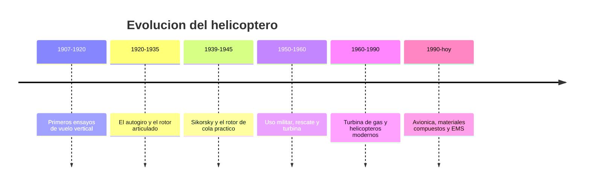

# 📜 Historia del helicoptero

[🏠 Inicio](../../../README.md) · [🚁 Curso: Helicopteros](../README.md) · 📜 Historia

## Origen

El sueno del vuelo vertical es muy antiguo, pero recien a inicios del siglo XX
aparecen ensayos serios. El gran obstaculo era controlar el par que genera un
rotor motorizado: al girar las palas, el fuselaje tiende a girar en sentido
contrario. Resolver esa compensacion fue la clave que abrio el vuelo practico.

## Linea de tiempo

| Periodo | Hito | Importancia |
| --- | --- | --- |
| 1907-1920 | Primeros ensayos de vuelo vertical | Prueba del concepto de ala rotatoria. |
| 1920-1935 | Autogiro de Juan de la Cierva | Rotor libre articulado que inspira soluciones de control. |
| 1939-1945 | Sikorsky VS-300 y rotor de cola | Configuracion practica que domina hasta hoy. |
| 1950-1960 | Rescate militar y primeras turbinas | El helicoptero se vuelve herramienta de trabajo. |
| 1960-1990 | Turbina de gas generalizada | Mas potencia, menos peso y mas fiabilidad. |
| 1990-presente | Avionica, compuestos y EMS | Mas seguridad, rescate y servicios medicos. |

## Evolucion tecnologica

- **Compensacion del par**: del problema sin resolver al rotor de cola y a los
  rotores en tandem.
- **Propulsion**: del motor a piston pesado a la turbina de gas ligera y potente.
- **Materiales**: del metal a las palas de material compuesto mas resistentes.
- **Control**: del plato ciclico mecanico a los mandos asistidos y estabilizados.
- **Instrumentos**: de relojes analogicos a pantallas de vuelo integradas.
- **Usos**: de la demostracion a rescate, trabajo aereo y servicios medicos.

## Tipos representativos

| Tipo | Uso tipico | Caracteristica destacada |
| --- | --- | --- |
| Ligero monoturbina | Instruccion y trabajo aereo | Sencillo, economico de operar. |
| Biturbina medio | Transporte y EMS | Mayor seguridad por dos motores. |
| Rotores en tandem | Carga pesada | Dos rotores principales, sin rotor de cola. |
| De rescate | Montana y mar | Grua de rescate y gran autonomia. |
| De extincion | Incendios forestales | Carga externa de agua bajo el fuselaje. |

## Impacto social y economico

El helicoptero hizo posible llegar donde no hay pista: montanas, mar, azoteas de
hospitales y zonas aisladas. Es clave en rescate, evacuacion medica, extincion de
incendios y trabajo aereo. Su costo de operacion es alto, por lo que se reserva
para tareas donde el vuelo vertical y estacionario es insustituible.

## Fuentes

- Registrar aqui las fuentes publicas consultadas.
- Enlazar cada fuente tambien en [`manuales/fuentes.md`](../../../manuales/fuentes.md).

---

[🎓 Portada del curso](../README.md) · [➡️ Siguiente: Caracteristicas](../operacion/caracteristicas-helicoptero.md)
