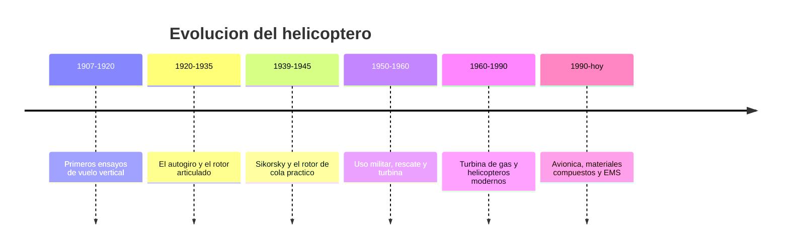

# 📜 Historia del helicóptero

[🏠 Inicio](../../../README.md) · [🚁 Curso: Helicópteros](../README.md) · 📜 Historia

## Origen

El sueño del vuelo vertical es muy antiguo, pero recién a inicios del siglo XX
aparecen ensayos serios. El gran obstáculo era controlar el par que genera un
rotor motorizado: al girar las palas, el fuselaje tiende a girar en sentido
contrario. Resolver esa compensación fue la clave que abrió el vuelo práctico.

## Línea de tiempo

| Periodo | Hito | Importancia |
| --- | --- | --- |
| 1907-1920 | Primeros ensayos de vuelo vertical | Prueba del concepto de ala rotatoria. |
| 1920-1935 | Autogiro de Juan de la Cierva | Rotor libre articulado que inspira soluciones de control. |
| 1939-1945 | Sikorsky VS-300 y rotor de cola | Configuración práctica que domina hasta hoy. |
| 1950-1960 | Rescate militar y primeras turbinas | El helicóptero se vuelve herramienta de trabajo. |
| 1960-1990 | Turbina de gas generalizada | Más potencia, menos peso y más fiabilidad. |
| 1990-presente | Avionica, compuestos y EMS | Más seguridad, rescate y servicios médicos. |

## Evolución tecnológica

- **Compensación del par**: del problema sin resolver al rotor de cola y a los
  rotores en tándem.
- **Propulsión**: del motor a pistón pesado a la turbina de gas ligera y potente.
- **Materiales**: del metal a las palas de material compuesto más resistentes.
- **Control**: del plato cíclico mecánico a los mandos asistidos y estabilizados.
- **Instrumentos**: de relojes analogicos a pantallas de vuelo integradas.
- **Usos**: de la demostración a rescate, trabajo aéreo y servicios médicos.

## Tipos representativos

| Tipo | Uso típico | Característica destacada |
| --- | --- | --- |
| Ligero monoturbina | Instrucción y trabajo aéreo | Sencillo, económico de operar. |
| Biturbina medio | Transporte y EMS | Mayor seguridad por dos motores. |
| Rotores en tándem | Carga pesada | Dos rotores principales, sin rotor de cola. |
| De rescate | Montaña y mar | Grúa de rescate y gran autonomía. |
| De extinción | Incendios forestales | Carga externa de agua bajo el fuselaje. |

## Impacto social y económico

El helicóptero hizo posible llegar donde no hay pista: montañas, mar, azoteas de
hospitales y zonas aisladas. Es clave en rescate, evacuación médica, extinción de
incendios y trabajo aéreo. Su costo de operación es alto, por lo que se reserva
para tareas donde el vuelo vertical y estacionario es insustituible.

## Fuentes

- Registrar aquí las fuentes públicas consultadas.
- Enlazar cada fuente también en [`manuales/fuentes.md`](../../../manuales/fuentes.md).

---

[🎓 Portada del curso](../README.md) · [➡️ Siguiente: Características](../operacion/caracteristicas-helicoptero.md)
