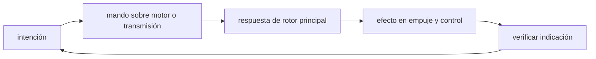

<!-- clase-meta
tipo_documento: clase
clase: 5
codigo: HELICOPTEROS-05
curso: helicopteros
titulo: "Mandos e instrumentos del helicóptero"
modalidad: "taller de simulación"
duracion_minutos: 60
nivel: introductorio
prerrequisito: HELICOPTEROS-04
competencia: "lectura_y_mando"
resultados_aprendizaje:
  - "Explicar controles, instrumentos, entradas y estados del sistema con vocabulario propio de Helicópteros."
  - "Aplicar esos conceptos a una decisión segura o a un escenario de simulación de Helicópteros."
evidencia: "Mapa de mandos y resolución de dos estados del tablero."
criterio_aprobacion: "Reconoce los controles críticos y responde a los estados sin introducir acciones inseguras."
fuentes: manuales/fuentes.md
ultima_revision: 2026-09-10
-->

# 🎛️ Mandos e instrumentos del helicóptero

[🏠 Inicio](../../../README.md) · [🚁 Curso: Helicópteros](../README.md) · 🎛️ Mandos

## Vista general

La cabina de un helicóptero exige coordinar las dos manos y los dos pies a la vez.
La mano izquierda opera la palanca de colectivo, con el mando de gas integrado; la
mano derecha lleva la palanca cíclica; los dos pies actuan sobre los pedales del
rotor de cola. El panel al frente muestra el estado del vuelo, del motor y de la
transmisión. Es un vehículo de equilibrio constante entre potencia, sustentación y
anti-par.

## Mapa de controles

| Zona | Control | Tipo | Función | Prioridad | Comentarios |
| --- | --- | --- | --- | --- | --- |
| Mano izquierda | Colectivo | Palanca | Subir o bajar el paso de todas las palas | Alta | Controla la sustentación total. |
| Mano izquierda | Mando de gas | Puño giratorio | Ajustar la potencia del motor | Alta | Integrado en el colectivo. |
| Mano derecha | Cíclico | Palanca central | Inclinar el disco rotor | Alta | Traslada el helicóptero. |
| Ambos pies | Pedales | Pedales | Cambiar el paso del rotor de cola | Alta | Controlan la guiñada y el anti-par. |
| Panel | Instrumentos de vuelo | Relojes / pantalla | Mostrar estado del vuelo | Alta | Ver sección de instrumentos. |
| Panel | Instrumentos de motor | Relojes / pantalla | Presión y temperatura | Alta | Vigilan la salud del motor. |
| Panel | Instrumentos de transmisión | Relojes / pantalla | Presión y temperatura de caja | Alta | Críticos por la carga del rotor. |
| Panel | Rotor RPM | Indicador | Régimen del rotor y del motor | Alta | Debe mantenerse en su rango. |
| Panel | Interruptores eléctricos | Botones | Luces, bombas, avionica | Media | Encendido por checklist. |
| Panel | Radio y transponder | Teclado | Comunicar y ser visto en radar | Alta | Frecuencias y código asignado. |

## Instrumentos de vuelo

| Instrumento | Mide o muestra | Unidad | Importancia | Notas |
| --- | --- | --- | --- | --- |
| Anemómetro (velocidad) | Velocidad respecto al aire | nudos | Alta | Menos útil en vuelo estacionario. |
| Altímetro | Altitud sobre el nivel de referencia | pies | Alta | Se ajusta con la presión local. |
| Variómetro | Velocidad vertical | pies/min | Alta | Clave en ascenso y descenso vertical. |
| Horizonte artificial | Actitud (cabeceo y alabeo) | grados | Alta | Referencia sin ver el exterior. |
| Indicador de rumbo | Dirección de la nariz | grados | Alta | Se alinea con la brújula. |
| Rotor RPM | Régimen del rotor y del motor | rpm | Alta | Vital; fuera de rango es peligroso. |
| Presión y temperatura de motor | Salud del motor | varias | Alta | Aceite y temperatura de gases. |
| Presión y temperatura de transmisión | Salud de la caja reductora | varias | Alta | La transmisión es punto crítico. |

## Entradas de simulación

| Acción | Teclado | Controlador | Palanca de vuelo | Comentarios |
| --- | --- | --- | --- | --- |
| Colectivo arriba/abajo | Teclas F2 / F3 | Gatillo izquierdo | Palanca de colectivo | Sube o baja la sustentación. |
| Cíclico adelante/atrás | Flechas arriba/abajo | Stick eje Y | Adelante-atrás | Avanza o retrocede. |
| Cíclico izq/der | Flechas izq/der | Stick eje X | Giro lateral | Se desplaza de lado. |
| Guiñada | Teclas Z / X | Pedales | Pedales | Gira la nariz; ajusta anti-par. |
| Gas / potencia | Teclas + / - | Rueda | Puño del colectivo | Ajusta la potencia del motor. |
| Arranque de rotor | Tecla I | Botón | Secuencia de arranque | Según checklist. |
| Freno de rotor | Tecla B | Botón | Palanca de freno | Solo con rotor detenido en tierra. |

## Estados del sistema

| Estado | Descripción | Indicadores | Acciones disponibles |
| --- | --- | --- | --- |
| En tierra apagado | Rotor detenido | Panel sin energía | Checklist, encender sistemas. |
| Rotor en marcha | Motor y rotor girando en tierra | Rotor RPM en rango | Estabilizar, prepararse para despegar. |
| Vuelo estacionario | Sostenido sobre un punto | Variómetro cerca de cero | Trasladar, ascender, girar. |
| En vuelo | Desplazamiento en crucero | Anemómetro y altímetro activos | Ascender, virar, crucero, descender. |
| Aproximación | Preparando aterrizaje | Descenso controlado | Reducir velocidad, estacionario, posar. |
| Emergencia | Falla o riesgo | Testigos de alerta | Autorrotación o checklist de emergencia. |

## Observaciones ergonomicas

- El rotor RPM y el horizonte artificial deben verse siempre; son críticos.
- Colectivo, cíclico y pedales se coordinan de forma continua: la interfaz debe
  mostrar como un mando afecta a los otros.
- Al subir colectivo aumenta el par, por lo que suele acompanarse con pedal.
- Los instrumentos de transmisión deben ser visibles y fácilmente reconocibles.
- La interfaz de simulación debería guiar el uso de checklist en cada fase.

## 🧭 Guía de estudio aplicada

### Pregunta guía

¿Cómo ayuda **Vista general, Mapa de controles, Instrumentos de vuelo y Entradas de simulación** a **interpretar mandos e indicaciones durante vuelo estacionario fuera de efecto suelo con temperatura elevada**?

### Explicación razonada

Un mando no se aprende memorizando su nombre, sino recorriendo el ciclo intención → acción → indicación → verificación. En Helicópteros, el operador actúa sobre motor o transmisión, observa la respuesta en rotor principal y confirma el efecto en empuje y control. Una indicación inesperada exige detener la secuencia mental, identificar el modo activo y evitar una segunda orden que agrave el estado.

Esta clase se conecta con el resto del curso mediante **sustentación del rotor condicionada por paso colectivo, cíclico, potencia y rotor de cola**. El hilo de
seguridad consiste en reconocer a tiempo **déficit de potencia, pérdida de rpm o control de guiñada** y poder justificar la decisión
**comprobar potencia disponible y mantener una vía de escape antes del estacionario**; en clases posteriores cambiará el ángulo de análisis, no esa relación causal.
La lectura funcional común sigue **motor → transmisión → rotor principal → empuje y control**, de modo que cada concepto pueda
ubicarse dentro del funcionamiento completo y no quede como un dato aislado.

**Apoyo documental:** [Helicopter Flying Handbook](https://www.faa.gov/sites/faa.gov/files/helicopter_flying_handbook.pdf) aporta aerodinámica y control de helicópteros;
[Aviation Handbooks and Manuals](https://www.faa.gov/regulations_policies/handbooks_manuals) se usa para aerodinámica, sistemas y operación. Estas fuentes
se contrastan con el alcance de la clase y no sustituyen un manual de equipo concreto.

### Caso resuelto: de la observación a la decisión

1. **Intención:** formula qué cambio se necesita durante **vuelo estacionario fuera de efecto suelo con temperatura elevada**.
2. **Mando:** identifica el control que actúa sobre **motor** o **transmisión** y el modo que debe estar activo.
3. **Lectura:** localiza la indicación que confirma la respuesta de **rotor principal** y el efecto en **empuje y control**.
4. **Verificación:** si la lectura no coincide, no acumules órdenes; estabiliza e investiga el estado.

### Comprueba tu comprensión

1. ¿Qué mando inicia la respuesta y qué instrumento confirma que el modo correcto está activo?
2. ¿Qué indicación temprana advertiría **déficit de potencia, pérdida de rpm o control de guiñada**?
3. ¿Qué secuencia usarías si la respuesta de **empuje y control** no coincide con la orden?

Orientación para revisar tus respuestas

- La primera respuesta debe relacionar el eslabón elegido con un efecto posterior, no solo nombrarlo.
- La segunda debe proponer una señal medible u observable y explicar qué tendencia sería preocupante.
- La tercera debe cambiar al menos una variable de capacidad, mando, entorno o margen de seguridad.

## 🎓 Cierre de clase

- **Actividad:** Recorre el puesto de mando simulado de Helicópteros: localiza los controles de controles, instrumentos, entradas y estados del sistema y asocia cada indicación con una decisión.
- **Evidencia:** Mapa de mandos y resolución de dos estados del tablero.
- **Criterio de aprobación:** Reconoce los controles críticos y responde a los estados sin introducir acciones inseguras.
- **Transferencia:** explica qué cambiaría al pasar a otra variante de esta máquina.

### Fuentes de esta clase

- [US-FAA-HELI](https://www.faa.gov/sites/faa.gov/files/helicopter_flying_handbook.pdf): Helicopter Flying Handbook, FAA. Uso: aerodinámica y control de helicópteros.
- [US-FAA-HANDBOOKS](https://www.faa.gov/regulations_policies/handbooks_manuals): Aviation Handbooks and Manuals, FAA. Uso: aerodinámica, sistemas y operación.
- [CL-DGAC](https://www.dgac.gob.cl/normativa/): Normativa aeronáutica, DGAC Chile. Uso: marco aeronáutico chileno.

> Las fuentes sostienen el marco conceptual y normativo; esta clase no reemplaza el manual
> del fabricante, la formación certificada ni la habilitación exigida para operar equipos reales.

---

[⬅️ Anterior: Sistemas mecánicos](../operacion/sistemas-mecanicos-helicoptero.md) · [➡️ Siguiente: Principios y operación](../operacion/principios-helicoptero.md)
