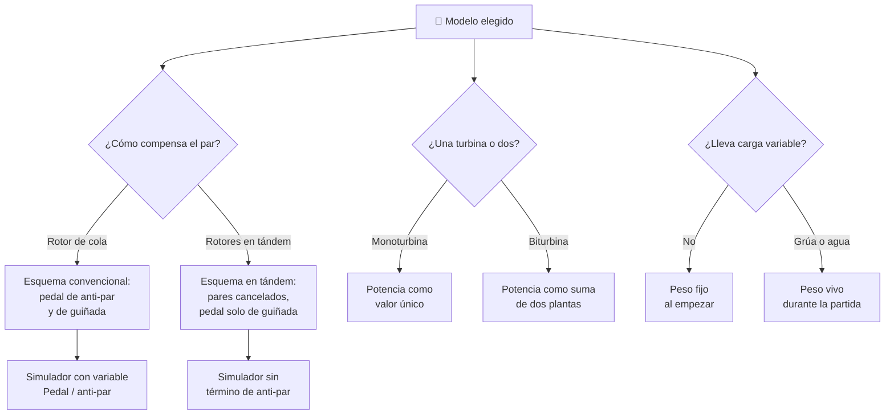

# 🧩 Modelos y variantes del helicóptero

[🏠 Inicio](../../../README.md) · [🚁 Curso: Helicópteros](../README.md) · 🧩 Modelos

El [Módulo 2](../operacion/caracteristicas-helicoptero.md) ya dijo qué tipos de
helicóptero existen y para qué sirve cada uno. Este módulo responde a lo
siguiente: **no todos se pilotan igual**, y esa diferencia no es de matiz. Cambia
qué mandos tiene la máquina y, por tanto, qué debe modelar el simulador.

> 🎯 **La idea que sostiene el módulo.** "Un helicóptero" no es una sola máquina
> desde el punto de vista del mando. Un rotor en tándem no tiene par que
> compensar: sus dos rotores giran en sentidos opuestos y sus pares se cancelan
> entre sí. No es que el anti-par sea más fácil, es que **no existe**. Un
> simulador que presente un solo esquema de control está representando un
> helicóptero concreto aunque diga representarlos todos.

---

## 🧭 Por qué el modelo decide el simulador

El [Módulo 5](../mandos/manual-mandos-helicoptero.md) describe un puesto de mando
donde los pedales "controlan la guiñada y el anti-par", las dos cosas a la vez con
el mismo pie. El [Módulo 9](../simulacion/diseno-simulador-helicoptero.md) expone
una variable `Pedal / anti-par` que "compensa el par del rotor". Ambos describen
un helicóptero de **rotor principal más rotor de cola**.

En un rotor en tándem no hay rotor de cola al que cambiarle el paso, y no hay par
de reacción que compensar. El pedal conserva la guiñada, pero pierde la mitad de
su trabajo. Si el simulador se construye sobre el esquema convencional y luego se
le "añade" un tándem, el resultado es un tándem que exige compensar un par que no
tiene, que no existe.

El [Módulo 4](../operacion/sistemas-mecanicos-helicoptero.md) ya lo enuncia al
hablar del par: la compensación se resuelve con rotor de cola **o** con rotores en
tándem de giros opuestos. Son dos caminos mecánicos distintos, y por eso son dos
esquemas de control distintos.

---

## 🗂️ Qué cambia en el manejo

| Modelo | Qué cambia al pilotarlo |
| --- | --- |
| Rotor principal + rotor de cola | La referencia del curso: colectivo, cíclico y pedales se coordinan de forma continua, y subir colectivo obliga a acompañar con pedal. |
| Rotores en tándem | Los pares se cancelan entre sí. El pedal deja de corregir el par al variar el colectivo, y el trabajo de pies se descarga. |
| Ligero monoturbina | Máquina sencilla y económica de operar: un solo motor que vigilar, respuesta directa entre gas y rotor. |
| Biturbina | Dos motores que vigilar en el panel. La seguridad sube porque la pérdida de uno no obliga necesariamente a la autorrotación. |
| De rescate | La grúa mueve carga y personas durante el vuelo: el peso y el balance cambian mientras se sostiene el estacionario. |
| De extinción | La carga externa de agua bajo el fuselaje pesa al ir y no al volver: la misma máquina responde distinto en cada tramo. |

---

## 🎛️ Qué cambia en el mando

| Modelo | Qué mando aparece o desaparece | Consecuencia |
| --- | --- | --- |
| Rotor principal + rotor de cola | Ninguno: el mapa de controles del Módulo 5 aplica tal cual. | Es el caso base del curso. |
| Rotores en tándem | **Desaparece** la función anti-par del pedal; **desaparece** el paso del rotor de cola como mando. El pedal queda solo como control de guiñada. | Los pies dejan de corregir el par al mover el colectivo. El freno de rotor y la vigilancia del rotor de cola pierden objeto. |
| Ligero monoturbina | Ninguno nuevo. | Cambian los rangos, no los controles. |
| Biturbina | **Se duplican** los instrumentos de motor: presión y temperatura por cada turbina. | El gas del colectivo gobierna dos plantas de potencia, no una. |
| De rescate | **Aparece** el mando de grúa como carga que el piloto gestiona en vuelo. | No es un mando de vuelo, pero altera el resultado de todos los demás. |
| De extinción | **Aparece** el mando de soltado de la carga externa de agua. | Una sola acción cambia el peso de golpe en pleno vuelo. |

---

## 🎮 Qué cambia en el simulador

Contrastado con las variables del
[Módulo 9](../simulacion/diseno-simulador-helicoptero.md):

| Modelo | Variables que cambian | Esquema de control |
| --- | --- | --- |
| Rotor principal + rotor de cola | Ninguna: es el caso base. | El del Módulo 5. |
| Rotores en tándem | `Pedal / anti-par` **pierde su mitad anti-par** y pasa a ser guiñada pura. El par deja de entrar en el cálculo de fuerzas del ciclo básico. | Sin entrada de anti-par; la guiñada se obtiene de los dos rotores, no de un rotor de cola. |
| Ligero monoturbina | `Potencia del motor` y `Peso del conjunto` reducen rango. | El mismo. |
| Biturbina | `Potencia del motor` **deja de ser un valor único** y pasa a ser la suma de dos plantas, cada una con su propio estado. | El mismo, con fallo de un motor como escenario distinto de la autorrotación. |
| De rescate | `Peso del conjunto` deja de ser fijo y pasa a variar durante la partida, con el estacionario sostenido mientras cambia. | El mismo. |
| De extinción | `Peso del conjunto` varía de golpe al soltar la carga. `Densidad del aire` pesa más en el cálculo por el calor del incendio. | El mismo. |

---

## 🗺️ Del modelo al esquema de control

---

## ⚠️ Qué modelos no comparten simulador

Tres familias no se resuelven con un ajuste de parámetros, porque su esquema de
control o su modelo de fuerzas es otro:

- **El rotor en tándem** frente al convencional: falta una entrada y el par
  desaparece del cálculo de fuerzas. Es un modo de control distinto, no una
  dificultad distinta. El error común que enseña el
  [Módulo 6](../operacion/principios-helicoptero.md) —subir colectivo sin
  compensar el par con el pedal— sencillamente no se comete en un tándem.
- **La biturbina** frente a la monoturbina: obliga a que la potencia sea dos
  estados y no uno, y abre un escenario de fallo que no termina en autorrotación.
- **El rescate y la extinción** frente a los demás: obligan a que el peso sea una
  variable viva durante la partida, no una constante que se fija al empezar.

El resto de modelos sí caben en un mismo simulador ajustando rangos, tal como
plantean los [niveles de realismo](../../../docs/03-niveles-de-realismo.md): en el
nivel 1 casi todos se comportan igual, y las diferencias emergen a medida que el
nivel sube. De hecho el par y el anti-par no entran hasta el nivel 2, así que
antes de ese nivel el tándem y el convencional aún son la misma máquina.

> ⚖️ **El principio detrás de todo esto.** Cuánto pesa la carga y dónde va no cambia
> solo los números: cambia qué puede hacer el operador. La física común a todas las
> máquinas del catálogo —sostener, girar, equilibrar y la masa que cambia en
> marcha— está en [⚖️ carga y manejo](../../../docs/09-carga-y-manejo.md).

---

[⬅️ Anterior: Características](../operacion/caracteristicas-helicoptero.md) · [➡️ Siguiente: Sistemas mecánicos](../operacion/sistemas-mecanicos-helicoptero.md)
