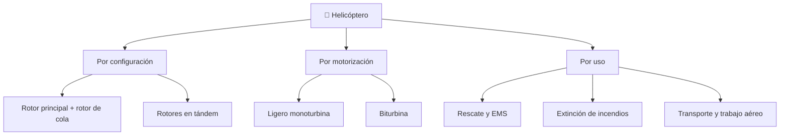

# 📋 Características funcionales del helicóptero

[🏠 Inicio](../../../README.md) · [🚁 Curso: Helicópteros](../README.md) · 📋 Características

Que es un helicóptero, que tipos existen y para que sirve cada uno. Este módulo
da el contexto antes de abrir la mecánica (Módulo 3).

---

## 🧭 Definición

Un helicóptero es una aeronave de ala rotatoria que genera sustentación con un
rotor motorizado en vez de con alas fijas. Gracias a ese rotor puede realizar
vuelo estacionario, ascenso y descenso vertical, y desplazamiento lateral o hacia
atrás. No necesita pista: despega y aterriza en vertical.

---

## 🧬 Características clave

| Característica | Descripción |
| --- | --- |
| Vuelo estacionario | Puede mantenerse inmóvil en el aire, sobre un punto fijo. |
| Despegue vertical | No requiere pista; opera desde helipuertos y zonas reducidas. |
| Movimiento omnidireccional | Avanza, retrocede y se desplaza de lado. |
| Compensación del par | Necesita anti-par para no girar sobre si mismo. |
| Autorrotación | Puede descender de forma segura sin motor. |
| Alto costo operativo | Mantenimiento exigente por la complejidad del rotor. |

---

## 🗂️ Tipos de helicóptero

| Tipo | Uso típico | Rasgo destacado |
| --- | --- | --- |
| Rotor principal + rotor de cola | Configuración general | El rotor de cola compensa el par. |
| Rotores en tándem | Carga pesada y transporte | Dos rotores principales, sin rotor de cola. |
| Ligero monoturbina | Instrucción y trabajo aéreo | Sencillo y económico de operar. |
| Biturbina | Transporte y EMS | Dos motores para mayor seguridad. |
| De rescate | Montaña y mar | Grúa y gran autonomía de vuelo. |
| De extinción | Incendios forestales | Carga externa de agua bajo el fuselaje. |

---

## 🎯 Para qué se usa

- Rescate en montaña, mar y zonas sin acceso terrestre.
- Evacuación médica y ambulancia aérea (EMS).
- Extinción de incendios forestales con carga externa.
- Transporte de personas y carga a lugares aislados.
- Trabajo aéreo: inspección de líneas, fotografía y observación.

---

[⬅️ Anterior: Historia](../historia/historia-helicoptero.md) · [➡️ Siguiente: Sistemas mecánicos](sistemas-mecanicos-helicoptero.md)
