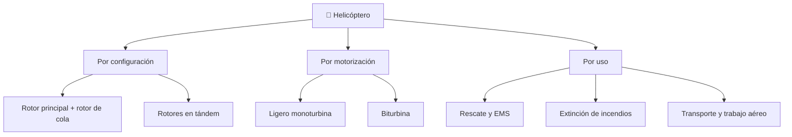

<!-- clase-meta
tipo_documento: clase
clase: 2
codigo: HELICOPTEROS-02
curso: helicopteros
titulo: "Características funcionales del helicóptero"
modalidad: "teórica aplicada"
duracion_minutos: 45
nivel: introductorio
prerrequisito: HELICOPTEROS-01
competencia: "identificacion_funcional"
resultados_aprendizaje:
  - "Explicar definición, rasgos funcionales, tipos y usos con vocabulario propio de Helicópteros."
  - "Aplicar esos conceptos a una decisión segura o a un escenario de simulación de Helicópteros."
evidencia: "Matriz comparativa y decisión justificada."
criterio_aprobacion: "La elección considera función, límites, mando y efecto en la simulación; no se apoya solo en preferencias."
fuentes: manuales/fuentes.md
ultima_revision: 2026-09-10
-->

# 📋 Características funcionales del helicóptero

[🏠 Inicio](../../../README.md) · [🚁 Curso: Helicópteros](../README.md) · 📋 Características

Que es un helicóptero, que tipos existen y para que sirve cada uno. Esta clase
da el contexto antes de abrir la mecánica (Clase 4).

---

## 🧭 Definición

Un helicóptero es una aeronave de ala rotatoria que genera sustentación con un
rotor motorizado en vez de con alas fijas. Gracias a ese rotor puede realizar
vuelo estacionario, ascenso y descenso vertical, y desplazamiento lateral o hacia
atrás. No necesita pista: despega y aterriza en vertical.

---

## 🧬 Características clave

| Característica | Descripción |
| --- | --- |
| Vuelo estacionario | Puede mantenerse inmóvil en el aire, sobre un punto fijo. |
| Despegue vertical | No requiere pista; opera desde helipuertos y zonas reducidas. |
| Movimiento omnidireccional | Avanza, retrocede y se desplaza de lado. |
| Compensación del par | Necesita anti-par para no girar sobre si mismo. |
| Autorrotación | Puede descender de forma segura sin motor. |
| Alto costo operativo | Mantenimiento exigente por la complejidad del rotor. |

---

## 🗂️ Tipos de helicóptero

```mermaid
flowchart TD
    Heli[🚁 Helicóptero] --> Config[Por configuración]
    Heli --> Motor[Por motorización]
    Heli --> Uso[Por uso]
    Config --> Convencional[Rotor principal + rotor de cola]
    Config --> Tandem[Rotores en tándem]
    Motor --> Mono[Ligero monoturbina]
    Motor --> Bi[Biturbina]
    Uso --> Rescate[Rescate y EMS]
    Uso --> Incendio[Extinción de incendios]
    Uso --> Transporte[Transporte y trabajo aéreo]
```

| Tipo | Uso típico | Rasgo destacado |
| --- | --- | --- |
| Rotor principal + rotor de cola | Configuración general | El rotor de cola compensa el par. |
| Rotores en tándem | Carga pesada y transporte | Dos rotores principales, sin rotor de cola. |
| Ligero monoturbina | Instrucción y trabajo aéreo | Sencillo y económico de operar. |
| Biturbina | Transporte y EMS | Dos motores para mayor seguridad. |
| De rescate | Montaña y mar | Grúa y gran autonomía de vuelo. |
| De extinción | Incendios forestales | Carga externa de agua bajo el fuselaje. |

---

## 🎯 Para qué se usa

- Rescate en montaña, mar y zonas sin acceso terrestre.
- Evacuación médica y ambulancia aérea (EMS).
- Extinción de incendios forestales con carga externa.
- Transporte de personas y carga a lugares aislados.
- Trabajo aéreo: inspección de líneas, fotografía y observación.

## 🧭 Guía de estudio aplicada

### Pregunta guía

¿Cómo ayuda **Definición, Características clave, Tipos de helicóptero y Para qué se usa** a **elegir una configuración adecuada para vuelo estacionario fuera de efecto suelo con temperatura elevada**?

### Explicación razonada

Una característica solo es útil cuando permite anticipar comportamiento. En Helicópteros, la relación entre motor, transmisión, rotor principal y empuje y control determina capacidad, respuesta y límites. Por eso «helicóptero ligero frente a helicóptero de transporte» no se compara por apariencia: se compara por misión, entorno, carga de trabajo y exposición al riesgo «déficit de potencia, pérdida de rpm o control de guiñada».

Esta clase se conecta con el resto del curso mediante **sustentación del rotor condicionada por paso colectivo, cíclico, potencia y rotor de cola**. El hilo de
seguridad consiste en reconocer a tiempo **déficit de potencia, pérdida de rpm o control de guiñada** y poder justificar la decisión
**comprobar potencia disponible y mantener una vía de escape antes del estacionario**; en clases posteriores cambiará el ángulo de análisis, no esa relación causal.
La lectura funcional común sigue **motor → transmisión → rotor principal → empuje y control**, de modo que cada concepto pueda
ubicarse dentro del funcionamiento completo y no quede como un dato aislado.

**Apoyo documental:** [Helicopter Flying Handbook](https://www.faa.gov/sites/faa.gov/files/helicopter_flying_handbook.pdf) aporta aerodinámica y control de helicópteros;
[Aviation Handbooks and Manuals](https://www.faa.gov/regulations_policies/handbooks_manuals) se usa para aerodinámica, sistemas y operación. Estas fuentes
se contrastan con el alcance de la clase y no sustituyen un manual de equipo concreto.

### Caso resuelto: de la observación a la decisión

1. **Definir la necesidad:** convierte «vuelo estacionario fuera de efecto suelo con temperatura elevada» en requisitos de capacidad, entorno y respuesta.
2. **Comparar:** contrasta **helicóptero ligero frente a helicóptero de transporte** usando esos requisitos y la cadena **motor → transmisión → rotor principal → empuje y control**.
3. **Descartar:** elimina la alternativa que deja menos margen frente a **déficit de potencia, pérdida de rpm o control de guiñada**.
4. **Elegir:** declara la variante escogida, la evidencia usada y una limitación que todavía debe respetarse.

### Comprueba tu comprensión

1. ¿Qué característica de **empuje y control** condiciona primero el caso «vuelo estacionario fuera de efecto suelo con temperatura elevada»?
2. ¿Qué requisito descartaría una de las alternativas **helicóptero ligero frente a helicóptero de transporte**?
3. ¿Qué límite debe declararse junto con la variante elegida?

Orientación para revisar tus respuestas

- La primera respuesta debe relacionar el eslabón elegido con un efecto posterior, no solo nombrarlo.
- La segunda debe proponer una señal medible u observable y explicar qué tendencia sería preocupante.
- La tercera debe cambiar al menos una variable de capacidad, mando, entorno o margen de seguridad.

## 🎓 Cierre de clase

- **Actividad:** Compara variantes de Helicópteros mediante los ejes «definición, rasgos funcionales, tipos y usos» y elige una para un caso de uso razonado.
- **Evidencia:** Matriz comparativa y decisión justificada.
- **Criterio de aprobación:** La elección considera función, límites, mando y efecto en la simulación; no se apoya solo en preferencias.
- **Transferencia:** explica qué cambiaría al pasar a otra variante de esta máquina.

### Fuentes de esta clase

- [US-FAA-HELI](https://www.faa.gov/sites/faa.gov/files/helicopter_flying_handbook.pdf): Helicopter Flying Handbook, FAA. Uso: aerodinámica y control de helicópteros.
- [US-FAA-HANDBOOKS](https://www.faa.gov/regulations_policies/handbooks_manuals): Aviation Handbooks and Manuals, FAA. Uso: aerodinámica, sistemas y operación.
- [CL-DGAC](https://www.dgac.gob.cl/normativa/): Normativa aeronáutica, DGAC Chile. Uso: marco aeronáutico chileno.

> Las fuentes sostienen el marco conceptual y normativo; esta clase no reemplaza el manual
> del fabricante, la formación certificada ni la habilitación exigida para operar equipos reales.

---

[⬅️ Anterior: Historia](../historia/historia-helicoptero.md) · [➡️ Siguiente: Modelos y variantes](../modelos/modelos-helicoptero.md)
