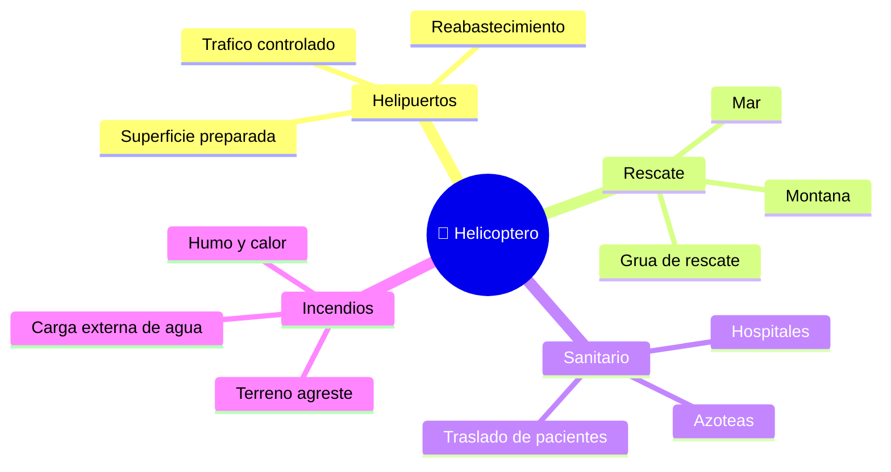

# 🌍 Entornos de trabajo del helicoptero

[🏠 Inicio](../../../README.md) · [🚁 Curso: Helicopteros](../README.md) · 🌍 Entornos

Donde opera un helicoptero y como cambia el vuelo segun el entorno. Cada entorno
implica reglas, riesgos y ajustes distintos, y en simulacion se traduce en
escenarios diferentes.

---

## 🗺️ Entornos principales

| Entorno | Caracteristicas | Riesgos tipicos | Ajuste de vuelo |
| --- | --- | --- | --- |
| Helipuerto | Superficie preparada y senalizada. | Trafico, obstaculos cercanos. | Aproximacion estandar, vigilar viento. |
| Rescate en montana | Altura, espacio reducido. | Aire menos denso, turbulencia. | Mas potencia, margenes amplios. |
| Rescate en mar | Sin referencias fijas, oleaje. | Desorientacion, spray de agua. | Estacionario preciso, uso de grua. |
| Hospital | Azoteas y helipuertos elevados. | Espacio estrecho, publico cercano. | Aproximacion suave y controlada. |
| Incendio forestal | Humo, calor, carga externa. | Baja visibilidad, aire caliente. | Vuelo con carga, rutas de escape. |

---

## 🌦️ Factores del entorno

- **Densidad del aire**: la altura y el calor reducen la densidad y con ella la
  sustentacion; se necesita mas potencia.
- **Viento y turbulencia**: afectan el estacionario y la aproximacion, sobre todo
  cerca de obstaculos y en montana.
- **Visibilidad**: humo, niebla o spray de mar dificultan mantener referencias.
- **Espacio disponible**: azoteas y claros exigen precision y margenes de rotor.

---

## 🎮 Traduccion a simulacion

Cada entorno es un escenario con su superficie, clima, densidad del aire y
obstaculos. Ver como se modela en el
[Modulo 8: Diseno de simulacion](../simulacion/diseno-simulador-helicoptero.md).

---

[⬅️ Anterior: Principios y operacion](principios-helicoptero.md) · [➡️ Siguiente: Reglamentos](../reglamentos/reglamentos-helicoptero.md)
