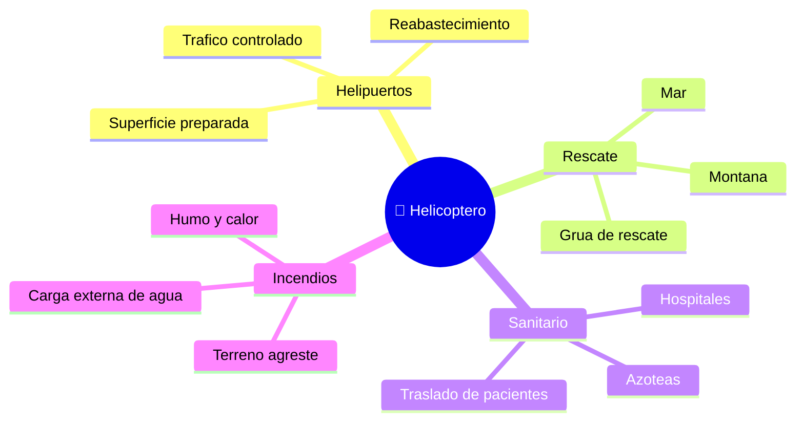

# 🌍 Entornos de trabajo del helicóptero

[🏠 Inicio](../../../README.md) · [🚁 Curso: Helicópteros](../README.md) · 🌍 Entornos

Dónde opera un helicóptero y cómo cambia el vuelo según el entorno. Cada entorno
implica reglas, riesgos y ajustes distintos, y en simulación se traduce en
escenarios diferentes.

---

## 🗺️ Entornos principales

```mermaid
mindmap
  root((🚁 Helicoptero))
    Helipuertos
      Superficie preparada
      Trafico controlado
      Reabastecimiento
    Rescate
      Montana
      Mar
      Grua de rescate
    Sanitario
      Hospitales
      Azoteas
      Traslado de pacientes
    Incendios
      Carga externa de agua
      Humo y calor
      Terreno agreste
```

| Entorno | Características | Riesgos típicos | Ajuste de vuelo |
| --- | --- | --- | --- |
| Helipuerto | Superficie preparada y senalizada. | Tráfico, obstáculos cercanos. | Aproximación estandar, vigilar viento. |
| Rescate en montaña | Altura, espacio reducido. | Aire menos denso, turbulencia. | Más potencia, margenes amplios. |
| Rescate en mar | Sin referencias fijas, oleaje. | Desorientación, spray de agua. | Estacionario preciso, uso de grúa. |
| Hospital | Azoteas y helipuertos elevados. | Espacio estrecho, público cercano. | Aproximación suave y controlada. |
| Incendio forestal | Humo, calor, carga externa. | Baja visibilidad, aire caliente. | Vuelo con carga, rutas de escape. |

---

## 🌦️ Factores del entorno

- **Densidad del aire**: la altura y el calor reducen la densidad y con ella la
  sustentación; se necesita más potencia.
- **Viento y turbulencia**: afectan el estacionario y la aproximación, sobre todo
  cerca de obstáculos y en montaña.
- **Visibilidad**: humo, niebla o spray de mar dificultan mantener referencias.
- **Espacio disponible**: azoteas y claros exigen precisión y margenes de rotor.

---

## 🎮 Traducción a simulación

Cada entorno es un escenario con su superficie, clima, densidad del aire y
obstáculos. Ver cómo se modela en el
[Módulo 9: Diseño de simulación](../simulacion/diseno-simulador-helicoptero.md).

## 🎓 Cierre de clase

- **Actividad:** Contrasta tres entornos de Helicópteros a partir de entornos, factores ambientales, riesgos y respuesta de simulación y determina cómo cambian variables, percepción, riesgos y respuesta.
- **Evidencia:** Matriz entorno–cambio–riesgo–respuesta.
- **Criterio de aprobación:** Cada respuesta se adapta al entorno y distingue riesgos que no son intercambiables entre escenarios.
- **Transferencia:** explica qué cambiaría al pasar a otra variante de esta máquina.

### Fuentes de esta clase

- [US-FAA-HELI](https://www.faa.gov/sites/faa.gov/files/helicopter_flying_handbook.pdf): Helicopter Flying Handbook, FAA. Uso: aerodinámica y control de helicópteros.
- [US-FAA-HANDBOOKS](https://www.faa.gov/regulations_policies/handbooks_manuals): Aviation Handbooks and Manuals, FAA. Uso: aerodinámica, sistemas y operación.
- [CL-DGAC](https://www.dgac.gob.cl/normativa/): Normativa aeronáutica, DGAC Chile. Uso: marco aeronáutico chileno.

> Las fuentes sostienen el marco conceptual y normativo; esta clase no reemplaza el manual
> del fabricante, la formación certificada ni la habilitación exigida para operar equipos reales.

---

[⬅️ Anterior: Principios y operación](principios-helicoptero.md) · [➡️ Siguiente: Reglamentos](../reglamentos/reglamentos-helicoptero.md)
