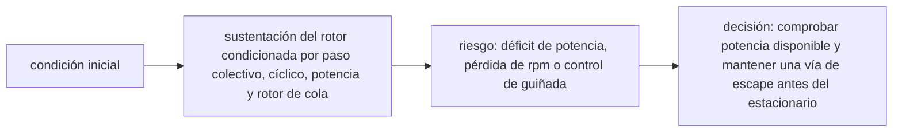

<!-- clase-meta
tipo_documento: clase
clase: 6
codigo: HELICOPTEROS-06
curso: helicopteros
titulo: "Principios y operación del helicóptero"
modalidad: "resolución de problemas"
duracion_minutos: 90
nivel: introductorio
prerrequisito: HELICOPTEROS-05
competencia: "razonamiento_operacional"
resultados_aprendizaje:
  - "Explicar principios físicos, fases de operación, decisiones y errores frecuentes con vocabulario propio de Helicópteros."
  - "Aplicar esos conceptos a una decisión segura o a un escenario de simulación de Helicópteros."
evidencia: "Resolución argumentada de un escenario operacional."
criterio_aprobacion: "Aplica los principios correctos, anticipa consecuencias y respeta los límites del curso."
fuentes: manuales/fuentes.md
ultima_revision: 2026-09-10
-->

# 🧪 Principios y operación del helicóptero

[🏠 Inicio](../../../README.md) · [🚁 Curso: Helicópteros](../README.md) · 🧪 Principios

Documento general y educativo. No sustituye una instrucción de vuelo certificada
ni el manual del fabricante. Describe cómo se opera un helicóptero en simulación y
que principios físicos conviene representar.

## Principios de funcionamiento

- **Sustentación del rotor**: las palas son alas que giran; al aumentar su paso o
  su régimen, crean la fuerza que sostiene la aeronave.
- **Traslación**: al inclinar el disco rotor con el cíclico, parte de la
  sustentación se convierte en tracción horizontal y el helicóptero se desplaza.
- **Par y anti-par**: el motor que gira el rotor tiende a girar el fuselaje; el
  rotor de cola compensa ese par y controla la guiñada.
- **Vuelo estacionario (hover)**: equilibrio fino entre sustentación, peso, par y
  anti-par para mantenerse inmóvil sobre un punto.
- **Disimetría de sustentación**: en vuelo hacia adelante, la pala que avanza
  recibe más aire que la que retrocede; la articulación de las palas equilibra ese
  desnivel para que el vuelo sea estable.
- **Autorrotación**: sin motor, el flujo de aire que sube por el rotor lo mantiene
  girando y permite un descenso controlado.
- **Efecto suelo**: cerca del terreno, la sustentación aumenta y el estacionario
  cuesta menos potencia.

## Fases de operación

| Fase | Que ocurre | Puntos clave |
| --- | --- | --- |
| Inspección previa | Revisión básica | Palas, rotor de cola, niveles, combustible, mandos. |
| Arranque de rotor | Encender y estabilizar el rotor | Rotor RPM en rango antes de despegar. |
| Despegue vertical | Elevarse sobre el punto | Subir colectivo, compensar par con pedal. |
| Vuelo estacionario | Mantenerse inmóvil | Coordinar colectivo, cíclico y pedales. |
| Crucero | Desplazamiento sostenido | Cíclico adelante, vigilar velocidad y altitud. |
| Aproximación | Preparar aterrizaje | Reducir velocidad hasta el estacionario. |
| Aterrizaje | Posarse con suavidad | Descenso controlado, uso del efecto suelo. |

## Técnica clave: el vuelo estacionario

1. Ajustar el **colectivo** para que la sustentación iguale el peso.
2. Usar el **cíclico** con pequeños movimientos para no derivar sobre el punto.
3. Compensar el **par** con los **pedales** para mantener la nariz fija.
4. Vigilar el **rotor RPM** y el **variómetro** cerca de cero.
5. Corregir de forma continua: los tres mandos se influyen entre sí.

## Errores comunes que la simulación puede enseñar a evitar

- Subir colectivo sin compensar el par con el pedal.
- Sobrecontrolar el cíclico y provocar oscilaciones en el estacionario.
- Dejar caer el rotor RPM fuera de su rango de seguridad.
- Olvidar el efecto suelo al comparar potencia en altura y cerca del terreno.
- No practicar la entrada en autorrotación ante un fallo de motor.

## Relación con los niveles de realismo

- **Nivel 1 (educativo)**: elevar, mantener el hover, trasladar y posar.
- **Nivel 2 (simplificado)**: agregar par, anti-par y efecto suelo.
- **Nivel 3 (técnico)**: sumar rotor RPM, disimetría de sustentación y
  autorrotación.

Ver [`docs/03-niveles-de-realismo.md`](../../../docs/03-niveles-de-realismo.md) para el detalle de cada nivel.

## 🧭 Guía de estudio aplicada

### Pregunta guía

¿Cómo ayuda **Principios de funcionamiento, Fases de operación, Técnica clave: el vuelo estacionario y Errores comunes que la simulación puede enseñar a evitar** a **resolver vuelo estacionario fuera de efecto suelo con temperatura elevada sin agotar el margen operacional**?

### Explicación razonada

El principio rector puede resumirse así: sustentación del rotor condicionada por paso colectivo, cíclico, potencia y rotor de cola. Esto explica por qué una misma orden produce resultados distintos cuando cambian velocidad, carga, configuración o entorno. Operar bien consiste en leer la tendencia antes de agotar el margen y tomar esta decisión: comprobar potencia disponible y mantener una vía de escape antes del estacionario.

Esta clase se conecta con el resto del curso mediante **sustentación del rotor condicionada por paso colectivo, cíclico, potencia y rotor de cola**. El hilo de
seguridad consiste en reconocer a tiempo **déficit de potencia, pérdida de rpm o control de guiñada** y poder justificar la decisión
**comprobar potencia disponible y mantener una vía de escape antes del estacionario**; en clases posteriores cambiará el ángulo de análisis, no esa relación causal.
La lectura funcional común sigue **motor → transmisión → rotor principal → empuje y control**, de modo que cada concepto pueda
ubicarse dentro del funcionamiento completo y no quede como un dato aislado.

**Apoyo documental:** [Helicopter Flying Handbook](https://www.faa.gov/sites/faa.gov/files/helicopter_flying_handbook.pdf) aporta aerodinámica y control de helicópteros;
[Aviation Handbooks and Manuals](https://www.faa.gov/regulations_policies/handbooks_manuals) se usa para aerodinámica, sistemas y operación. Estas fuentes
se contrastan con el alcance de la clase y no sustituyen un manual de equipo concreto.

### Caso resuelto: de la observación a la decisión

1. **Datos:** reconoce condiciones, configuración y margen disponibles en **vuelo estacionario fuera de efecto suelo con temperatura elevada**.
2. **Modelo:** aplica **sustentación del rotor condicionada por paso colectivo, cíclico, potencia y rotor de cola** para predecir una tendencia antes de actuar.
3. **Riesgo:** explica mediante qué cadena de causas podría ocurrir **déficit de potencia, pérdida de rpm o control de guiñada**.
4. **Decisión:** ejecuta mentalmente **comprobar potencia disponible y mantener una vía de escape antes del estacionario** y define qué observación confirmaría que funcionó.

### Comprueba tu comprensión

1. ¿Qué variable del principio «sustentación del rotor condicionada por paso colectivo, cíclico, potencia y rotor de cola» cambia primero en el caso?
2. ¿Cómo se propaga ese cambio hasta **empuje y control**?
3. ¿Qué evidencia confirmaría que **comprobar potencia disponible y mantener una vía de escape antes del estacionario** conservó margen operacional?

Orientación para revisar tus respuestas

- La primera respuesta debe relacionar el eslabón elegido con un efecto posterior, no solo nombrarlo.
- La segunda debe proponer una señal medible u observable y explicar qué tendencia sería preocupante.
- La tercera debe cambiar al menos una variable de capacidad, mando, entorno o margen de seguridad.

## 🎓 Cierre de clase

- **Actividad:** Resuelve un escenario de Helicópteros explicando, paso a paso, cómo intervienen principios físicos, fases de operación, decisiones y errores frecuentes.
- **Evidencia:** Resolución argumentada de un escenario operacional.
- **Criterio de aprobación:** Aplica los principios correctos, anticipa consecuencias y respeta los límites del curso.
- **Transferencia:** explica qué cambiaría al pasar a otra variante de esta máquina.

### Fuentes de esta clase

- [US-FAA-HELI](https://www.faa.gov/sites/faa.gov/files/helicopter_flying_handbook.pdf): Helicopter Flying Handbook, FAA. Uso: aerodinámica y control de helicópteros.
- [US-FAA-HANDBOOKS](https://www.faa.gov/regulations_policies/handbooks_manuals): Aviation Handbooks and Manuals, FAA. Uso: aerodinámica, sistemas y operación.
- [CL-DGAC](https://www.dgac.gob.cl/normativa/): Normativa aeronáutica, DGAC Chile. Uso: marco aeronáutico chileno.

> Las fuentes sostienen el marco conceptual y normativo; esta clase no reemplaza el manual
> del fabricante, la formación certificada ni la habilitación exigida para operar equipos reales.

---

[⬅️ Anterior: Mandos](../mandos/manual-mandos-helicoptero.md) · [➡️ Siguiente: Entornos de trabajo](entornos-helicoptero.md)
