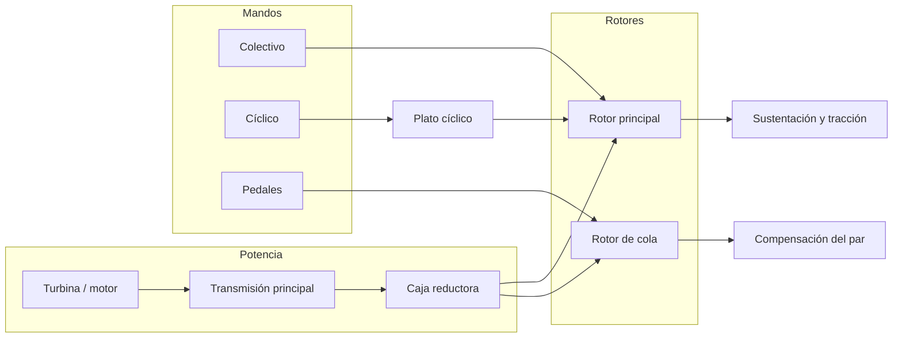
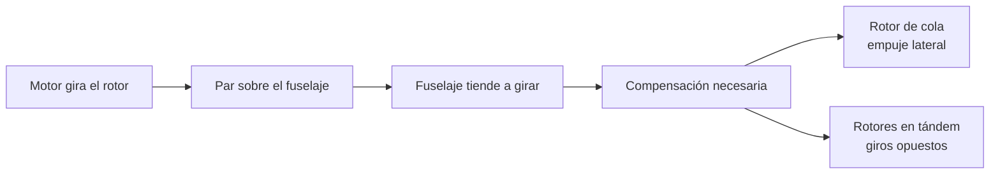
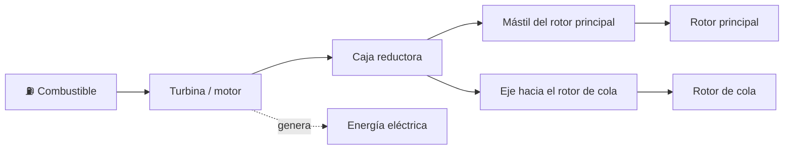

# 🔧 Sistemas mecánicos del helicóptero

[🏠 Inicio](../../../README.md) · [🚁 Curso: Helicópteros](../README.md) · 🔧 Sistemas mecánicos

Este módulo abre el helicóptero por dentro. Explica cada sistema, como funciona y
como se conecta con los demás. Es la base técnica para entender los mandos
(Módulo 5) y la física del vuelo (Módulo 6).

---

## 1. 🚁 Rotor principal

El rotor principal es el corazón del helicóptero: sus palas giran como alas
rotatorias y generan la sustentación que lo sostiene y la tracción que lo mueve.

- **Palas**: perfiles alares que, al girar y cortar el aire, producen sustentación.
- **Paso de pala**: el ángulo de ataque de cada pala; al aumentarlo, sube la
  sustentación. Cambiar el paso es como acelerar o frenar la fuerza del rotor.
- **Cabeza del rotor**: articula las palas para que suban, bajen y cambien su paso.
- **Número de palas**: más palas dan marcha más suave; menos palas, más simpleza.

| Concepto del rotor | Función |
| --- | --- |
| Sustentación | Fuerza hacia arriba que sostiene el helicóptero. |
| Tracción | Componente horizontal que lo desplaza al inclinar el disco. |
| Disco rotor | Plano imaginario que describen las puntas de las palas. |
| Paso colectivo | Cambia por igual el paso de todas las palas. |
| Paso cíclico | Cambia el paso de cada pala según su posición en el giro. |

---

## 2. 🌀 El par motor y su compensación

Al hacer girar el rotor principal, el motor aplica un par sobre el fuselaje. Por
la ley de acción y reacción, el fuselaje tiende a girar en sentido contrario al
rotor. Esa tendencia se llama par de reacción o simplemente par, y hay que
compensarla o el helicóptero girara descontroladamente sobre si mismo.

- En la configuración clásica, el **rotor de cola** genera un empuje lateral que
  contrarresta el par.
- En los **rotores en tándem**, los dos rotores giran en sentidos opuestos y sus
  pares se cancelan entre sí, por lo que no hace falta rotor de cola.

---

## 3. 🪃 Rotor de cola

El rotor de cola es un rotor pequeño montado al final del fuselaje. Cumple dos
tareas: compensa el par del rotor principal y permite controlar la guiñada (girar
la nariz a izquierda o derecha).

| Función del rotor de cola | Descripción |
| --- | --- |
| Anti-par | Su empuje lateral evita que el fuselaje gire por el par del rotor. |
| Control de guiñada | Variando su paso, la nariz gira a un lado u otro. |
| Enlace con pedales | Los pedales cambian el paso del rotor de cola. |

Si el rotor de cola falla, el helicóptero pierde el control de guiñada; por eso su
transmisión y su estado son críticos para la seguridad.

---

## 4. 🎛️ Plato cíclico (swashplate)

El plato cíclico es la pieza que traduce los movimientos de los mandos de la
cabina en cambios de paso de las palas mientras giran. Tiene dos partes:

- **Parte fija (no giratoria)**: recibe el movimiento de las palancas de
  colectivo y cíclico desde la cabina.
- **Parte giratoria**: gira con el rotor y transmite ese movimiento a cada pala a
  través de bielas.

| Movimiento del plato | Mando que lo produce | Efecto en las palas |
| --- | --- | --- |
| Subir o bajar en bloque | Colectivo | Cambia el paso de todas por igual. |
| Inclinarse | Cíclico | Cambia el paso según la posición de cada pala. |

---

## 5. ⚙️ Transmisión, caja reductora y motor

La turbina o motor entrega mucha potencia a alto régimen; la transmisión la adapta
al giro más lento que necesita el rotor.

| Componente | Función |
| --- | --- |
| Turbina de gas | Entrega gran potencia con poco peso; común en helicópteros modernos. |
| Motor a pistón | Alternativa en helicópteros ligeros de instrucción. |
| Caja reductora | Baja el régimen de la turbina al que necesita el rotor. |
| Mástil | Eje que sube la potencia al rotor principal. |
| Embrague / rueda libre | Permite la autorrotación si el motor se detiene. |
| Eje de cola | Lleva potencia desde la caja al rotor de cola. |

---

## 6. 🎚️ Control de paso: colectivo, cíclico y pedales

El piloto no acelera ruedas: gobierna la fuerza y la dirección del rotor cambiando
el paso de las palas.

| Mando | Que cambia | Efecto |
| --- | --- | --- |
| Paso colectivo | Sube o baja el paso de todas las palas por igual | Más o menos sustentación; sube o baja el helicóptero. |
| Paso cíclico | Inclina el disco rotor variando el paso pala a pala | Traslada el helicóptero hacia donde se inclina el disco. |
| Pedales | Cambian el paso del rotor de cola | Giran la nariz a izquierda o derecha (guiñada). |

- El **colectivo** suele llevar acoplado el mando de gas (giro tipo puño) para
  ajustar la potencia al variar el paso.
- El **cíclico** se maneja como una palanca central que inclina el disco rotor.
- Los **pedales** ajustan el anti-par y controlan la guiñada.

---

## 7. 🍃 Autorrotación y efecto suelo

Dos fenómenos propios del ala rotatoria que todo piloto debe entender.

- **Autorrotación**: si el motor falla, el rotor no se detiene de golpe. Al
  descender, el flujo de aire que sube a través del rotor lo mantiene girando, lo
  que permite un descenso controlado y un aterrizaje seguro sin potencia. La rueda
  libre desconecta el motor detenido para que el rotor gire libre.
- **Efecto suelo**: cerca del suelo, el aire que empuja el rotor forma un colchón
  que aumenta la sustentación. Por eso el vuelo estacionario cuesta menos potencia
  cerca del terreno que en altura.

| Fenómeno | Cuando aparece | Efecto práctico |
| --- | --- | --- |
| Autorrotación | Fallo de motor en vuelo | Descenso seguro usando el flujo de aire. |
| Efecto suelo | Vuelo estacionario bajo | Mayor sustentación, menos potencia. |

---

## 🔁 Cómo se conecta todo

1. La **turbina** genera potencia y la **caja reductora** la adapta.
2. El **rotor principal** convierte esa potencia en sustentación y tracción.
3. El **plato cíclico** transmite los mandos a las palas mientras giran.
4. El **colectivo** regula la fuerza total y el **cíclico** inclina el disco.
5. El **rotor de cola** compensa el par y controla la guiñada con los **pedales**.
6. La **autorrotación** protege el descenso si falta el motor.

Con esto entendido, el [Módulo 5: Mandos](../mandos/manual-mandos-helicoptero.md)
muestra como el piloto opera cada uno de estos sistemas.

---

[⬅️ Anterior: Modelos y variantes](../modelos/modelos-helicoptero.md) · [➡️ Siguiente: Mandos e instrumentos](../mandos/manual-mandos-helicoptero.md)
