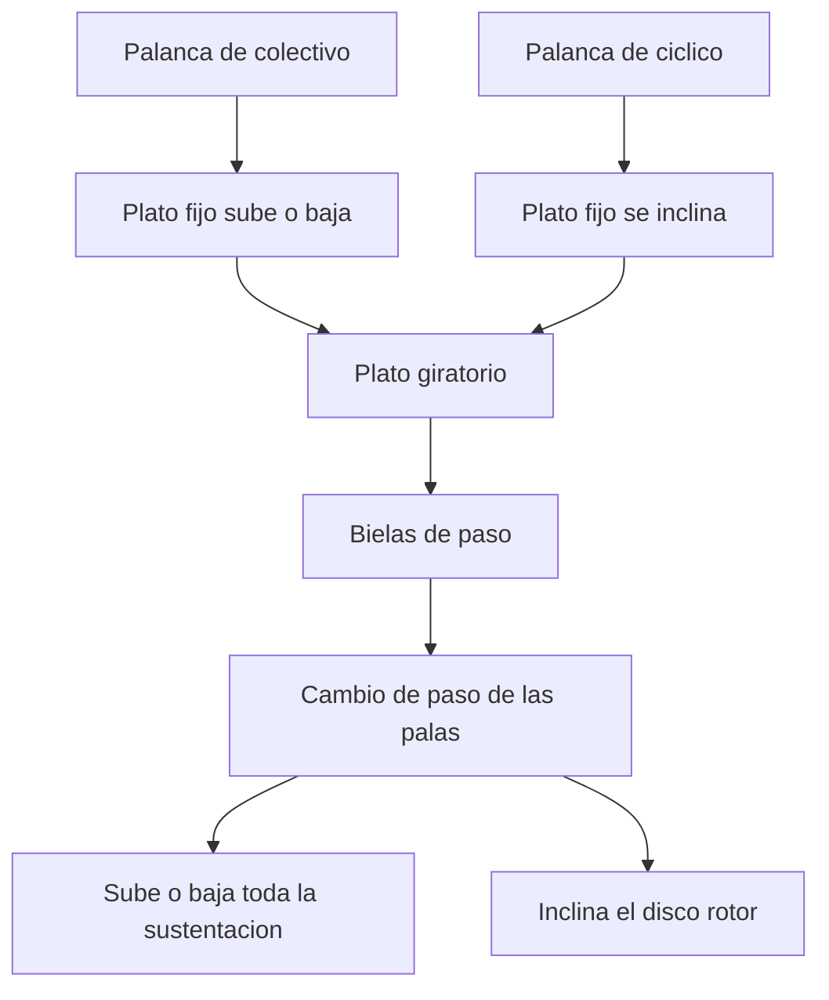
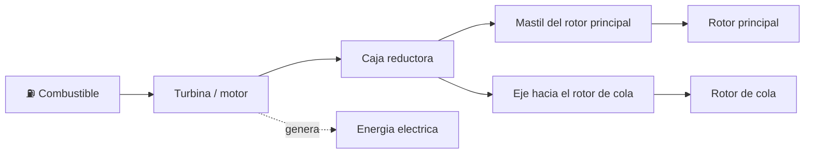

# 🔧 Sistemas mecanicos del helicoptero

[🏠 Inicio](../../../README.md) · [🚁 Curso: Helicopteros](../README.md) · 🔧 Sistemas mecanicos

Este modulo abre el helicoptero por dentro. Explica cada sistema, como funciona y
como se conecta con los demas. Es la base tecnica para entender los mandos
(Modulo 4) y la fisica del vuelo (Modulo 5).

---

## 1. 🚁 Rotor principal

El rotor principal es el corazon del helicoptero: sus palas giran como alas
rotatorias y generan la sustentacion que lo sostiene y la traccion que lo mueve.

- **Palas**: perfiles alares que, al girar y cortar el aire, producen sustentacion.
- **Paso de pala**: el angulo de ataque de cada pala; al aumentarlo, sube la
  sustentacion. Cambiar el paso es como acelerar o frenar la fuerza del rotor.
- **Cabeza del rotor**: articula las palas para que suban, bajen y cambien su paso.
- **Numero de palas**: mas palas dan marcha mas suave; menos palas, mas simpleza.

| Concepto del rotor | Funcion |
| --- | --- |
| Sustentacion | Fuerza hacia arriba que sostiene el helicoptero. |
| Traccion | Componente horizontal que lo desplaza al inclinar el disco. |
| Disco rotor | Plano imaginario que describen las puntas de las palas. |
| Paso colectivo | Cambia por igual el paso de todas las palas. |
| Paso ciclico | Cambia el paso de cada pala segun su posicion en el giro. |

---

## 2. 🌀 El par motor y su compensacion

Al hacer girar el rotor principal, el motor aplica un par sobre el fuselaje. Por
la ley de accion y reaccion, el fuselaje tiende a girar en sentido contrario al
rotor. Esa tendencia se llama par de reaccion o simplemente par, y hay que
compensarla o el helicoptero girara descontroladamente sobre si mismo.

- En la configuracion clasica, el **rotor de cola** genera un empuje lateral que
  contrarresta el par.
- En los **rotores en tandem**, los dos rotores giran en sentidos opuestos y sus
  pares se cancelan entre si, por lo que no hace falta rotor de cola.

---

## 3. 🪃 Rotor de cola

El rotor de cola es un rotor pequeno montado al final del fuselaje. Cumple dos
tareas: compensa el par del rotor principal y permite controlar la guinada (girar
la nariz a izquierda o derecha).

| Funcion del rotor de cola | Descripcion |
| --- | --- |
| Anti-par | Su empuje lateral evita que el fuselaje gire por el par del rotor. |
| Control de guinada | Variando su paso, la nariz gira a un lado u otro. |
| Enlace con pedales | Los pedales cambian el paso del rotor de cola. |

Si el rotor de cola falla, el helicoptero pierde el control de guinada; por eso su
transmision y su estado son criticos para la seguridad.

---

## 4. 🎛️ Plato ciclico (swashplate)

El plato ciclico es la pieza que traduce los movimientos de los mandos de la
cabina en cambios de paso de las palas mientras giran. Tiene dos partes:

- **Parte fija (no giratoria)**: recibe el movimiento de las palancas de
  colectivo y ciclico desde la cabina.
- **Parte giratoria**: gira con el rotor y transmite ese movimiento a cada pala a
  traves de bielas.

| Movimiento del plato | Mando que lo produce | Efecto en las palas |
| --- | --- | --- |
| Subir o bajar en bloque | Colectivo | Cambia el paso de todas por igual. |
| Inclinarse | Ciclico | Cambia el paso segun la posicion de cada pala. |

---

## 5. ⚙️ Transmision, caja reductora y motor

La turbina o motor entrega mucha potencia a alto regimen; la transmision la adapta
al giro mas lento que necesita el rotor.

| Componente | Funcion |
| --- | --- |
| Turbina de gas | Entrega gran potencia con poco peso; comun en helicopteros modernos. |
| Motor a piston | Alternativa en helicopteros ligeros de instruccion. |
| Caja reductora | Baja el regimen de la turbina al que necesita el rotor. |
| Mastil | Eje que sube la potencia al rotor principal. |
| Embrague / rueda libre | Permite la autorrotacion si el motor se detiene. |
| Eje de cola | Lleva potencia desde la caja al rotor de cola. |

---

## 6. 🎚️ Control de paso: colectivo, ciclico y pedales

El piloto no acelera ruedas: gobierna la fuerza y la direccion del rotor cambiando
el paso de las palas.

| Mando | Que cambia | Efecto |
| --- | --- | --- |
| Paso colectivo | Sube o baja el paso de todas las palas por igual | Mas o menos sustentacion; sube o baja el helicoptero. |
| Paso ciclico | Inclina el disco rotor variando el paso pala a pala | Traslada el helicoptero hacia donde se inclina el disco. |
| Pedales | Cambian el paso del rotor de cola | Giran la nariz a izquierda o derecha (guinada). |

- El **colectivo** suele llevar acoplado el mando de gas (giro tipo puno) para
  ajustar la potencia al variar el paso.
- El **ciclico** se maneja como una palanca central que inclina el disco rotor.
- Los **pedales** ajustan el anti-par y controlan la guinada.

---

## 7. 🍃 Autorrotacion y efecto suelo

Dos fenomenos propios del ala rotatoria que todo piloto debe entender.

- **Autorrotacion**: si el motor falla, el rotor no se detiene de golpe. Al
  descender, el flujo de aire que sube a traves del rotor lo mantiene girando, lo
  que permite un descenso controlado y un aterrizaje seguro sin potencia. La rueda
  libre desconecta el motor detenido para que el rotor gire libre.
- **Efecto suelo**: cerca del suelo, el aire que empuja el rotor forma un colchon
  que aumenta la sustentacion. Por eso el vuelo estacionario cuesta menos potencia
  cerca del terreno que en altura.

| Fenomeno | Cuando aparece | Efecto practico |
| --- | --- | --- |
| Autorrotacion | Fallo de motor en vuelo | Descenso seguro usando el flujo de aire. |
| Efecto suelo | Vuelo estacionario bajo | Mayor sustentacion, menos potencia. |

---

## 🔁 Como se conecta todo

1. La **turbina** genera potencia y la **caja reductora** la adapta.
2. El **rotor principal** convierte esa potencia en sustentacion y traccion.
3. El **plato ciclico** transmite los mandos a las palas mientras giran.
4. El **colectivo** regula la fuerza total y el **ciclico** inclina el disco.
5. El **rotor de cola** compensa el par y controla la guinada con los **pedales**.
6. La **autorrotacion** protege el descenso si falta el motor.

Con esto entendido, el [Modulo 4: Mandos](../mandos/manual-mandos-helicoptero.md)
muestra como el piloto opera cada uno de estos sistemas.

---

[⬅️ Anterior: Caracteristicas](caracteristicas-helicoptero.md) · [➡️ Siguiente: Mandos e instrumentos](../mandos/manual-mandos-helicoptero.md)
