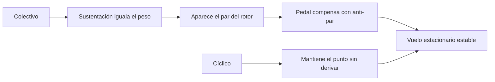

# 🧰 Recursos del helicóptero

[🏠 Inicio](../../../README.md) · [🚁 Curso: Helicópteros](../README.md) · 🧰 Recursos

Glosario específico, enlaces y diagramas de apoyo del curso de helicópteros.
Amplia el [glosario general](../../../docs/05-glosario-general.md).

---

## 📖 Glosario específico

| Término | Definición |
| --- | --- |
| Rotor principal | Conjunto de palas que genera la sustentación y la tracción. |
| Rotor de cola | Rotor pequeño que compensa el par y controla la guiñada. |
| Plato cíclico | Pieza que transmite los mandos a las palas mientras giran. |
| Paso colectivo | Cambio por igual del paso de todas las palas del rotor. |
| Paso cíclico | Cambio del paso pala a pala que inclina el disco rotor. |
| Anti-par | Fuerza que compensa el par del rotor sobre el fuselaje. |
| Autorrotación | Descenso seguro sin motor usando el flujo de aire por el rotor. |
| Efecto suelo | Aumento de sustentación al volar cerca del terreno. |
| Disimetría de sustentación | Diferencia de sustentación entre la pala que avanza y la que retrocede. |

---

## 🗺️ Diagrama de equilibrio del vuelo estacionario

---

## 🔗 Enlaces y fuentes

- Marco legal: [⚖️ docs/07-marco-legal-chile.md](../../../docs/07-marco-legal-chile.md)
- Registro de fuentes: [📚 manuales/fuentes.md](../../../manuales/fuentes.md)
- Autoridad aeronáutica (DGAC): ver el registro de fuentes.

Registrar cada recurso nuevo con su origen y licencia, siguiendo
[`recursos/README.md`](../../../recursos/README.md).

---

[🎓 Portada del curso](../README.md) · [⬅️ Anterior: Diseño de simulación](../simulacion/diseno-simulador-helicoptero.md)
