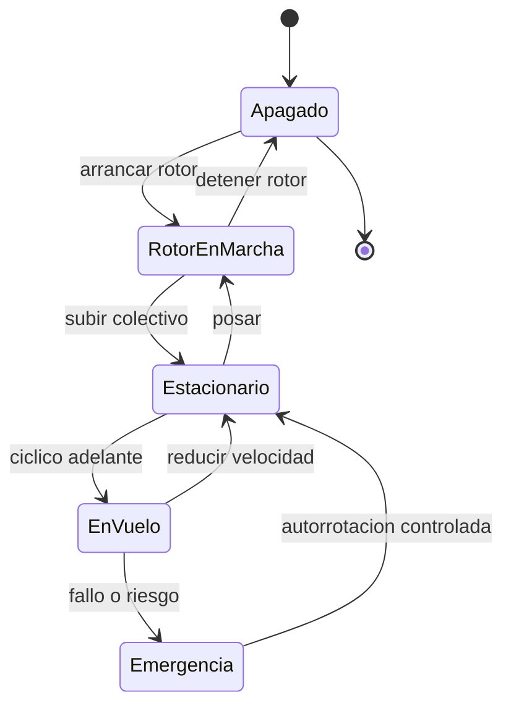

# 🎮 Diseno de simulacion del helicoptero

[🏠 Inicio](../../../README.md) · [🚁 Curso: Helicopteros](../README.md) · 🎮 Simulacion

## Objetivo de la simulacion

Que el usuario aprenda a arrancar el rotor, elevarse en vertical, mantener el
vuelo estacionario, trasladarse, compensar el par con los pedales y practicar la
autorrotacion, de forma segura y progresiva.

## Nivel de realismo

- Nivel elegido: se ofrece del 1 al 3 (ver `docs/03-niveles-de-realismo.md`).
- Justificacion: el helicoptero es un vehiculo avanzado porque exige coordinar
  colectivo, ciclico y pedales a la vez; conviene introducirlo tras dominar el
  avion pequeno.

## Variables principales

| Variable | Tipo | Rango | Afecta a | Comentarios |
| --- | --- | --- | --- | --- |
| Paso colectivo | numerica | 0-100% | Sustentacion total | Sube o baja el helicoptero. |
| Inclinacion del ciclico | numerica | -30..30 grados | Traslacion | Direccion del desplazamiento. |
| Pedal / anti-par | numerica | -100..100% | Guinada | Compensa el par del rotor. |
| Rotor RPM | numerica | 0-110% | Sustentacion y control | Debe mantenerse en rango. |
| Potencia del motor | numerica | 0-100% | Rotor RPM y sustentacion | Ligada al colectivo. |
| Densidad del aire | numerica | baja-alta | Sustentacion disponible | Baja con altura y calor. |
| Combustible/energia | numerica | 0-100% | Autonomia | Afecta peso y balance. |
| Peso del conjunto | numerica | fijo + carga | Inercia y potencia necesaria | Incluye carga externa. |

## Ciclo basico

1. Leer entrada del usuario (colectivo, ciclico, pedales, potencia).
2. Actualizar el rotor RPM y la potencia del motor.
3. Calcular fuerzas: sustentacion, peso, par, anti-par y traccion.
4. Aplicar restricciones del entorno (densidad del aire, viento, efecto suelo).
5. Actualizar posicion, altitud, actitud y guinada.
6. Refrescar instrumentos y retroalimentacion (sonido, vibracion, testigos).

## Modos de juego futuros

- Tutorial guiado de mandos y del vuelo estacionario.
- Practica libre de despegue y aterrizaje vertical.
- Misiones de rescate en montana y mar.
- Practica de autorrotacion ante fallo de motor.
- Extincion de incendios con carga externa de agua.

## Elementos fuera de alcance

- Maniobras acrobaticas peligrosas presentadas como recomendables.
- Reproduccion de vuelo temerario como objetivo del juego.
- Datos tecnicos que permitan alterar sistemas reales de un helicoptero.

## Pendientes

- [ ] Definir valores por defecto de cada variable por tipo de helicoptero.
- [ ] Prototipar el ciclo basico del vuelo estacionario en un motor simple.
- [ ] Ajustar el modelo de par y anti-par con la coordinacion de pedales.
- [ ] Agregar fuentes tecnicas publicas a [`manuales/fuentes.md`](../../../manuales/fuentes.md).

---

[⬅️ Anterior: Reglamentos](../reglamentos/reglamentos-helicoptero.md) · [➡️ Siguiente: Recursos](../recursos/recursos-helicoptero.md)
