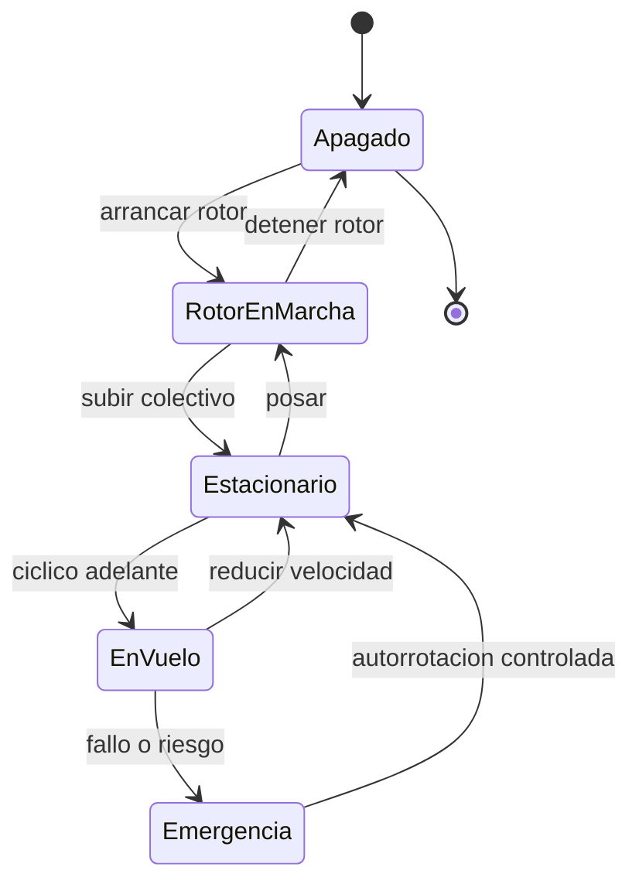

# 🎮 Diseño de simulación del helicóptero

[🏠 Inicio](../../../README.md) · [🚁 Curso: Helicópteros](../README.md) · 🎮 Simulación

## Objetivo de la simulación

Que el usuario aprenda a arrancar el rotor, elevarse en vertical, mantener el
vuelo estacionario, trasladarse, compensar el par con los pedales y practicar la
autorrotación, de forma segura y progresiva.

## Nivel de realismo

- Nivel elegido: se ofrece del 1 al 3 (ver `docs/03-niveles-de-realismo.md`).
- Justificación: el helicóptero es un vehículo avanzado porque exige coordinar
  colectivo, cíclico y pedales a la vez; conviene introducirlo tras dominar el
  avión pequeño.

## Variables principales

| Variable | Tipo | Rango | Afecta a | Comentarios |
| --- | --- | --- | --- | --- |
| Paso colectivo | numérica | 0-100% | Sustentación total | Sube o baja el helicóptero. |
| Inclinación del cíclico | numérica | -30..30 grados | Traslación | Dirección del desplazamiento. |
| Pedal / anti-par | numérica | -100..100% | Guiñada | Compensa el par del rotor. |
| Rotor RPM | numérica | 0-110% | Sustentación y control | Debe mantenerse en rango. |
| Potencia del motor | numérica | 0-100% | Rotor RPM y sustentación | Ligada al colectivo. |
| Densidad del aire | numérica | baja-alta | Sustentación disponible | Baja con altura y calor. |
| Combustible/energía | numérica | 0-100% | Autonomía | Afecta peso y balance. |
| Peso del conjunto | numérica | fijo + carga | Inercia y potencia necesaria | Incluye carga externa. |

## Ciclo básico

1. Leer entrada del usuario (colectivo, cíclico, pedales, potencia).
2. Actualizar el rotor RPM y la potencia del motor.
3. Calcular fuerzas: sustentación, peso, par, anti-par y tracción.
4. Aplicar restricciones del entorno (densidad del aire, viento, efecto suelo).
5. Actualizar posición, altitud, actitud y guiñada.
6. Refrescar instrumentos y retroalimentación (sonido, vibración, testigos).

## Modos de juego futuros

- Tutorial guiado de mandos y del vuelo estacionario.
- Práctica libre de despegue y aterrizaje vertical.
- Misiones de rescate en montaña y mar.
- Práctica de autorrotación ante fallo de motor.
- Extinción de incendios con carga externa de agua.

## Elementos fuera de alcance

- Maniobras acrobaticas peligrosas presentadas como recomendables.
- Reproducción de vuelo temerario como objetivo del juego.
- Datos técnicos que permitan alterar sistemas reales de un helicóptero.

## Pendientes

- [ ] Definir valores por defecto de cada variable por tipo de helicóptero.
- [ ] Prototipar el ciclo básico del vuelo estacionario en un motor simple.
- [ ] Ajustar el modelo de par y anti-par con la coordinación de pedales.
- [ ] Agregar fuentes técnicas públicas a [`manuales/fuentes.md`](../../../manuales/fuentes.md).

---

[⬅️ Anterior: Reglamentos](../reglamentos/reglamentos-helicoptero.md) · [➡️ Siguiente: Recursos](../recursos/recursos-helicoptero.md)
