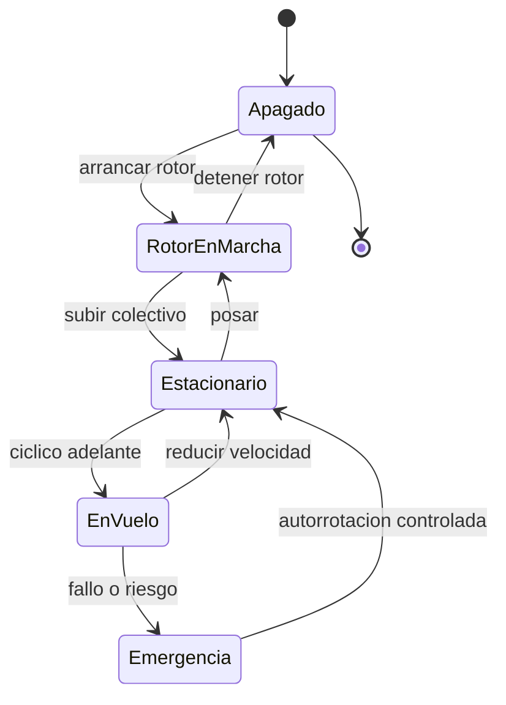
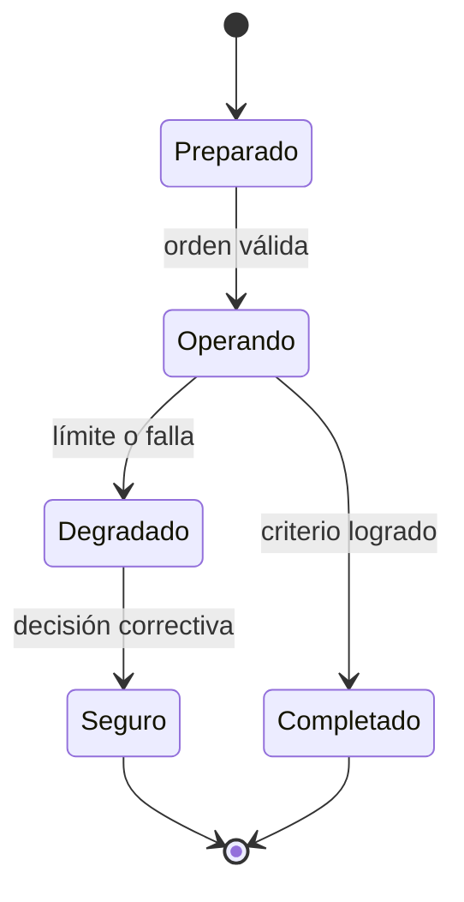

<!-- clase-meta
tipo_documento: clase
clase: 9
codigo: HELICOPTEROS-09
curso: helicopteros
titulo: "Diseño de simulación del helicóptero"
modalidad: "laboratorio de diseño"
duracion_minutos: 90
nivel: introductorio
prerrequisito: HELICOPTEROS-08
competencia: "modelado_de_simulacion"
resultados_aprendizaje:
  - "Explicar objetivo, variables, estados, ciclo y escenarios de simulación con vocabulario propio de Helicópteros."
  - "Aplicar esos conceptos a una decisión segura o a un escenario de simulación de Helicópteros."
evidencia: "Ficha de escenario y diagrama de estados."
criterio_aprobacion: "El modelo es específico de la máquina, medible, seguro y trazable a clases anteriores."
fuentes: manuales/fuentes.md
ultima_revision: 2026-09-10
-->

# 🎮 Diseño de simulación del helicóptero

[🏠 Inicio](../../../README.md) · [🚁 Curso: Helicópteros](../README.md) · 🎮 Simulación

```mermaid
stateDiagram-v2
    [*] --> Apagado
    Apagado --> RotorEnMarcha: arrancar rotor
    RotorEnMarcha --> Estacionario: subir colectivo
    Estacionario --> EnVuelo: ciclico adelante
    EnVuelo --> Estacionario: reducir velocidad
    Estacionario --> RotorEnMarcha: posar
    EnVuelo --> Emergencia: fallo o riesgo
    Emergencia --> Estacionario: autorrotacion controlada
    RotorEnMarcha --> Apagado: detener rotor
    Apagado --> [*]
```

## Objetivo de la simulación

Que el usuario aprenda a arrancar el rotor, elevarse en vertical, mantener el
vuelo estacionario, trasladarse, compensar el par con los pedales y practicar la
autorrotación, de forma segura y progresiva.

## Nivel de realismo

- Nivel elegido: se ofrece del 1 al 3 (ver `docs/03-niveles-de-realismo.md`).
- Justificación: el helicóptero es un vehículo avanzado porque exige coordinar
  colectivo, cíclico y pedales a la vez; conviene introducirlo tras dominar el
  avión pequeño.

## Variables principales

| Variable | Tipo | Rango | Afecta a | Comentarios |
| --- | --- | --- | --- | --- |
| Paso colectivo | numérica | 0-100% | Sustentación total | Sube o baja el helicóptero. |
| Inclinación del cíclico | numérica | -30..30 grados | Traslación | Dirección del desplazamiento. |
| Pedal / anti-par | numérica | -100..100% | Guiñada | Compensa el par del rotor. |
| Rotor RPM | numérica | 0-110% | Sustentación y control | Debe mantenerse en rango. |
| Potencia del motor | numérica | 0-100% | Rotor RPM y sustentación | Ligada al colectivo. |
| Densidad del aire | numérica | baja-alta | Sustentación disponible | Baja con altura y calor. |
| Combustible/energía | numérica | 0-100% | Autonomía | Afecta peso y balance. |
| Peso del conjunto | numérica | fijo + carga | Inercia y potencia necesaria | Incluye carga externa. |

## Ciclo básico

1. Leer entrada del usuario (colectivo, cíclico, pedales, potencia).
2. Actualizar el rotor RPM y la potencia del motor.
3. Calcular fuerzas: sustentación, peso, par, anti-par y tracción.
4. Aplicar restricciones del entorno (densidad del aire, viento, efecto suelo).
5. Actualizar posición, altitud, actitud y guiñada.
6. Refrescar instrumentos y retroalimentación (sonido, vibración, testigos).

## Modos de juego futuros

- Tutorial guiado de mandos y del vuelo estacionario.
- Práctica libre de despegue y aterrizaje vertical.
- Misiones de rescate en montaña y mar.
- Práctica de autorrotación ante fallo de motor.
- Extinción de incendios con carga externa de agua.

## Elementos fuera de alcance

- Maniobras acrobaticas peligrosas presentadas como recomendables.
- Reproducción de vuelo temerario como objetivo del juego.
- Datos técnicos que permitan alterar sistemas reales de un helicóptero.

## Pendientes

- [ ] Definir valores por defecto de cada variable por tipo de helicóptero.
- [ ] Prototipar el ciclo básico del vuelo estacionario en un motor simple.
- [ ] Ajustar el modelo de par y anti-par con la coordinación de pedales.
- [ ] Agregar fuentes técnicas públicas a [`manuales/fuentes.md`](../../../manuales/fuentes.md).

## 🧭 Guía de estudio aplicada

### Pregunta guía

¿Cómo ayuda **Objetivo de la simulación, Nivel de realismo, Variables principales y Ciclo básico** a **modelar vuelo estacionario fuera de efecto suelo con temperatura elevada como estados, variables y decisiones observables**?

### Explicación razonada

Una simulación de Helicópteros es educativa si representa decisiones y consecuencias. Como mínimo debe modelar el estado de motor, la respuesta de transmisión, la transición en rotor principal y el resultado en empuje y control. El escenario «vuelo estacionario fuera de efecto suelo con temperatura elevada» es valioso porque obliga a observar, formular una hipótesis, actuar y comprobar.

```mermaid
stateDiagram-v2
    [*] --> Preparado
    Preparado --> Operando: orden válida
    Operando --> Degradado: límite o falla
    Degradado --> Seguro: decisión correctiva
    Operando --> Completado: criterio logrado
    Seguro --> [*]
    Completado --> [*]
```

Esta clase se conecta con el resto del curso mediante **sustentación del rotor condicionada por paso colectivo, cíclico, potencia y rotor de cola**. El hilo de
seguridad consiste en reconocer a tiempo **déficit de potencia, pérdida de rpm o control de guiñada** y poder justificar la decisión
**comprobar potencia disponible y mantener una vía de escape antes del estacionario**; en clases posteriores cambiará el ángulo de análisis, no esa relación causal.
La lectura funcional común sigue **motor → transmisión → rotor principal → empuje y control**, de modo que cada concepto pueda
ubicarse dentro del funcionamiento completo y no quede como un dato aislado.

**Apoyo documental:** [Helicopter Flying Handbook](https://www.faa.gov/sites/faa.gov/files/helicopter_flying_handbook.pdf) aporta aerodinámica y control de helicópteros;
[Aviation Handbooks and Manuals](https://www.faa.gov/regulations_policies/handbooks_manuals) se usa para aerodinámica, sistemas y operación. Estas fuentes
se contrastan con el alcance de la clase y no sustituyen un manual de equipo concreto.

### Caso resuelto: de la observación a la decisión

1. **Estado inicial:** representa vuelo estacionario fuera de efecto suelo con temperatura elevada con valores observables para **motor**, **transmisión**, **rotor principal** y **empuje y control**.
2. **Decisión del estudiante:** ofrece una elección que cambie el estado, no una animación automática.
3. **Consecuencia:** modela la tendencia hacia **déficit de potencia, pérdida de rpm o control de guiñada** y una señal previa que permita corregir.
4. **Cierre:** evalúa la explicación de la decisión, además de si el estudiante “ganó” el escenario.

### Comprueba tu comprensión

1. ¿Qué cuatro estados mínimos necesita el escenario «vuelo estacionario fuera de efecto suelo con temperatura elevada»?
2. ¿Qué variable anticipa **déficit de potencia, pérdida de rpm o control de guiñada** antes de llegar al estado de falla?
3. ¿Cómo evaluarías la explicación del estudiante y no solo el resultado final?

Orientación para revisar tus respuestas

- La primera respuesta debe relacionar el eslabón elegido con un efecto posterior, no solo nombrarlo.
- La segunda debe proponer una señal medible u observable y explicar qué tendencia sería preocupante.
- La tercera debe cambiar al menos una variable de capacidad, mando, entorno o margen de seguridad.

## 🎓 Cierre de clase

- **Actividad:** Diseña un escenario educativo de Helicópteros basado en objetivo, variables, estados, ciclo y escenarios de simulación, con entradas, estados, variables y criterio de cierre.
- **Evidencia:** Ficha de escenario y diagrama de estados.
- **Criterio de aprobación:** El modelo es específico de la máquina, medible, seguro y trazable a clases anteriores.
- **Transferencia:** explica qué cambiaría al pasar a otra variante de esta máquina.

### Fuentes de esta clase

- [US-FAA-HELI](https://www.faa.gov/sites/faa.gov/files/helicopter_flying_handbook.pdf): Helicopter Flying Handbook, FAA. Uso: aerodinámica y control de helicópteros.
- [US-FAA-HANDBOOKS](https://www.faa.gov/regulations_policies/handbooks_manuals): Aviation Handbooks and Manuals, FAA. Uso: aerodinámica, sistemas y operación.
- [CL-DGAC](https://www.dgac.gob.cl/normativa/): Normativa aeronáutica, DGAC Chile. Uso: marco aeronáutico chileno.

> Las fuentes sostienen el marco conceptual y normativo; esta clase no reemplaza el manual
> del fabricante, la formación certificada ni la habilitación exigida para operar equipos reales.

---

[⬅️ Anterior: Reglamentos](../reglamentos/reglamentos-helicoptero.md) · [➡️ Siguiente: Recursos](../recursos/recursos-helicoptero.md)
