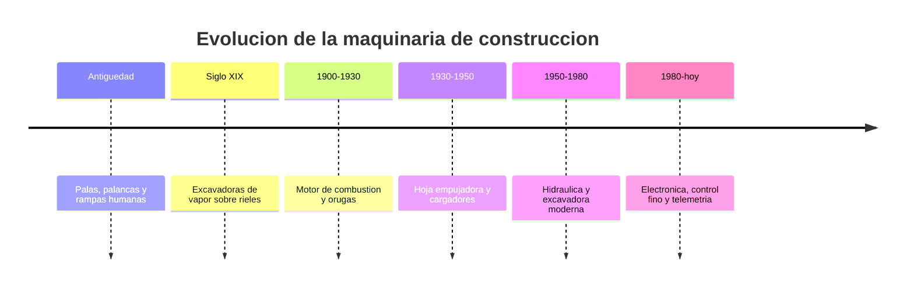

# 📜 Historia de la maquinaria de construcción

[🏠 Inicio](../../../README.md) · [🚧 Curso: Maquinaria de construcción](../README.md) · 📜 Historia

## Origen

Durante siglos, mover tierra dependio de la fuerza humana y animal con palas,
palancas y rampas. La mecanización comenzó en el siglo XIX con las excavadoras de
vapor montadas sobre rieles. El motor de combustión y las orugas las liberaron
del riel a comienzos del siglo XX, y la **hidráulica**, a mediados de siglo,
transformó por completo la excavadora al permitir mover el brazo y el cucharón
con fuerza y precisión.

## Línea de tiempo

| Periodo | Hito | Importancia |
| --- | --- | --- |
| Antiguedad | Palas, palancas y rampas | Movimiento de tierra manual. |
| Siglo XIX | Excavadoras de vapor sobre rieles | Primera mecanización pesada. |
| 1900-1930 | Combustión y orugas | Autonomía y movilidad en terreno. |
| 1930-1950 | Hoja empujadora y cargadores | Empuje y carga de material a escala. |
| 1950-1980 | Hidráulica y excavadora moderna | Fuerza y control fino del brazo. |
| 1980-presente | Electrónica y telemetría | Precisión, seguridad y gestión de flota. |

## Evolución tecnológica

- **Fuerza**: de la fuerza humana al vapor, la combustión y la hidráulica.
- **Movilidad**: del riel fijo a las orugas y los neumáticos.
- **Trabajo**: de cables y poleas a cilindros hidráulicos precisos.
- **Control**: de palancas mecánicas a joysticks electrohidraulicos.
- **Seguridad**: cabinas ROPS y FOPS, cámaras y sensores de zona.
- **Precisión**: guiado por GPS y control automático de la hoja o el cucharón.

## Tipos representativos

| Tipo | Uso típico | Característica destacada |
| --- | --- | --- |
| Excavadora | Excavación y zanjas | Brazo articulado y giro de 360 grados. |
| Cargador frontal | Carga de material | Cucharón frontal de gran volumen. |
| Bulldozer | Empuje y nivelación | Hoja empujadora y orugas. |
| Retroexcavadora | Obra mixta | Pala frontal y brazo trasero. |
| Motoniveladora | Terminación de caminos | Hoja central regulable. |
| Minicargador | Espacios reducidos | Compacto, muy maniobrable. |

## Impacto en la construcción e infraestructura

La maquinaria de construcción hizo posible la infraestructura moderna: caminos,
puentes, represas, minería y edificación a gran escala. Al mecanizar el
movimiento de tierra, multiplicó lo que un equipo puede hacer en un día y redujo
el esfuerzo humano en las tareas más pesadas. Su evolución sigue apuntando a la
precisión, la eficiencia de combustible y la seguridad de la faena.

## Fuentes

- Registrar aquí las fuentes públicas consultadas.
- Enlazar cada fuente también en [`manuales/fuentes.md`](../../../manuales/fuentes.md).

---

[🎓 Portada del curso](../README.md) · [➡️ Siguiente: Características](../operacion/caracteristicas-maquinaria.md)
