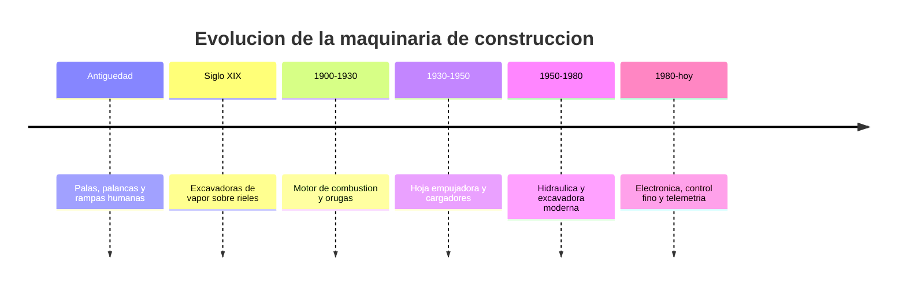

<!-- clase-meta
tipo_documento: clase
clase: 1
codigo: MAQUINARIACO-01
curso: maquinaria-construccion
titulo: "Historia de la maquinaria de construcción"
modalidad: "teórica dialogada"
duracion_minutos: 45
nivel: introductorio
prerrequisito: ninguno
competencia: "contexto_historico"
resultados_aprendizaje:
  - "Explicar origen, evolución tecnológica, variantes representativas e impacto con vocabulario propio de Maquinaria de construcción."
  - "Aplicar esos conceptos a una decisión segura o a un escenario de simulación de Maquinaria de construcción."
evidencia: "Línea de tiempo comentada con cuatro hitos o más."
criterio_aprobacion: "Los hitos están ordenados, son pertinentes y dos relaciones de causa y efecto quedan justificadas."
fuentes: manuales/fuentes.md
ultima_revision: 2026-09-10
-->

# 📜 Historia de la maquinaria de construcción

[🏠 Inicio](../../../README.md) · [🚧 Curso: Maquinaria de construcción](../README.md) · 📜 Historia

```mermaid
timeline
    title Evolucion de la maquinaria de construccion
    Antiguedad : Palas, palancas y rampas humanas
    Siglo XIX : Excavadoras de vapor sobre rieles
    1900-1930 : Motor de combustion y orugas
    1930-1950 : Hoja empujadora y cargadores
    1950-1980 : Hidraulica y excavadora moderna
    1980-hoy : Electronica, control fino y telemetria
```

## Origen

Durante siglos, mover tierra dependio de la fuerza humana y animal con palas,
palancas y rampas. La mecanización comenzó en el siglo XIX con las excavadoras de
vapor montadas sobre rieles. El motor de combustión y las orugas las liberaron
del riel a comienzos del siglo XX, y la **hidráulica**, a mediados de siglo,
transformó por completo la excavadora al permitir mover el brazo y el cucharón
con fuerza y precisión.

## Línea de tiempo

| Periodo | Hito | Importancia |
| --- | --- | --- |
| Antiguedad | Palas, palancas y rampas | Movimiento de tierra manual. |
| Siglo XIX | Excavadoras de vapor sobre rieles | Primera mecanización pesada. |
| 1900-1930 | Combustión y orugas | Autonomía y movilidad en terreno. |
| 1930-1950 | Hoja empujadora y cargadores | Empuje y carga de material a escala. |
| 1950-1980 | Hidráulica y excavadora moderna | Fuerza y control fino del brazo. |
| 1980-presente | Electrónica y telemetría | Precisión, seguridad y gestión de flota. |

## Evolución tecnológica

- **Fuerza**: de la fuerza humana al vapor, la combustión y la hidráulica.
- **Movilidad**: del riel fijo a las orugas y los neumáticos.
- **Trabajo**: de cables y poleas a cilindros hidráulicos precisos.
- **Control**: de palancas mecánicas a joysticks electrohidraulicos.
- **Seguridad**: cabinas ROPS y FOPS, cámaras y sensores de zona.
- **Precisión**: guiado por GPS y control automático de la hoja o el cucharón.

## Tipos representativos

| Tipo | Uso típico | Característica destacada |
| --- | --- | --- |
| Excavadora | Excavación y zanjas | Brazo articulado y giro de 360 grados. |
| Cargador frontal | Carga de material | Cucharón frontal de gran volumen. |
| Bulldozer | Empuje y nivelación | Hoja empujadora y orugas. |
| Retroexcavadora | Obra mixta | Pala frontal y brazo trasero. |
| Motoniveladora | Terminación de caminos | Hoja central regulable. |
| Minicargador | Espacios reducidos | Compacto, muy maniobrable. |

## Impacto en la construcción e infraestructura

La maquinaria de construcción hizo posible la infraestructura moderna: caminos,
puentes, represas, minería y edificación a gran escala. Al mecanizar el
movimiento de tierra, multiplicó lo que un equipo puede hacer en un día y redujo
el esfuerzo humano en las tareas más pesadas. Su evolución sigue apuntando a la
precisión, la eficiencia de combustible y la seguridad de la faena.

## 🧭 Guía de estudio aplicada

### Pregunta guía

¿Cómo ayuda **Origen, Línea de tiempo, Evolución tecnológica y Tipos representativos** a **explicar cómo la evolución hizo posibles alternativas como excavadora frente a cargador frontal**?

### Explicación razonada

La evolución de Maquinaria de construcción se comprende mejor como una sucesión de respuestas a problemas, no como una lista de fechas. Los cambios en motor, sistema hidráulico, implemento y suelo alteraron qué podía hacer la máquina, quién podía usarla y qué riesgos debían controlarse. El contraste «excavadora frente a cargador frontal» permite observar qué decisiones de diseño permanecieron y cuáles cambiaron con la tecnología y el propósito.

Esta clase se conecta con el resto del curso mediante **estabilidad dependiente del centro de gravedad, apoyo y reacción del terreno**. El hilo de
seguridad consiste en reconocer a tiempo **vuelco, colapso del borde o ingreso de terceros al radio de acción** y poder justificar la decisión
**evaluar terreno, zona de exclusión y posición antes de accionar el implemento**; en clases posteriores cambiará el ángulo de análisis, no esa relación causal.
La lectura funcional común sigue **motor → sistema hidráulico → implemento → suelo**, de modo que cada concepto pueda
ubicarse dentro del funcionamiento completo y no quede como un dato aislado.

**Apoyo documental:** [Construction Industry](https://www.osha.gov/construction) aporta maquinaria y seguridad de obra;
[Crane, Derrick and Hoist Safety](https://www.osha.gov/cranes-derricks) se usa para izaje, riesgos y controles. Estas fuentes
se contrastan con el alcance de la clase y no sustituyen un manual de equipo concreto.

### Caso resuelto: de la observación a la decisión

1. **Situar:** ordena los hitos que explican cómo se llegó a **excavadora frente a cargador frontal** y describe la necesidad que impulsó cada cambio.
2. **Relacionar:** explica qué se modificó en **motor**, **sistema hidráulico**, **implemento** o **suelo**; una fecha sin mecanismo no basta.
3. **Interpretar:** vincula el cambio con una capacidad nueva y también con el riesgo **vuelco, colapso del borde o ingreso de terceros al radio de acción**.
4. **Transferir:** usa la evolución para justificar por qué hoy conviene **evaluar terreno, zona de exclusión y posición antes de accionar el implemento**.

### Comprueba tu comprensión

1. ¿Qué necesidad histórica impulsó un cambio en **motor** o **sistema hidráulico**?
2. ¿Qué hito modificó la relación entre capacidad y **vuelco, colapso del borde o ingreso de terceros al radio de acción**?
3. ¿Por qué **excavadora frente a cargador frontal** no puede explicarse como una simple diferencia estética?

Orientación para revisar tus respuestas

- La primera respuesta debe relacionar el eslabón elegido con un efecto posterior, no solo nombrarlo.
- La segunda debe proponer una señal medible u observable y explicar qué tendencia sería preocupante.
- La tercera debe cambiar al menos una variable de capacidad, mando, entorno o margen de seguridad.

## 🎓 Cierre de clase

- **Actividad:** Construye una línea de tiempo de Maquinaria de construcción y explica cómo dos cambios históricos transformaron su función o su puesto de mando.
- **Evidencia:** Línea de tiempo comentada con cuatro hitos o más.
- **Criterio de aprobación:** Los hitos están ordenados, son pertinentes y dos relaciones de causa y efecto quedan justificadas.
- **Transferencia:** explica qué cambiaría al pasar a otra variante de esta máquina.

### Fuentes de esta clase

- [OSHA-CONSTRUCTION](https://www.osha.gov/construction): Construction Industry, OSHA. Uso: maquinaria y seguridad de obra.
- [OSHA-CRANES](https://www.osha.gov/cranes-derricks): Crane, Derrick and Hoist Safety, OSHA. Uso: izaje, riesgos y controles.

> Las fuentes sostienen el marco conceptual y normativo; esta clase no reemplaza el manual
> del fabricante, la formación certificada ni la habilitación exigida para operar equipos reales.

---

[🎓 Portada del curso](../README.md) · [➡️ Siguiente: Características](../operacion/caracteristicas-maquinaria.md)
