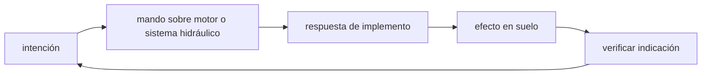

<!-- clase-meta
tipo_documento: clase
clase: 5
codigo: MAQUINARIACO-05
curso: maquinaria-construccion
titulo: "Mandos e instrumentos de la maquinaria de construcción"
modalidad: "taller de simulación"
duracion_minutos: 60
nivel: introductorio
prerrequisito: MAQUINARIACO-04
competencia: "lectura_y_mando"
resultados_aprendizaje:
  - "Explicar controles, instrumentos, entradas y estados del sistema con vocabulario propio de Maquinaria de construcción."
  - "Aplicar esos conceptos a una decisión segura o a un escenario de simulación de Maquinaria de construcción."
evidencia: "Mapa de mandos y resolución de dos estados del tablero."
criterio_aprobacion: "Reconoce los controles críticos y responde a los estados sin introducir acciones inseguras."
fuentes: manuales/fuentes.md
ultima_revision: 2026-09-10
-->

# 🎛️ Mandos e instrumentos de la maquinaria de construcción

[🏠 Inicio](../../../README.md) · [🚧 Curso: Maquinaria de construcción](../README.md) · 🎛️ Mandos

## Vista general

El puesto de mando de la maquinaria de construcción se organiza en torno a dos
**joysticks** que controlan el brazo, el cucharón y el giro, más pedales y
palancas para la traslación. A diferencia de un vehículo de transporte, aquí casi
todo el trabajo se hace con la máquina detenida y el foco está en coordinar los
movimientos hidráulicos. La cabina protege con estructuras ROPS y FOPS.

## Mapa de controles

| Zona | Control | Tipo | Función | Prioridad | Comentarios |
| --- | --- | --- | --- | --- | --- |
| Mano izquierda | Joystick izquierdo | Palanca proporcional | Giro y balancín | Alta | Combina rotación y acercar el brazo. |
| Mano derecha | Joystick derecho | Palanca proporcional | Pluma y cucharón | Alta | Sube el brazo y cierra el cucharón. |
| Pies | Pedales de traslación | Pedales o palancas | Mover cada oruga | Alta | Giro diferencial de la máquina. |
| Consola | Acelerador del motor | Dial o palanca | Fijar régimen de trabajo | Alta | Se mantiene constante en faena. |
| Consola | Bloqueo hidráulico | Palanca de seguridad | Anular los mandos | Alta | Se baja al subir o bajar de la cabina. |
| Consola | Herramienta auxiliar | Botón o rueda | Martillo, pinza u otra | Media | Según el implemento montado. |
| Cabina | Luces y bocina | Botones | Alumbrar y advertir | Media | Bocina y alarma de retroceso. |
| Cabina | Cámaras | Pantalla | Ver puntos ciegos | Media | Visión trasera y lateral. |

## Instrumentos principales

| Instrumento | Mide o muestra | Unidad | Importancia | Notas |
| --- | --- | --- | --- | --- |
| Tacómetro | Régimen del motor | rpm | Alta | Guía el régimen de trabajo. |
| Temperatura hidráulica | Calor del aceite | grados | Alta | El aceite caliente pierde eficacia. |
| Temperatura del motor | Calor del refrigerante | grados | Alta | Vigila el esfuerzo continuo. |
| Presión hidráulica | Empuje del sistema | bar | Alta | Fuerza disponible de trabajo. |
| Nivel de combustible | Diesel restante | fracción | Alta | Autonomía de la jornada. |
| Cuentahoras | Horas de trabajo | horas | Alta | Base del mantenimiento. |
| Testigos | Estado de sistemas | luz | Alta | Filtros, carga, freno, alertas. |

## Entradas de simulación

| Acción | Teclado | Controlador | Pantalla táctil | Comentarios |
| --- | --- | --- | --- | --- |
| Subir/bajar pluma | W / S | Stick derecho vertical | Deslizar vertical | Proporcional a lo desplazado. |
| Abrir/cerrar cucharón | A / D | Stick derecho horizontal | Deslizar horizontal | Llena y descarga el cucharón. |
| Acercar/alejar balancín | R / F | Stick izquierdo vertical | Deslizar vertical | Extiende y recoge el brazo. |
| Girar superestructura | Q / E | Stick izquierdo horizontal | Deslizar horizontal | Rota 360 grados. |
| Trasladar | Flechas | Gatillos | Botones de oruga | Giro diferencial. |
| Bloqueo hidráulico | Tecla L | Botón dedicado | Interruptor | Anula mandos al entrar o salir. |
| Herramienta auxiliar | Tecla T | Botón | Botón implemento | Martillo, pinza u otro. |

## Estados del sistema

| Estado | Descripción | Indicadores | Acciones disponibles |
| --- | --- | --- | --- |
| Apagado | Motor detenido | Tablero off | Encender, inspeccionar. |
| Preparado | Motor en marcha, mandos bloqueados | Bloqueo activo | Desbloquear para operar. |
| Trasladando | Moviendose por la faena | Traslación activa | Avanzar, girar, posicionar. |
| Trabajando | Excavando o empujando | Hidráulica en carga | Coordinar brazo, cucharón y giro. |
| Emergencia | Riesgo o falla | Testigos de alerta | Bloquear mandos, bajar carga, detener. |

## Observaciones ergonomicas

- Los dos joysticks deben responder de forma proporcional y previsible.
- El bloqueo hidráulico debe accionarse siempre al subir o bajar de la cabina.
- Las cámaras y espejos son esenciales por los grandes puntos ciegos.
- La interfaz de simulación debería advertir el acercamiento al límite de vuelco y
  la presencia de personas en el radio de giro.

## 🧭 Guía de estudio aplicada

### Pregunta guía

¿Cómo ayuda **Vista general, Mapa de controles, Instrumentos principales y Entradas de simulación** a **interpretar mandos e indicaciones durante excavación próxima a un borde con material cambiante**?

### Explicación razonada

Un mando no se aprende memorizando su nombre, sino recorriendo el ciclo intención → acción → indicación → verificación. En Maquinaria de construcción, el operador actúa sobre motor o sistema hidráulico, observa la respuesta en implemento y confirma el efecto en suelo. Una indicación inesperada exige detener la secuencia mental, identificar el modo activo y evitar una segunda orden que agrave el estado.

Esta clase se conecta con el resto del curso mediante **estabilidad dependiente del centro de gravedad, apoyo y reacción del terreno**. El hilo de
seguridad consiste en reconocer a tiempo **vuelco, colapso del borde o ingreso de terceros al radio de acción** y poder justificar la decisión
**evaluar terreno, zona de exclusión y posición antes de accionar el implemento**; en clases posteriores cambiará el ángulo de análisis, no esa relación causal.
La lectura funcional común sigue **motor → sistema hidráulico → implemento → suelo**, de modo que cada concepto pueda
ubicarse dentro del funcionamiento completo y no quede como un dato aislado.

**Apoyo documental:** [Construction Industry](https://www.osha.gov/construction) aporta maquinaria y seguridad de obra;
[Crane, Derrick and Hoist Safety](https://www.osha.gov/cranes-derricks) se usa para izaje, riesgos y controles. Estas fuentes
se contrastan con el alcance de la clase y no sustituyen un manual de equipo concreto.

### Caso resuelto: de la observación a la decisión

1. **Intención:** formula qué cambio se necesita durante **excavación próxima a un borde con material cambiante**.
2. **Mando:** identifica el control que actúa sobre **motor** o **sistema hidráulico** y el modo que debe estar activo.
3. **Lectura:** localiza la indicación que confirma la respuesta de **implemento** y el efecto en **suelo**.
4. **Verificación:** si la lectura no coincide, no acumules órdenes; estabiliza e investiga el estado.

### Comprueba tu comprensión

1. ¿Qué mando inicia la respuesta y qué instrumento confirma que el modo correcto está activo?
2. ¿Qué indicación temprana advertiría **vuelco, colapso del borde o ingreso de terceros al radio de acción**?
3. ¿Qué secuencia usarías si la respuesta de **suelo** no coincide con la orden?

Orientación para revisar tus respuestas

- La primera respuesta debe relacionar el eslabón elegido con un efecto posterior, no solo nombrarlo.
- La segunda debe proponer una señal medible u observable y explicar qué tendencia sería preocupante.
- La tercera debe cambiar al menos una variable de capacidad, mando, entorno o margen de seguridad.

## 🎓 Cierre de clase

- **Actividad:** Recorre el puesto de mando simulado de Maquinaria de construcción: localiza los controles de controles, instrumentos, entradas y estados del sistema y asocia cada indicación con una decisión.
- **Evidencia:** Mapa de mandos y resolución de dos estados del tablero.
- **Criterio de aprobación:** Reconoce los controles críticos y responde a los estados sin introducir acciones inseguras.
- **Transferencia:** explica qué cambiaría al pasar a otra variante de esta máquina.

### Fuentes de esta clase

- [OSHA-CONSTRUCTION](https://www.osha.gov/construction): Construction Industry, OSHA. Uso: maquinaria y seguridad de obra.
- [OSHA-CRANES](https://www.osha.gov/cranes-derricks): Crane, Derrick and Hoist Safety, OSHA. Uso: izaje, riesgos y controles.

> Las fuentes sostienen el marco conceptual y normativo; esta clase no reemplaza el manual
> del fabricante, la formación certificada ni la habilitación exigida para operar equipos reales.

---

[⬅️ Anterior: Sistemas mecánicos](../operacion/sistemas-mecanicos-maquinaria.md) · [➡️ Siguiente: Principios y operación](../operacion/principios-maquinaria.md)
