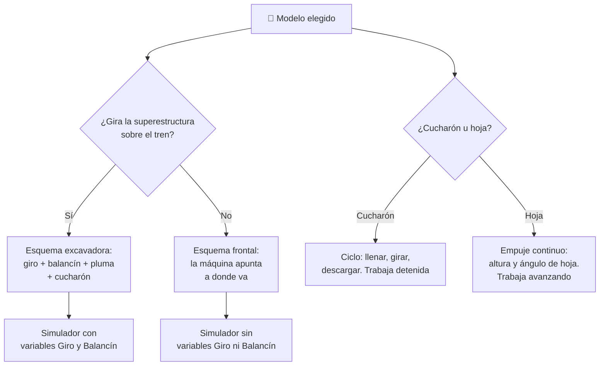

# 🧩 Modelos y variantes de la maquinaria de construcción

[🏠 Inicio](../../../README.md) · [🚧 Curso: Maquinaria de construcción](../README.md) · 🧩 Modelos

El [Módulo 2](../operacion/caracteristicas-maquinaria.md) ya dijo qué tipos de
máquina existen y para qué sirve cada uno. Este módulo responde a otra cosa: **no
todas se operan igual**, y aquí la diferencia no es de matiz. Cambia qué mandos
tiene la máquina y, por tanto, qué debe modelar el simulador.

> 🎯 **La idea que sostiene el módulo.** "La maquinaria de construcción" no es una
> sola máquina desde el punto de vista del mando. Un bulldozer no tiene giro de
> superestructura ni balancín: no es que los tenga más lentos, es que **no
> existen**. Un simulador que presente un solo esquema de control está
> representando una excavadora aunque diga representarlas todas.

---

## 🧭 Por qué el modelo decide el simulador

El [Módulo 5](../mandos/manual-mandos-maquinaria.md) describe un puesto de mando
con dos joysticks: el izquierdo hace **giro y balancín**, el derecho hace **pluma
y cucharón**. Y entre las entradas de simulación aparece "Girar superestructura
(Q / E), rota 360 grados". El [Módulo 9](../simulacion/diseno-simulador-maquinaria.md)
expone en coherencia con eso una variable `Giro` con rango `0-360 grados` y una
variable `Ángulo de balancín` con rango `0..150 grados`. Los tres describen la
misma máquina: una **excavadora**.

En un bulldozer no hay superestructura que rote sobre el tren de rodaje: la
máquina apunta a donde apuntan sus orugas. La entrada `Q / E` no controla nada, y
la variable `Giro` no tiene valores que tomar. Tampoco hay balancín que acercar o
alejar, porque no hay brazo articulado, sino una hoja colgada del frente. Si el
simulador se construye sobre el esquema de la excavadora y luego se le "añade" un
bulldozer, el resultado es un bulldozer que gira la cabina sin mover las orugas,
que no existe.

---

## 🗂️ Qué cambia en el manejo

| Modelo | Qué cambia al operarla |
| --- | --- |
| Excavadora | La referencia del curso: la máquina trabaja detenida y el ciclo es excavar, girar, descargar. El giro de 360 grados hace todo el transporte del material. |
| Cargador frontal | El material no se transporta girando, sino **conduciendo**: cargar, desplazarse hasta el camión, levantar y descargar. El desplazamiento pasa a ser parte del ciclo de trabajo. |
| Bulldozer | No hay ciclo de recogida: la máquina empuja avanzando con la hoja baja. La fuerza sale del agarre de las orugas, no del brazo. |
| Retroexcavadora | Dos frentes de trabajo en una máquina: pala frontal y brazo excavador atrás. El operador cambia de puesto y de lógica según el frente que use. |
| Motoniveladora | El trabajo es de precisión y en marcha continua: la hoja central corta y perfila mientras la máquina avanza, con el ángulo como variable fina. |
| Minicargador | Compacto y de giro sobre su eje por diferencia entre lados. Cambia de herramienta rápido, así que la misma máquina opera distinto según el implemento. |

---

## 🎛️ Qué cambia en el mando

| Modelo | Qué mando aparece o desaparece | Consecuencia |
| --- | --- | --- |
| Excavadora | Ninguno: el mapa de controles del Módulo 5 aplica tal cual. | Es el caso base del curso. |
| Cargador frontal | **Desaparecen** el giro de superestructura y el balancín. **Aparece** la dirección para conducir la máquina cargada. | El joystick izquierdo se queda sin sus dos funciones; la traslación deja de ser reposicionamiento y pasa a ser trabajo. |
| Bulldozer | **Desaparecen** el giro, el balancín y el cucharón. **Aparecen** los mandos de altura, ángulo e inclinación de la hoja, y el escarificador. | El mando derecho deja de cerrar una carga y pasa a fijar una profundidad de corte mientras la máquina avanza. |
| Retroexcavadora | **Se duplica** el puesto: mandos de pala frontal y mandos de brazo trasero, más los estabilizadores. | Un mismo modelo tiene dos mapas de control que no se usan a la vez. |
| Motoniveladora | **Desaparecen** el giro y el cucharón. **Aparece** un conjunto amplio de mandos de la hoja central (altura por lado, ángulo, desplazamiento lateral). | La coordinación deja de ser brazo-cucharón-giro y pasa a ser hoja-avance. |
| Minicargador | **Desaparece** el giro de superestructura. La traslación **se muda** a los mandos de mano y el implemento ocupa la entrada de herramienta auxiliar. | Ambas manos comparten traslación y trabajo; el mando cambia de significado con el implemento montado. |

---

## 🎮 Qué cambia en el simulador

Contrastado con las variables del
[Módulo 9](../simulacion/diseno-simulador-maquinaria.md):

| Modelo | Variables que cambian | Esquema de control |
| --- | --- | --- |
| Excavadora | Ninguna: es el caso base. | El del Módulo 5. |
| Cargador frontal | `Giro` y `Ángulo de balancín` **se eliminan**. `Traslación` deja de ser reposicionamiento y entra en el cálculo de la carga. `Alcance` queda casi fijo, definido por el brazo del cucharón. | Sin entrada de giro ni de balancín; con dirección. |
| Bulldozer | `Giro`, `Ángulo de balancín` y `Llenado del cucharón` **se eliminan**. `Ángulo de pluma` **se sustituye** por altura y ángulo de la hoja. `Pendiente del terreno` y `Traslación` pasan al centro: son la fuerza de empuje. | Sin brazo articulado; hoja más avance. |
| Retroexcavadora | Ninguna se elimina, pero `Giro` y `Alcance` **solo tienen sentido** en el frente trasero. El conjunto de variables activas cambia según el puesto. | Dos esquemas alternados en la misma máquina. |
| Motoniveladora | `Giro`, `Ángulo de balancín` y `Llenado del cucharón` **se eliminan**. Aparece el ángulo de la hoja como variable fina, y `Traslación` se vuelve continua durante el trabajo. | Hoja central más avance sostenido. |
| Minicargador | `Giro` **se elimina**. `Traslación` gobierna también la orientación (giro sobre el eje por diferencia entre lados). `Llenado del cucharón` depende del implemento montado. | Traslación y trabajo compartiendo las manos. |

`Presión hidráulica` es la única variable que ninguna variante pierde: todas
mueven su herramienta con aceite a presión, como explica el
[Módulo 4](../operacion/sistemas-mecanicos-maquinaria.md).

---

## 🗺️ Del modelo al esquema de control

---

## ⚠️ Qué modelos no comparten simulador

Tres familias no se resuelven con un ajuste de parámetros, porque su esquema de
control es otro:

- **El bulldozer y la motoniveladora** frente a la excavadora: pierden tres
  entradas (giro, balancín, cucharón) y ganan un grupo de mandos de hoja que no
  tiene equivalente. Además cambia el supuesto de fondo: no trabajan detenidas.
  Es un modo de control distinto, no una dificultad distinta.
- **El cargador frontal y el minicargador** frente a la excavadora: la traslación
  deja de ser un traslado entre tareas y se convierte en la tarea. El modelo de
  estabilidad tiene que contemplar la máquina en movimiento con carga alta.
- **La retroexcavadora** frente a todas: no necesita variables nuevas, necesita
  que el simulador sepa que un mismo vehículo tiene dos puestos de mando y que
  solo uno está activo a la vez.

El resto de diferencias sí caben en un mismo simulador ajustando rangos, tal como
plantean los [niveles de realismo](../../../docs/03-niveles-de-realismo.md): en
el nivel 1 la tarea se reduce a mover la herramienta y las variantes casi se
tocan, y las diferencias emergen a medida que el nivel sube. El
[Módulo 9](../simulacion/diseno-simulador-maquinaria.md) ya lo anota como
pendiente: definir los valores por defecto de cada variable **por tipo de
máquina**. Este módulo dice por qué esa tarea no es solo rellenar una tabla.

---

[⬅️ Anterior: Características](../operacion/caracteristicas-maquinaria.md) · [➡️ Siguiente: Sistemas mecánicos](../operacion/sistemas-mecanicos-maquinaria.md)
