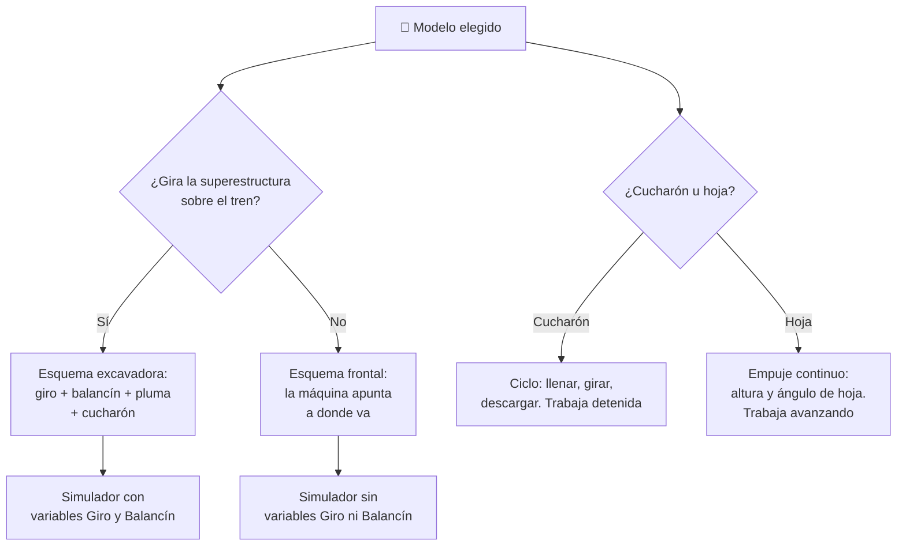

<!-- clase-meta
tipo_documento: clase
clase: 3
codigo: MAQUINARIACO-03
curso: maquinaria-construccion
titulo: "Modelos y variantes de la maquinaria de construcción"
modalidad: "comparativa guiada"
duracion_minutos: 60
nivel: introductorio
prerrequisito: MAQUINARIACO-02
competencia: "seleccion_de_configuracion"
resultados_aprendizaje:
  - "Explicar manejo, arquitectura de mandos y variables de simulación con vocabulario propio de Maquinaria de construcción."
  - "Aplicar esos conceptos a una decisión segura o a un escenario de simulación de Maquinaria de construcción."
evidencia: "Matriz comparativa y decisión justificada."
criterio_aprobacion: "La elección considera función, límites, mando y efecto en la simulación; no se apoya solo en preferencias."
fuentes: manuales/fuentes.md
ultima_revision: 2026-09-10
-->

# 🧩 Modelos y variantes de la maquinaria de construcción

[🏠 Inicio](../../../README.md) · [🚧 Curso: Maquinaria de construcción](../README.md) · 🧩 Modelos

El [Clase 2](../operacion/caracteristicas-maquinaria.md) ya dijo qué tipos de
máquina existen y para qué sirve cada uno. Esta clase responde a otra cosa: **no
todas se operan igual**, y aquí la diferencia no es de matiz. Cambia qué mandos
tiene la máquina y, por tanto, qué debe modelar el simulador.

> 🎯 **La idea que sostiene el módulo.** "La maquinaria de construcción" no es una
> sola máquina desde el punto de vista del mando. Un bulldozer no tiene giro de
> superestructura ni balancín: no es que los tenga más lentos, es que **no
> existen**. Un simulador que presente un solo esquema de control está
> representando una excavadora aunque diga representarlas todas.

---

## 🧭 Por qué el modelo decide el simulador

El [Clase 5](../mandos/manual-mandos-maquinaria.md) describe un puesto de mando
con dos joysticks: el izquierdo hace **giro y balancín**, el derecho hace **pluma
y cucharón**. Y entre las entradas de simulación aparece "Girar superestructura
(Q / E), rota 360 grados". El [Clase 9](../simulacion/diseno-simulador-maquinaria.md)
expone en coherencia con eso una variable `Giro` con rango `0-360 grados` y una
variable `Ángulo de balancín` con rango `0..150 grados`. Los tres describen la
misma máquina: una **excavadora**.

En un bulldozer no hay superestructura que rote sobre el tren de rodaje: la
máquina apunta a donde apuntan sus orugas. La entrada `Q / E` no controla nada, y
la variable `Giro` no tiene valores que tomar. Tampoco hay balancín que acercar o
alejar, porque no hay brazo articulado, sino una hoja colgada del frente. Si el
simulador se construye sobre el esquema de la excavadora y luego se le "añade" un
bulldozer, el resultado es un bulldozer que gira la cabina sin mover las orugas,
que no existe.

---

## 🗂️ Qué cambia en el manejo

| Modelo | Qué cambia al operarla |
| --- | --- |
| Excavadora | La referencia del curso: la máquina trabaja detenida y el ciclo es excavar, girar, descargar. El giro de 360 grados hace todo el transporte del material. |
| Cargador frontal | El material no se transporta girando, sino **conduciendo**: cargar, desplazarse hasta el camión, levantar y descargar. El desplazamiento pasa a ser parte del ciclo de trabajo. |
| Bulldozer | No hay ciclo de recogida: la máquina empuja avanzando con la hoja baja. La fuerza sale del agarre de las orugas, no del brazo. |
| Retroexcavadora | Dos frentes de trabajo en una máquina: pala frontal y brazo excavador atrás. El operador cambia de puesto y de lógica según el frente que use. |
| Motoniveladora | El trabajo es de precisión y en marcha continua: la hoja central corta y perfila mientras la máquina avanza, con el ángulo como variable fina. |
| Minicargador | Compacto y de giro sobre su eje por diferencia entre lados. Cambia de herramienta rápido, así que la misma máquina opera distinto según el implemento. |

---

## 🎛️ Qué cambia en el mando

| Modelo | Qué mando aparece o desaparece | Consecuencia |
| --- | --- | --- |
| Excavadora | Ninguno: el mapa de controles del Clase 5 aplica tal cual. | Es el caso base del curso. |
| Cargador frontal | **Desaparecen** el giro de superestructura y el balancín. **Aparece** la dirección para conducir la máquina cargada. | El joystick izquierdo se queda sin sus dos funciones; la traslación deja de ser reposicionamiento y pasa a ser trabajo. |
| Bulldozer | **Desaparecen** el giro, el balancín y el cucharón. **Aparecen** los mandos de altura, ángulo e inclinación de la hoja, y el escarificador. | El mando derecho deja de cerrar una carga y pasa a fijar una profundidad de corte mientras la máquina avanza. |
| Retroexcavadora | **Se duplica** el puesto: mandos de pala frontal y mandos de brazo trasero, más los estabilizadores. | Un mismo modelo tiene dos mapas de control que no se usan a la vez. |
| Motoniveladora | **Desaparecen** el giro y el cucharón. **Aparece** un conjunto amplio de mandos de la hoja central (altura por lado, ángulo, desplazamiento lateral). | La coordinación deja de ser brazo-cucharón-giro y pasa a ser hoja-avance. |
| Minicargador | **Desaparece** el giro de superestructura. La traslación **se muda** a los mandos de mano y el implemento ocupa la entrada de herramienta auxiliar. | Ambas manos comparten traslación y trabajo; el mando cambia de significado con el implemento montado. |

---

## 🎮 Qué cambia en el simulador

Contrastado con las variables del
[Clase 9](../simulacion/diseno-simulador-maquinaria.md):

| Modelo | Variables que cambian | Esquema de control |
| --- | --- | --- |
| Excavadora | Ninguna: es el caso base. | El del Clase 5. |
| Cargador frontal | `Giro` y `Ángulo de balancín` **se eliminan**. `Traslación` deja de ser reposicionamiento y entra en el cálculo de la carga. `Alcance` queda casi fijo, definido por el brazo del cucharón. | Sin entrada de giro ni de balancín; con dirección. |
| Bulldozer | `Giro`, `Ángulo de balancín` y `Llenado del cucharón` **se eliminan**. `Ángulo de pluma` **se sustituye** por altura y ángulo de la hoja. `Pendiente del terreno` y `Traslación` pasan al centro: son la fuerza de empuje. | Sin brazo articulado; hoja más avance. |
| Retroexcavadora | Ninguna se elimina, pero `Giro` y `Alcance` **solo tienen sentido** en el frente trasero. El conjunto de variables activas cambia según el puesto. | Dos esquemas alternados en la misma máquina. |
| Motoniveladora | `Giro`, `Ángulo de balancín` y `Llenado del cucharón` **se eliminan**. Aparece el ángulo de la hoja como variable fina, y `Traslación` se vuelve continua durante el trabajo. | Hoja central más avance sostenido. |
| Minicargador | `Giro` **se elimina**. `Traslación` gobierna también la orientación (giro sobre el eje por diferencia entre lados). `Llenado del cucharón` depende del implemento montado. | Traslación y trabajo compartiendo las manos. |

`Presión hidráulica` es la única variable que ninguna variante pierde: todas
mueven su herramienta con aceite a presión, como explica el
[Clase 4](../operacion/sistemas-mecanicos-maquinaria.md).

---

## 🗺️ Del modelo al esquema de control

```mermaid
flowchart TD
    Modelo[🧩 Modelo elegido] --> Giro{¿Gira la superestructura<br/>sobre el tren?}
    Giro -- Sí --> Excav[Esquema excavadora:<br/>giro + balancín + pluma<br/>+ cucharón]
    Giro -- No --> Frontal[Esquema frontal:<br/>la máquina apunta<br/>a donde va]
    Excav --> Var1[Simulador con<br/>variables Giro y Balancín]
    Frontal --> Var2[Simulador sin<br/>variables Giro ni Balancín]
    Modelo --> Herr{¿Cucharón u hoja?}
    Herr -- Cucharón --> Ciclo[Ciclo: llenar, girar,<br/>descargar. Trabaja detenida]
    Herr -- Hoja --> Empuje[Empuje continuo:<br/>altura y ángulo de hoja.<br/>Trabaja avanzando]
```

---

## ⚠️ Qué modelos no comparten simulador

Tres familias no se resuelven con un ajuste de parámetros, porque su esquema de
control es otro:

- **El bulldozer y la motoniveladora** frente a la excavadora: pierden tres
  entradas (giro, balancín, cucharón) y ganan un grupo de mandos de hoja que no
  tiene equivalente. Además cambia el supuesto de fondo: no trabajan detenidas.
  Es un modo de control distinto, no una dificultad distinta.
- **El cargador frontal y el minicargador** frente a la excavadora: la traslación
  deja de ser un traslado entre tareas y se convierte en la tarea. El modelo de
  estabilidad tiene que contemplar la máquina en movimiento con carga alta.
- **La retroexcavadora** frente a todas: no necesita variables nuevas, necesita
  que el simulador sepa que un mismo vehículo tiene dos puestos de mando y que
  solo uno está activo a la vez.

El resto de diferencias sí caben en un mismo simulador ajustando rangos, tal como
plantean los [niveles de realismo](../../../docs/03-niveles-de-realismo.md): en
el nivel 1 la tarea se reduce a mover la herramienta y las variantes casi se
tocan, y las diferencias emergen a medida que el nivel sube. El
[Clase 9](../simulacion/diseno-simulador-maquinaria.md) ya lo anota como
pendiente: definir los valores por defecto de cada variable **por tipo de
máquina**. Esta clase dice por qué esa tarea no es solo rellenar una tabla.

> ⚖️ **El principio detrás de todo esto.** Cuánto pesa la carga y dónde va no cambia
> solo los números: cambia qué puede hacer el operador. La física común a todas las
> máquinas del catálogo —sostener, girar, equilibrar y la masa que cambia en
> marcha— está en [⚖️ carga y manejo](../../../docs/09-carga-y-manejo.md).

## 🧭 Guía de estudio aplicada

### Pregunta guía

¿Cómo ayuda **Por qué el modelo decide el simulador, Qué cambia en el manejo, Qué cambia en el mando y Qué cambia en el simulador** a **comparar excavadora frente a cargador frontal frente al mismo encargo**?

### Explicación razonada

Las variantes «excavadora frente a cargador frontal» resuelven prioridades distintas. Una comparación profesional sigue la cadena motor → sistema hidráulico → implemento → suelo: cada cambio de arquitectura modifica mandos, respuesta, mantenimiento y variables que una simulación debe representar. Elegir un modelo significa justificar qué compromiso sirve mejor al caso, no declarar un favorito.

Esta clase se conecta con el resto del curso mediante **estabilidad dependiente del centro de gravedad, apoyo y reacción del terreno**. El hilo de
seguridad consiste en reconocer a tiempo **vuelco, colapso del borde o ingreso de terceros al radio de acción** y poder justificar la decisión
**evaluar terreno, zona de exclusión y posición antes de accionar el implemento**; en clases posteriores cambiará el ángulo de análisis, no esa relación causal.
La lectura funcional común sigue **motor → sistema hidráulico → implemento → suelo**, de modo que cada concepto pueda
ubicarse dentro del funcionamiento completo y no quede como un dato aislado.

**Apoyo documental:** [Construction Industry](https://www.osha.gov/construction) aporta maquinaria y seguridad de obra;
[Crane, Derrick and Hoist Safety](https://www.osha.gov/cranes-derricks) se usa para izaje, riesgos y controles. Estas fuentes
se contrastan con el alcance de la clase y no sustituyen un manual de equipo concreto.

### Caso resuelto: de la observación a la decisión

1. **Mantener el encargo constante:** ambas variantes deben evaluarse ante **excavación próxima a un borde con material cambiante**.
2. **Trazar consecuencias:** para cada variante sigue el efecto desde **motor** hasta **suelo**.
3. **Comparar el puesto de mando:** determina qué debe percibir y controlar el operador en cada arquitectura.
4. **Justificar:** elige una variante y explica qué sacrifica; toda selección técnica contiene un compromiso.

### Comprueba tu comprensión

1. ¿Qué cambia en la cadena **motor → sistema hidráulico → implemento → suelo** entre las dos variantes?
2. ¿Qué indicación o mando adicional necesitaría una de ellas?
3. ¿Cuál elegirías para «excavación próxima a un borde con material cambiante» y qué desventaja aceptarías?

Orientación para revisar tus respuestas

- La primera respuesta debe relacionar el eslabón elegido con un efecto posterior, no solo nombrarlo.
- La segunda debe proponer una señal medible u observable y explicar qué tendencia sería preocupante.
- La tercera debe cambiar al menos una variable de capacidad, mando, entorno o margen de seguridad.

## 🎓 Cierre de clase

- **Actividad:** Compara variantes de Maquinaria de construcción mediante los ejes «manejo, arquitectura de mandos y variables de simulación» y elige una para un caso de uso razonado.
- **Evidencia:** Matriz comparativa y decisión justificada.
- **Criterio de aprobación:** La elección considera función, límites, mando y efecto en la simulación; no se apoya solo en preferencias.
- **Transferencia:** explica qué cambiaría al pasar a otra variante de esta máquina.

### Fuentes de esta clase

- [OSHA-CONSTRUCTION](https://www.osha.gov/construction): Construction Industry, OSHA. Uso: maquinaria y seguridad de obra.
- [OSHA-CRANES](https://www.osha.gov/cranes-derricks): Crane, Derrick and Hoist Safety, OSHA. Uso: izaje, riesgos y controles.

> Las fuentes sostienen el marco conceptual y normativo; esta clase no reemplaza el manual
> del fabricante, la formación certificada ni la habilitación exigida para operar equipos reales.

---

[⬅️ Anterior: Características](../operacion/caracteristicas-maquinaria.md) · [➡️ Siguiente: Sistemas mecánicos](../operacion/sistemas-mecanicos-maquinaria.md)
