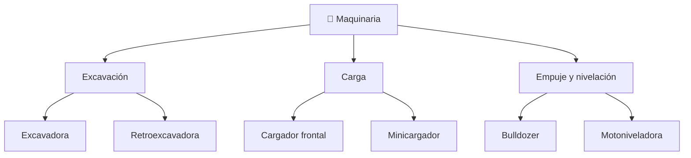

# 📋 Características funcionales de la maquinaria de construcción

[🏠 Inicio](../../../README.md) · [🚧 Curso: Maquinaria de construcción](../README.md) · 📋 Características

Que es la maquinaria de construcción, que tipos existen y para que sirve cada
uno. Este módulo da el contexto antes de abrir la mecánica (Módulo 3).

---

## 🧭 Definición

La maquinaria de construcción es un conjunto de máquinas automotrices disenadas
para mover, excavar, empujar, cargar y nivelar tierra y material. A diferencia de
un vehículo de transporte, su objetivo no es desplazarse sino **trabajar el
terreno**. Casi toda usa hidráulica de alta presión para accionar brazos,
cucharones y hojas, y se desplaza sobre orugas o neumáticos según el terreno.

---

## 🧬 Características clave

| Característica | Descripción |
| --- | --- |
| Hidráulica de trabajo | Cilindros y motores mueven las herramientas con gran fuerza. |
| Herramienta de trabajo | Cucharón, hoja o pala según la máquina y la labor. |
| Orugas o neumáticos | Las orugas dan agarre y reparten peso; los neumáticos, velocidad. |
| Estabilidad | La carga y el alcance pueden acercar la máquina al vuelco. |
| Baja velocidad | Prioriza fuerza y control, no desplazamiento rápido. |
| Robustez | Estructura pesada para resistir esfuerzos y golpes. |

---

## 🗂️ Tipos de máquina

| Tipo | Uso típico | Rasgo destacado |
| --- | --- | --- |
| Excavadora | Excavación y zanjas | Brazo articulado, giro de 360 grados. |
| Cargador frontal | Carga de material a camión | Cucharón frontal de gran volumen. |
| Bulldozer | Empuje y desmonte | Hoja empujadora, orugas de mucho agarre. |
| Retroexcavadora | Obra mixta y urbana | Pala frontal y brazo excavador atrás. |
| Motoniveladora | Terminación de caminos | Hoja central de ángulo regulable. |
| Minicargador | Espacios reducidos | Compacto, cambia de herramienta rápido. |

---

## 🎯 Para qué se usa

- Excavación de zanjas, fundaciones y piscinas.
- Carga de tierra, árido y mineral sobre camiones.
- Empuje y desmonte de terreno para nivelar.
- Terminación y perfilado de caminos y explanadas.
- Demolición y manejo de escombros con herramientas especiales.

---

[⬅️ Anterior: Historia](../historia/historia-maquinaria.md) · [➡️ Siguiente: Sistemas mecánicos](sistemas-mecanicos-maquinaria.md)
