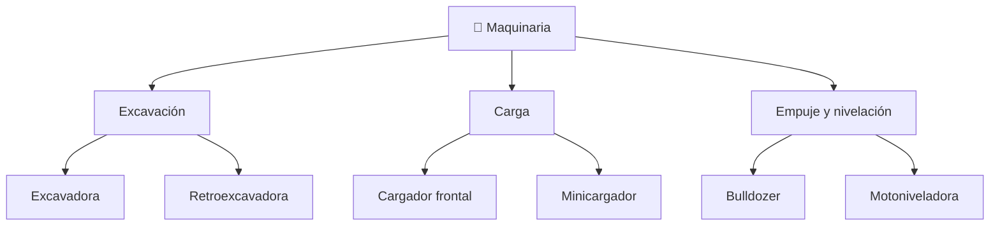

<!-- clase-meta
tipo_documento: clase
clase: 2
codigo: MAQUINARIACO-02
curso: maquinaria-construccion
titulo: "Características funcionales de la maquinaria de construcción"
modalidad: "teórica aplicada"
duracion_minutos: 45
nivel: introductorio
prerrequisito: MAQUINARIACO-01
competencia: "identificacion_funcional"
resultados_aprendizaje:
  - "Explicar definición, rasgos funcionales, tipos y usos con vocabulario propio de Maquinaria de construcción."
  - "Aplicar esos conceptos a una decisión segura o a un escenario de simulación de Maquinaria de construcción."
evidencia: "Matriz comparativa y decisión justificada."
criterio_aprobacion: "La elección considera función, límites, mando y efecto en la simulación; no se apoya solo en preferencias."
fuentes: manuales/fuentes.md
ultima_revision: 2026-09-10
-->

# 📋 Características funcionales de la maquinaria de construcción

[🏠 Inicio](../../../README.md) · [🚧 Curso: Maquinaria de construcción](../README.md) · 📋 Características

Que es la maquinaria de construcción, que tipos existen y para que sirve cada
uno. Esta clase da el contexto antes de abrir la mecánica (Clase 4).

---

## 🧭 Definición

La maquinaria de construcción es un conjunto de máquinas automotrices disenadas
para mover, excavar, empujar, cargar y nivelar tierra y material. A diferencia de
un vehículo de transporte, su objetivo no es desplazarse sino **trabajar el
terreno**. Casi toda usa hidráulica de alta presión para accionar brazos,
cucharones y hojas, y se desplaza sobre orugas o neumáticos según el terreno.

---

## 🧬 Características clave

| Característica | Descripción |
| --- | --- |
| Hidráulica de trabajo | Cilindros y motores mueven las herramientas con gran fuerza. |
| Herramienta de trabajo | Cucharón, hoja o pala según la máquina y la labor. |
| Orugas o neumáticos | Las orugas dan agarre y reparten peso; los neumáticos, velocidad. |
| Estabilidad | La carga y el alcance pueden acercar la máquina al vuelco. |
| Baja velocidad | Prioriza fuerza y control, no desplazamiento rápido. |
| Robustez | Estructura pesada para resistir esfuerzos y golpes. |

---

## 🗂️ Tipos de máquina

```mermaid
flowchart TD
    Maquina[🚧 Maquinaria] --> Excava[Excavación]
    Maquina --> Carga[Carga]
    Maquina --> Empuje[Empuje y nivelación]
    Excava --> Excavadora[Excavadora]
    Excava --> Retro[Retroexcavadora]
    Carga --> Cargador[Cargador frontal]
    Carga --> Mini[Minicargador]
    Empuje --> Bulldozer[Bulldozer]
    Empuje --> Moto[Motoniveladora]
```

| Tipo | Uso típico | Rasgo destacado |
| --- | --- | --- |
| Excavadora | Excavación y zanjas | Brazo articulado, giro de 360 grados. |
| Cargador frontal | Carga de material a camión | Cucharón frontal de gran volumen. |
| Bulldozer | Empuje y desmonte | Hoja empujadora, orugas de mucho agarre. |
| Retroexcavadora | Obra mixta y urbana | Pala frontal y brazo excavador atrás. |
| Motoniveladora | Terminación de caminos | Hoja central de ángulo regulable. |
| Minicargador | Espacios reducidos | Compacto, cambia de herramienta rápido. |

---

## 🎯 Para qué se usa

- Excavación de zanjas, fundaciones y piscinas.
- Carga de tierra, árido y mineral sobre camiones.
- Empuje y desmonte de terreno para nivelar.
- Terminación y perfilado de caminos y explanadas.
- Demolición y manejo de escombros con herramientas especiales.

## 🧭 Guía de estudio aplicada

### Pregunta guía

¿Cómo ayuda **Definición, Características clave, Tipos de máquina y Para qué se usa** a **elegir una configuración adecuada para excavación próxima a un borde con material cambiante**?

### Explicación razonada

Una característica solo es útil cuando permite anticipar comportamiento. En Maquinaria de construcción, la relación entre motor, sistema hidráulico, implemento y suelo determina capacidad, respuesta y límites. Por eso «excavadora frente a cargador frontal» no se compara por apariencia: se compara por misión, entorno, carga de trabajo y exposición al riesgo «vuelco, colapso del borde o ingreso de terceros al radio de acción».

Esta clase se conecta con el resto del curso mediante **estabilidad dependiente del centro de gravedad, apoyo y reacción del terreno**. El hilo de
seguridad consiste en reconocer a tiempo **vuelco, colapso del borde o ingreso de terceros al radio de acción** y poder justificar la decisión
**evaluar terreno, zona de exclusión y posición antes de accionar el implemento**; en clases posteriores cambiará el ángulo de análisis, no esa relación causal.
La lectura funcional común sigue **motor → sistema hidráulico → implemento → suelo**, de modo que cada concepto pueda
ubicarse dentro del funcionamiento completo y no quede como un dato aislado.

**Apoyo documental:** [Construction Industry](https://www.osha.gov/construction) aporta maquinaria y seguridad de obra;
[Crane, Derrick and Hoist Safety](https://www.osha.gov/cranes-derricks) se usa para izaje, riesgos y controles. Estas fuentes
se contrastan con el alcance de la clase y no sustituyen un manual de equipo concreto.

### Caso resuelto: de la observación a la decisión

1. **Definir la necesidad:** convierte «excavación próxima a un borde con material cambiante» en requisitos de capacidad, entorno y respuesta.
2. **Comparar:** contrasta **excavadora frente a cargador frontal** usando esos requisitos y la cadena **motor → sistema hidráulico → implemento → suelo**.
3. **Descartar:** elimina la alternativa que deja menos margen frente a **vuelco, colapso del borde o ingreso de terceros al radio de acción**.
4. **Elegir:** declara la variante escogida, la evidencia usada y una limitación que todavía debe respetarse.

### Comprueba tu comprensión

1. ¿Qué característica de **suelo** condiciona primero el caso «excavación próxima a un borde con material cambiante»?
2. ¿Qué requisito descartaría una de las alternativas **excavadora frente a cargador frontal**?
3. ¿Qué límite debe declararse junto con la variante elegida?

Orientación para revisar tus respuestas

- La primera respuesta debe relacionar el eslabón elegido con un efecto posterior, no solo nombrarlo.
- La segunda debe proponer una señal medible u observable y explicar qué tendencia sería preocupante.
- La tercera debe cambiar al menos una variable de capacidad, mando, entorno o margen de seguridad.

## 🎓 Cierre de clase

- **Actividad:** Compara variantes de Maquinaria de construcción mediante los ejes «definición, rasgos funcionales, tipos y usos» y elige una para un caso de uso razonado.
- **Evidencia:** Matriz comparativa y decisión justificada.
- **Criterio de aprobación:** La elección considera función, límites, mando y efecto en la simulación; no se apoya solo en preferencias.
- **Transferencia:** explica qué cambiaría al pasar a otra variante de esta máquina.

### Fuentes de esta clase

- [OSHA-CONSTRUCTION](https://www.osha.gov/construction): Construction Industry, OSHA. Uso: maquinaria y seguridad de obra.
- [OSHA-CRANES](https://www.osha.gov/cranes-derricks): Crane, Derrick and Hoist Safety, OSHA. Uso: izaje, riesgos y controles.

> Las fuentes sostienen el marco conceptual y normativo; esta clase no reemplaza el manual
> del fabricante, la formación certificada ni la habilitación exigida para operar equipos reales.

---

[⬅️ Anterior: Historia](../historia/historia-maquinaria.md) · [➡️ Siguiente: Modelos y variantes](../modelos/modelos-maquinaria.md)
