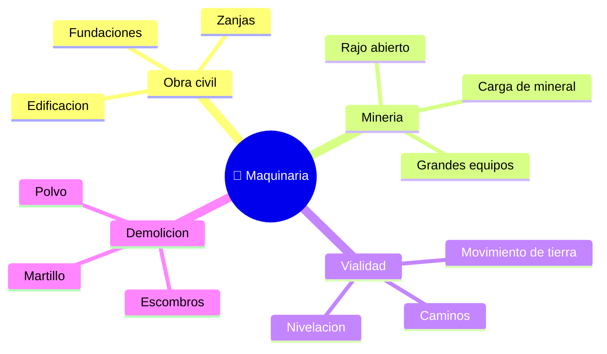

# 🌍 Entornos de trabajo de la maquinaria de construcción

[🏠 Inicio](../../../README.md) · [🚧 Curso: Maquinaria de construcción](../README.md) · 🌍 Entornos

Dónde opera la maquinaria de construcción y cómo cambia la operación según el
entorno. Cada entorno implica reglas, riesgos y ajustes distintos, y en
simulación se traduce en escenarios diferentes.

---

## 🗺️ Entornos principales

| Entorno | Características | Riesgos típicos | Ajuste de operación |
| --- | --- | --- | --- |
| Obra civil | Zanjas, fundaciones, poco espacio. | Ductos ocultos, personas cerca. | Radio controlado, señaleros. |
| Minería a rajo | Grandes volumenes, equipos pesados. | Tráfico de camiones, polvo. | Reglas de faena, distancia y radio. |
| Vialidad | Movimiento de tierra y nivelación. | Tráfico vehicular, taludes. | Señalización, hoja y pendiente controladas. |
| Demolición | Escombros y estructuras. | Caída de material, polvo. | FOPS, riego, área despejada. |
| Terreno blando / lluvia | Barro, suelo que cede. | Hundimiento, deslizamiento. | Orugas anchas, base firme, baja velocidad. |

---

## 🌦️ Factores del entorno

- **Terreno**: firmeza, pendiente y humedad definen estabilidad y agarre.
- **Espacio**: en obra urbana el radio de giro y los servicios enterrados limitan.
- **Personas**: la faena suele tener trabajadores a pie; el radio de trabajo es
  zona de exclusión.
- **Clima**: lluvia, polvo y calor afectan visibilidad, suelo y la máquina.
- **Otros equipos**: camiones y máquinas comparten la faena y deben coordinarse.

---

## 🎮 Traducción a simulación

Cada entorno es un escenario con su terreno, espacio, clima y presencia de
personas y equipos. Ver cómo se modela en el
[Módulo 8: Diseño de simulación](../simulacion/diseno-simulador-maquinaria.md).

---

[⬅️ Anterior: Principios y operación](principios-maquinaria.md) · [➡️ Siguiente: Reglamentos](../reglamentos/reglamentos-maquinaria.md)
