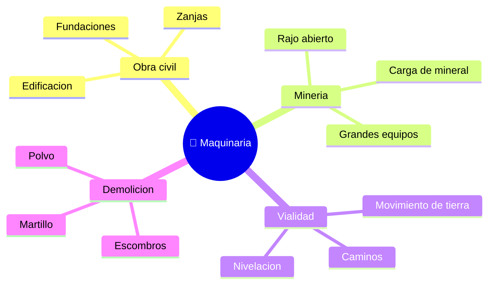

<!-- clase-meta
tipo_documento: clase
clase: 7
codigo: MAQUINARIACO-07
curso: maquinaria-construccion
titulo: "Entornos de trabajo de la maquinaria de construcción"
modalidad: "análisis de escenarios"
duracion_minutos: 60
nivel: introductorio
prerrequisito: MAQUINARIACO-06
competencia: "adaptacion_al_entorno"
resultados_aprendizaje:
  - "Explicar entornos, factores ambientales, riesgos y respuesta de simulación con vocabulario propio de Maquinaria de construcción."
  - "Aplicar esos conceptos a una decisión segura o a un escenario de simulación de Maquinaria de construcción."
evidencia: "Matriz entorno–cambio–riesgo–respuesta."
criterio_aprobacion: "Cada respuesta se adapta al entorno y distingue riesgos que no son intercambiables entre escenarios."
fuentes: manuales/fuentes.md
ultima_revision: 2026-09-10
-->

# 🌍 Entornos de trabajo de la maquinaria de construcción

[🏠 Inicio](../../../README.md) · [🚧 Curso: Maquinaria de construcción](../README.md) · 🌍 Entornos

Dónde opera la maquinaria de construcción y cómo cambia la operación según el
entorno. Cada entorno implica reglas, riesgos y ajustes distintos, y en
simulación se traduce en escenarios diferentes.

---

## 🗺️ Entornos principales

```mermaid
mindmap
  root((🚧 Maquinaria))
    Obra civil
      Fundaciones
      Zanjas
      Edificacion
    Mineria
      Rajo abierto
      Carga de mineral
      Grandes equipos
    Vialidad
      Movimiento de tierra
      Nivelacion
      Caminos
    Demolicion
      Escombros
      Martillo
      Polvo
```

| Entorno | Características | Riesgos típicos | Ajuste de operación |
| --- | --- | --- | --- |
| Obra civil | Zanjas, fundaciones, poco espacio. | Ductos ocultos, personas cerca. | Radio controlado, señaleros. |
| Minería a rajo | Grandes volumenes, equipos pesados. | Tráfico de camiones, polvo. | Reglas de faena, distancia y radio. |
| Vialidad | Movimiento de tierra y nivelación. | Tráfico vehicular, taludes. | Señalización, hoja y pendiente controladas. |
| Demolición | Escombros y estructuras. | Caída de material, polvo. | FOPS, riego, área despejada. |
| Terreno blando / lluvia | Barro, suelo que cede. | Hundimiento, deslizamiento. | Orugas anchas, base firme, baja velocidad. |

---

## 🌦️ Factores del entorno

- **Terreno**: firmeza, pendiente y humedad definen estabilidad y agarre.
- **Espacio**: en obra urbana el radio de giro y los servicios enterrados limitan.
- **Personas**: la faena suele tener trabajadores a pie; el radio de trabajo es
  zona de exclusión.
- **Clima**: lluvia, polvo y calor afectan visibilidad, suelo y la máquina.
- **Otros equipos**: camiones y máquinas comparten la faena y deben coordinarse.

---

## 🎮 Traducción a simulación

Cada entorno es un escenario con su terreno, espacio, clima y presencia de
personas y equipos. Ver cómo se modela en el
[Clase 9: Diseño de simulación](../simulacion/diseno-simulador-maquinaria.md).

## 🧭 Guía de estudio aplicada

### Pregunta guía

¿Cómo ayuda **Entornos principales, Factores del entorno, Traducción a simulación y Guía de estudio aplicada** a **adaptar excavación próxima a un borde con material cambiante a tres condiciones ambientales distintas**?

### Explicación razonada

El entorno no es decoración: modifica las fuerzas, la percepción y el tiempo disponible. En el caso «excavación próxima a un borde con material cambiante», cambia el comportamiento de suelo y aumenta la probabilidad de vuelco, colapso del borde o ingreso de terceros al radio de acción. La respuesta correcta empieza por reconocer qué variable cambió y después adaptar límites, ruta o misión.

Esta clase se conecta con el resto del curso mediante **estabilidad dependiente del centro de gravedad, apoyo y reacción del terreno**. El hilo de
seguridad consiste en reconocer a tiempo **vuelco, colapso del borde o ingreso de terceros al radio de acción** y poder justificar la decisión
**evaluar terreno, zona de exclusión y posición antes de accionar el implemento**; en clases posteriores cambiará el ángulo de análisis, no esa relación causal.
La lectura funcional común sigue **motor → sistema hidráulico → implemento → suelo**, de modo que cada concepto pueda
ubicarse dentro del funcionamiento completo y no quede como un dato aislado.

**Apoyo documental:** [Construction Industry](https://www.osha.gov/construction) aporta maquinaria y seguridad de obra;
[Crane, Derrick and Hoist Safety](https://www.osha.gov/cranes-derricks) se usa para izaje, riesgos y controles. Estas fuentes
se contrastan con el alcance de la clase y no sustituyen un manual de equipo concreto.

### Caso resuelto: de la observación a la decisión

1. **Escenario base:** conserva la misión «excavación próxima a un borde con material cambiante» para poder comparar.
2. **Cambiar una condición:** modifica sucesivamente superficie o medio, visibilidad y perturbación externa.
3. **Recalcular margen:** explica cómo cada cambio afecta **suelo** y acerca o aleja **vuelco, colapso del borde o ingreso de terceros al radio de acción**.
4. **Adaptar:** cambia límite, ruta, configuración o incluso cancela; no mantengas la misma respuesta por hábito.

### Comprueba tu comprensión

1. ¿Cómo cambiaría **suelo** si empeora la perturbación externa?
2. ¿Qué condición ambiental acerca más el escenario a **vuelco, colapso del borde o ingreso de terceros al radio de acción**?
3. ¿Cuándo adaptarías la maniobra y cuándo la cancelarías?

Orientación para revisar tus respuestas

- La primera respuesta debe relacionar el eslabón elegido con un efecto posterior, no solo nombrarlo.
- La segunda debe proponer una señal medible u observable y explicar qué tendencia sería preocupante.
- La tercera debe cambiar al menos una variable de capacidad, mando, entorno o margen de seguridad.

## 🎓 Cierre de clase

- **Actividad:** Contrasta tres entornos de Maquinaria de construcción a partir de entornos, factores ambientales, riesgos y respuesta de simulación y determina cómo cambian variables, percepción, riesgos y respuesta.
- **Evidencia:** Matriz entorno–cambio–riesgo–respuesta.
- **Criterio de aprobación:** Cada respuesta se adapta al entorno y distingue riesgos que no son intercambiables entre escenarios.
- **Transferencia:** explica qué cambiaría al pasar a otra variante de esta máquina.

### Fuentes de esta clase

- [OSHA-CONSTRUCTION](https://www.osha.gov/construction): Construction Industry, OSHA. Uso: maquinaria y seguridad de obra.
- [OSHA-CRANES](https://www.osha.gov/cranes-derricks): Crane, Derrick and Hoist Safety, OSHA. Uso: izaje, riesgos y controles.

> Las fuentes sostienen el marco conceptual y normativo; esta clase no reemplaza el manual
> del fabricante, la formación certificada ni la habilitación exigida para operar equipos reales.

---

[⬅️ Anterior: Principios y operación](principios-maquinaria.md) · [➡️ Siguiente: Reglamentos](../reglamentos/reglamentos-maquinaria.md)
