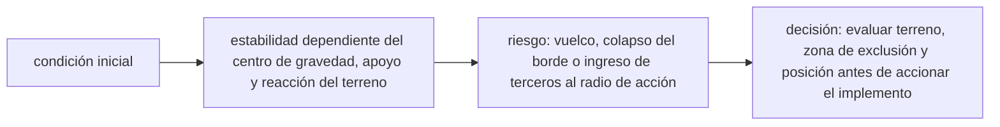

<!-- clase-meta
tipo_documento: clase
clase: 6
codigo: MAQUINARIACO-06
curso: maquinaria-construccion
titulo: "Principios y operación de la maquinaria de construcción"
modalidad: "resolución de problemas"
duracion_minutos: 90
nivel: introductorio
prerrequisito: MAQUINARIACO-05
competencia: "razonamiento_operacional"
resultados_aprendizaje:
  - "Explicar principios físicos, fases de operación, decisiones y errores frecuentes con vocabulario propio de Maquinaria de construcción."
  - "Aplicar esos conceptos a una decisión segura o a un escenario de simulación de Maquinaria de construcción."
evidencia: "Resolución argumentada de un escenario operacional."
criterio_aprobacion: "Aplica los principios correctos, anticipa consecuencias y respeta los límites del curso."
fuentes: manuales/fuentes.md
ultima_revision: 2026-09-10
-->

# 🧪 Principios y operación de la maquinaria de construcción

[🏠 Inicio](../../../README.md) · [🚧 Curso: Maquinaria de construcción](../README.md) · 🧪 Principios

Documento general y educativo. No sustituye la capacitación de operador
certificada ni el manual del fabricante. Describe cómo se opera la maquinaria en
simulación y que principios físicos conviene representar.

## Principios de funcionamiento

- **Fuerza hidráulica**: el motor mueve una bomba que genera presión; esa presión
  se convierte en fuerza en cilindros y motores. A mayor presión y área, más
  fuerza de excavación o empuje.
- **Movimiento proporcional**: la velocidad de cada actuador depende de cuanto se
  mueve el joystick, lo que permite trabajo fino y combinado.
- **Estabilidad por momentos**: la máquina vuelca si el momento de la carga (peso
  por alcance) supera el momento resistente de su base y contrapeso.
- **Reparto de peso**: las orugas distribuyen el peso en el suelo; en terreno
  blando esto evita el hundimiento y mejora la estabilidad.
- **Ciclo de trabajo**: excavar, girar, descargar y volver forman un ciclo
  repetitivo cuya eficiencia depende de la coordinación del operador.

## Fases de operación

| Fase | Que ocurre | Puntos clave |
| --- | --- | --- |
| Inspección previa | Revisión de la máquina y el frente | Aceite, fugas, orugas, terreno firme. |
| Posicionamiento | Ubicar la máquina | Base nivelada, distancia al camión y a la zanja. |
| Excavación / empuje | Trabajar el material | Coordinar brazo, cucharón o hoja. |
| Giro y descarga | Llevar el material | Girar hacia la zona estable, descargar controlado. |
| Traslado | Reubicarse en la faena | Bloqueo de mandos liberado, ruta despejada. |
| Cierre | Dejar la máquina segura | Cucharón apoyado, mandos bloqueados, motor apagado. |

## Estabilidad y cargas: idea general

1. Trabajar sobre **terreno nivelado y firme** siempre que sea posible.
2. No extender el brazo con carga más allá de lo necesario.
3. Girar y descargar hacia el lado más estable de la máquina.
4. Mantener el cucharón bajo y cerca del cuerpo al trasladarse.
5. Vigilar el margen frente al vuelco al aumentar el alcance.

## Errores comunes que la simulación puede enseñar a evitar

- Excavar o cargar con la máquina inclinada en terreno que cede.
- Extender el brazo con carga hasta acercarse al vuelco lateral.
- Trasladarse con el cucharón en alto y perder estabilidad.
- Girar hacia una zona con personas dentro del radio de trabajo.
- Ignorar la temperatura del aceite hidráulico en faena larga.
- Subir o bajar de la cabina sin bloquear los mandos.

## Relación con los niveles de realismo

- **Nivel 1 (educativo)**: mover el brazo, llenar el cucharón y descargar.
- **Nivel 2 (simplificado)**: agregar traslación, giro y estabilidad básica.
- **Nivel 3 (técnico)**: sumar hidráulica proporcional, momento de carga, límite
  de vuelco y coordinación del ciclo completo.

Ver [`docs/03-niveles-de-realismo.md`](../../../docs/03-niveles-de-realismo.md)
para el detalle de cada nivel.

## 🧭 Guía de estudio aplicada

### Pregunta guía

¿Cómo ayuda **Principios de funcionamiento, Fases de operación, Estabilidad y cargas: idea general y Errores comunes que la simulación puede enseñar a evitar** a **resolver excavación próxima a un borde con material cambiante sin agotar el margen operacional**?

### Explicación razonada

El principio rector puede resumirse así: estabilidad dependiente del centro de gravedad, apoyo y reacción del terreno. Esto explica por qué una misma orden produce resultados distintos cuando cambian velocidad, carga, configuración o entorno. Operar bien consiste en leer la tendencia antes de agotar el margen y tomar esta decisión: evaluar terreno, zona de exclusión y posición antes de accionar el implemento.

Esta clase se conecta con el resto del curso mediante **estabilidad dependiente del centro de gravedad, apoyo y reacción del terreno**. El hilo de
seguridad consiste en reconocer a tiempo **vuelco, colapso del borde o ingreso de terceros al radio de acción** y poder justificar la decisión
**evaluar terreno, zona de exclusión y posición antes de accionar el implemento**; en clases posteriores cambiará el ángulo de análisis, no esa relación causal.
La lectura funcional común sigue **motor → sistema hidráulico → implemento → suelo**, de modo que cada concepto pueda
ubicarse dentro del funcionamiento completo y no quede como un dato aislado.

**Apoyo documental:** [Construction Industry](https://www.osha.gov/construction) aporta maquinaria y seguridad de obra;
[Crane, Derrick and Hoist Safety](https://www.osha.gov/cranes-derricks) se usa para izaje, riesgos y controles. Estas fuentes
se contrastan con el alcance de la clase y no sustituyen un manual de equipo concreto.

### Caso resuelto: de la observación a la decisión

1. **Datos:** reconoce condiciones, configuración y margen disponibles en **excavación próxima a un borde con material cambiante**.
2. **Modelo:** aplica **estabilidad dependiente del centro de gravedad, apoyo y reacción del terreno** para predecir una tendencia antes de actuar.
3. **Riesgo:** explica mediante qué cadena de causas podría ocurrir **vuelco, colapso del borde o ingreso de terceros al radio de acción**.
4. **Decisión:** ejecuta mentalmente **evaluar terreno, zona de exclusión y posición antes de accionar el implemento** y define qué observación confirmaría que funcionó.

### Comprueba tu comprensión

1. ¿Qué variable del principio «estabilidad dependiente del centro de gravedad, apoyo y reacción del terreno» cambia primero en el caso?
2. ¿Cómo se propaga ese cambio hasta **suelo**?
3. ¿Qué evidencia confirmaría que **evaluar terreno, zona de exclusión y posición antes de accionar el implemento** conservó margen operacional?

Orientación para revisar tus respuestas

- La primera respuesta debe relacionar el eslabón elegido con un efecto posterior, no solo nombrarlo.
- La segunda debe proponer una señal medible u observable y explicar qué tendencia sería preocupante.
- La tercera debe cambiar al menos una variable de capacidad, mando, entorno o margen de seguridad.

## 🎓 Cierre de clase

- **Actividad:** Resuelve un escenario de Maquinaria de construcción explicando, paso a paso, cómo intervienen principios físicos, fases de operación, decisiones y errores frecuentes.
- **Evidencia:** Resolución argumentada de un escenario operacional.
- **Criterio de aprobación:** Aplica los principios correctos, anticipa consecuencias y respeta los límites del curso.
- **Transferencia:** explica qué cambiaría al pasar a otra variante de esta máquina.

### Fuentes de esta clase

- [OSHA-CONSTRUCTION](https://www.osha.gov/construction): Construction Industry, OSHA. Uso: maquinaria y seguridad de obra.
- [OSHA-CRANES](https://www.osha.gov/cranes-derricks): Crane, Derrick and Hoist Safety, OSHA. Uso: izaje, riesgos y controles.

> Las fuentes sostienen el marco conceptual y normativo; esta clase no reemplaza el manual
> del fabricante, la formación certificada ni la habilitación exigida para operar equipos reales.

---

[⬅️ Anterior: Mandos](../mandos/manual-mandos-maquinaria.md) · [➡️ Siguiente: Entornos de trabajo](entornos-maquinaria.md)
