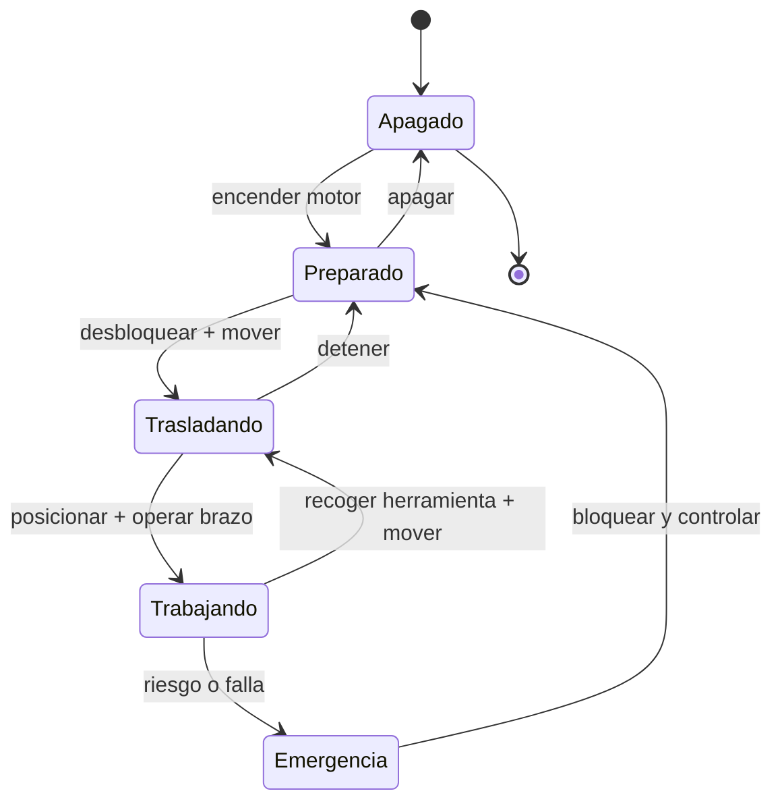

# 🎮 Diseño de simulación de la maquinaria de construcción

[🏠 Inicio](../../../README.md) · [🚧 Curso: Maquinaria de construcción](../README.md) · 🎮 Simulación

## Objetivo de la simulación

Que el usuario aprenda a operar maquinaria de construcción con seguridad:
coordinar el brazo y el cucharón o la hoja, trasladar la máquina sobre orugas o
neumáticos, mantener la estabilidad frente al vuelco y respetar la zona de
exclusión de la faena.

## Nivel de realismo

- Nivel elegido: se ofrece del 1 al 3 (ver `docs/03-niveles-de-realismo.md`).
- Justificación: la maquinaria comparte con la grúa la hidráulica de trabajo y la
  estabilidad por momentos, y agrega el ciclo de movimiento de tierra, por lo que
  se ubica en el nivel avanzado del catálogo.

## Variables principales

| Variable | Tipo | Rango | Afecta a | Comentarios |
| --- | --- | --- | --- | --- |
| Presión hidráulica | numérica | 0-350 bar | Fuerza de trabajo | Empuje de cilindros y motores. |
| Ángulo de pluma | numérica | -30..60 grados | Alcance y altura | Define el radio de trabajo. |
| Ángulo de balancín | numérica | 0..150 grados | Acercar/alejar carga | Combina con la pluma. |
| Llenado del cucharón | numérica | 0-100% | Peso de la carga | Afecta el momento de vuelco. |
| Alcance | numérica | 0-12 m | Momento de carga | Más alcance, menos capacidad. |
| Giro | numérica | 0-360 grados | Estabilidad lateral | Menos estable de costado. |
| Pendiente del terreno | numérica | -20..20 grados | Riesgo de vuelco | Factor de estabilidad. |
| Traslación | numérica | 0-100% por lado | Avance y giro | Giro diferencial de orugas. |

## Ciclo básico

1. Leer entrada del usuario (joysticks, pedales, acelerador, bloqueo).
2. Actualizar estado del motor y la presión hidráulica.
3. Calcular fuerzas y movimientos de brazo, cucharón, giro y traslación.
4. Aplicar restricciones del entorno (terreno, pendiente, personas, otros equipos).
5. Actualizar posición, alcance, carga y margen de estabilidad.
6. Refrescar instrumentos y retroalimentación (sonido, testigos, aviso de vuelco).

## Modos de juego futuros

- Tutorial guiado de joysticks y ciclo de excavación.
- Práctica de carga de camión coordinando giro y descarga.
- Desafíos de nivelación con hoja empujadora.
- Excavación de zanjas respetando servicios enterrados.
- Trabajo en pendiente sin superar el límite de vuelco.

## Elementos fuera de alcance

- Presentar la operación sin ROPS/FOPS como algo aceptable.
- Ignorar la zona de exclusión como opción valida de juego.
- Datos que permitan alterar sistemas reales de la máquina.

## Pendientes

- [ ] Definir valores por defecto de cada variable por tipo de máquina.
- [ ] Prototipar el ciclo de excavación y la carga del cucharón.
- [ ] Ajustar el modelo de estabilidad y límite de vuelco.
- [ ] Agregar fuentes técnicas públicas a
      [`manuales/fuentes.md`](../../../manuales/fuentes.md).

---

[⬅️ Anterior: Reglamentos](../reglamentos/reglamentos-maquinaria.md) · [➡️ Siguiente: Recursos](../recursos/recursos-maquinaria.md)
