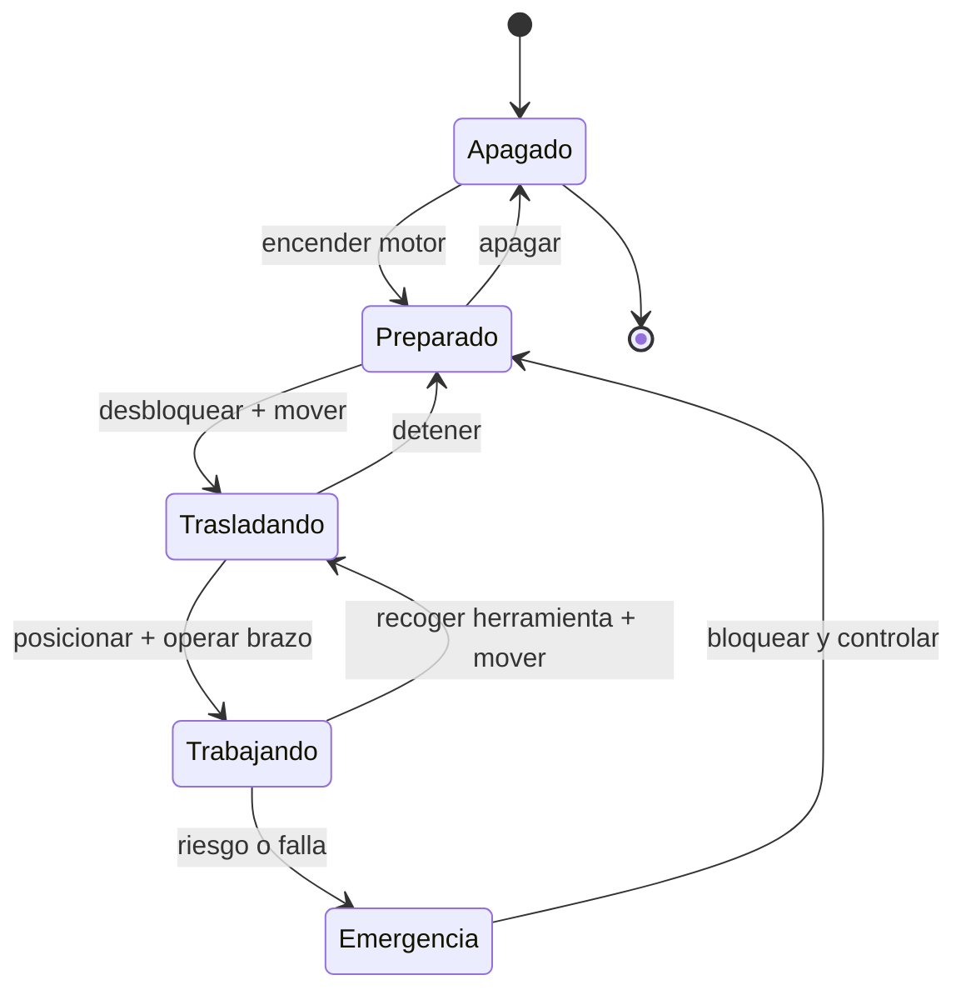
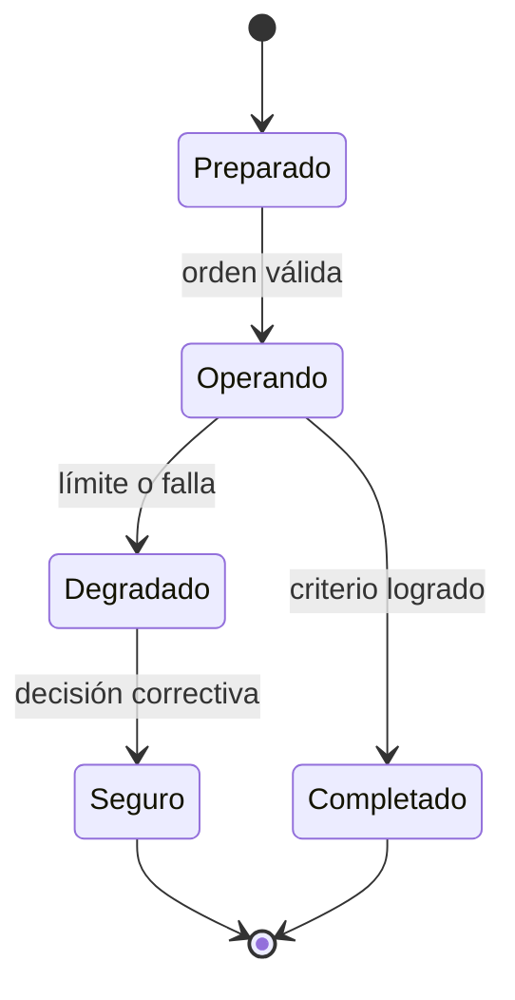

<!-- clase-meta
tipo_documento: clase
clase: 9
codigo: MAQUINARIACO-09
curso: maquinaria-construccion
titulo: "Diseño de simulación de la maquinaria de construcción"
modalidad: "laboratorio de diseño"
duracion_minutos: 90
nivel: introductorio
prerrequisito: MAQUINARIACO-08
competencia: "modelado_de_simulacion"
resultados_aprendizaje:
  - "Explicar objetivo, variables, estados, ciclo y escenarios de simulación con vocabulario propio de Maquinaria de construcción."
  - "Aplicar esos conceptos a una decisión segura o a un escenario de simulación de Maquinaria de construcción."
evidencia: "Ficha de escenario y diagrama de estados."
criterio_aprobacion: "El modelo es específico de la máquina, medible, seguro y trazable a clases anteriores."
fuentes: manuales/fuentes.md
ultima_revision: 2026-09-10
-->

# 🎮 Diseño de simulación de la maquinaria de construcción

[🏠 Inicio](../../../README.md) · [🚧 Curso: Maquinaria de construcción](../README.md) · 🎮 Simulación

```mermaid
stateDiagram-v2
    [*] --> Apagado
    Apagado --> Preparado: encender motor
    Preparado --> Trasladando: desbloquear + mover
    Trasladando --> Trabajando: posicionar + operar brazo
    Trabajando --> Trasladando: recoger herramienta + mover
    Trasladando --> Preparado: detener
    Trabajando --> Emergencia: riesgo o falla
    Emergencia --> Preparado: bloquear y controlar
    Preparado --> Apagado: apagar
    Apagado --> [*]
```

## Objetivo de la simulación

Que el usuario aprenda a operar maquinaria de construcción con seguridad:
coordinar el brazo y el cucharón o la hoja, trasladar la máquina sobre orugas o
neumáticos, mantener la estabilidad frente al vuelco y respetar la zona de
exclusión de la faena.

## Nivel de realismo

- Nivel elegido: se ofrece del 1 al 3 (ver `docs/03-niveles-de-realismo.md`).
- Justificación: la maquinaria comparte con la grúa la hidráulica de trabajo y la
  estabilidad por momentos, y agrega el ciclo de movimiento de tierra, por lo que
  se ubica en el nivel avanzado del catálogo.

## Variables principales

| Variable | Tipo | Rango | Afecta a | Comentarios |
| --- | --- | --- | --- | --- |
| Presión hidráulica | numérica | 0-350 bar | Fuerza de trabajo | Empuje de cilindros y motores. |
| Ángulo de pluma | numérica | -30..60 grados | Alcance y altura | Define el radio de trabajo. |
| Ángulo de balancín | numérica | 0..150 grados | Acercar/alejar carga | Combina con la pluma. |
| Llenado del cucharón | numérica | 0-100% | Peso de la carga | Afecta el momento de vuelco. |
| Alcance | numérica | 0-12 m | Momento de carga | Más alcance, menos capacidad. |
| Giro | numérica | 0-360 grados | Estabilidad lateral | Menos estable de costado. |
| Pendiente del terreno | numérica | -20..20 grados | Riesgo de vuelco | Factor de estabilidad. |
| Traslación | numérica | 0-100% por lado | Avance y giro | Giro diferencial de orugas. |

## Ciclo básico

1. Leer entrada del usuario (joysticks, pedales, acelerador, bloqueo).
2. Actualizar estado del motor y la presión hidráulica.
3. Calcular fuerzas y movimientos de brazo, cucharón, giro y traslación.
4. Aplicar restricciones del entorno (terreno, pendiente, personas, otros equipos).
5. Actualizar posición, alcance, carga y margen de estabilidad.
6. Refrescar instrumentos y retroalimentación (sonido, testigos, aviso de vuelco).

## Modos de juego futuros

- Tutorial guiado de joysticks y ciclo de excavación.
- Práctica de carga de camión coordinando giro y descarga.
- Desafíos de nivelación con hoja empujadora.
- Excavación de zanjas respetando servicios enterrados.
- Trabajo en pendiente sin superar el límite de vuelco.

## Elementos fuera de alcance

- Presentar la operación sin ROPS/FOPS como algo aceptable.
- Ignorar la zona de exclusión como opción valida de juego.
- Datos que permitan alterar sistemas reales de la máquina.

## Pendientes

- [ ] Definir valores por defecto de cada variable por tipo de máquina.
- [ ] Prototipar el ciclo de excavación y la carga del cucharón.
- [ ] Ajustar el modelo de estabilidad y límite de vuelco.
- [ ] Agregar fuentes técnicas públicas a
      [`manuales/fuentes.md`](../../../manuales/fuentes.md).

## 🧭 Guía de estudio aplicada

### Pregunta guía

¿Cómo ayuda **Objetivo de la simulación, Nivel de realismo, Variables principales y Ciclo básico** a **modelar excavación próxima a un borde con material cambiante como estados, variables y decisiones observables**?

### Explicación razonada

Una simulación de Maquinaria de construcción es educativa si representa decisiones y consecuencias. Como mínimo debe modelar el estado de motor, la respuesta de sistema hidráulico, la transición en implemento y el resultado en suelo. El escenario «excavación próxima a un borde con material cambiante» es valioso porque obliga a observar, formular una hipótesis, actuar y comprobar.

```mermaid
stateDiagram-v2
    [*] --> Preparado
    Preparado --> Operando: orden válida
    Operando --> Degradado: límite o falla
    Degradado --> Seguro: decisión correctiva
    Operando --> Completado: criterio logrado
    Seguro --> [*]
    Completado --> [*]
```

Esta clase se conecta con el resto del curso mediante **estabilidad dependiente del centro de gravedad, apoyo y reacción del terreno**. El hilo de
seguridad consiste en reconocer a tiempo **vuelco, colapso del borde o ingreso de terceros al radio de acción** y poder justificar la decisión
**evaluar terreno, zona de exclusión y posición antes de accionar el implemento**; en clases posteriores cambiará el ángulo de análisis, no esa relación causal.
La lectura funcional común sigue **motor → sistema hidráulico → implemento → suelo**, de modo que cada concepto pueda
ubicarse dentro del funcionamiento completo y no quede como un dato aislado.

**Apoyo documental:** [Construction Industry](https://www.osha.gov/construction) aporta maquinaria y seguridad de obra;
[Crane, Derrick and Hoist Safety](https://www.osha.gov/cranes-derricks) se usa para izaje, riesgos y controles. Estas fuentes
se contrastan con el alcance de la clase y no sustituyen un manual de equipo concreto.

### Caso resuelto: de la observación a la decisión

1. **Estado inicial:** representa excavación próxima a un borde con material cambiante con valores observables para **motor**, **sistema hidráulico**, **implemento** y **suelo**.
2. **Decisión del estudiante:** ofrece una elección que cambie el estado, no una animación automática.
3. **Consecuencia:** modela la tendencia hacia **vuelco, colapso del borde o ingreso de terceros al radio de acción** y una señal previa que permita corregir.
4. **Cierre:** evalúa la explicación de la decisión, además de si el estudiante “ganó” el escenario.

### Comprueba tu comprensión

1. ¿Qué cuatro estados mínimos necesita el escenario «excavación próxima a un borde con material cambiante»?
2. ¿Qué variable anticipa **vuelco, colapso del borde o ingreso de terceros al radio de acción** antes de llegar al estado de falla?
3. ¿Cómo evaluarías la explicación del estudiante y no solo el resultado final?

Orientación para revisar tus respuestas

- La primera respuesta debe relacionar el eslabón elegido con un efecto posterior, no solo nombrarlo.
- La segunda debe proponer una señal medible u observable y explicar qué tendencia sería preocupante.
- La tercera debe cambiar al menos una variable de capacidad, mando, entorno o margen de seguridad.

## 🎓 Cierre de clase

- **Actividad:** Diseña un escenario educativo de Maquinaria de construcción basado en objetivo, variables, estados, ciclo y escenarios de simulación, con entradas, estados, variables y criterio de cierre.
- **Evidencia:** Ficha de escenario y diagrama de estados.
- **Criterio de aprobación:** El modelo es específico de la máquina, medible, seguro y trazable a clases anteriores.
- **Transferencia:** explica qué cambiaría al pasar a otra variante de esta máquina.

### Fuentes de esta clase

- [OSHA-CONSTRUCTION](https://www.osha.gov/construction): Construction Industry, OSHA. Uso: maquinaria y seguridad de obra.
- [OSHA-CRANES](https://www.osha.gov/cranes-derricks): Crane, Derrick and Hoist Safety, OSHA. Uso: izaje, riesgos y controles.

> Las fuentes sostienen el marco conceptual y normativo; esta clase no reemplaza el manual
> del fabricante, la formación certificada ni la habilitación exigida para operar equipos reales.

---

[⬅️ Anterior: Reglamentos](../reglamentos/reglamentos-maquinaria.md) · [➡️ Siguiente: Recursos](../recursos/recursos-maquinaria.md)
