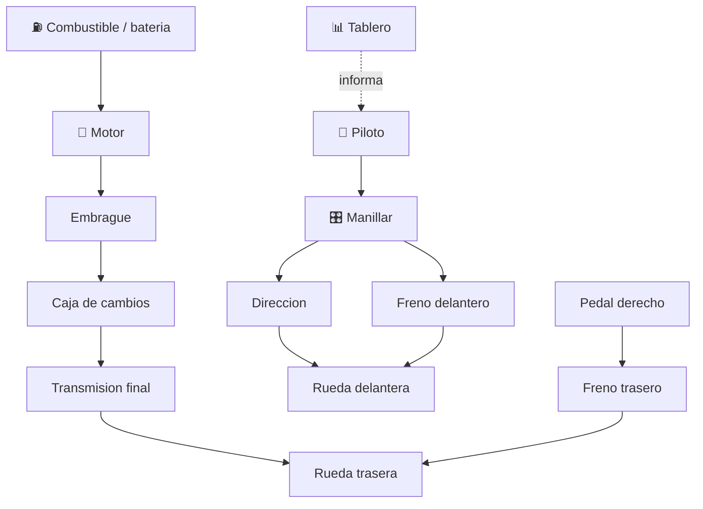

# 🏍️ Curso: Motocicletas

[🏠 Inicio](../../README.md) · [🚙 Catalogo de vehiculos](../README.md) · [🎓 Guia de curso](../../docs/08-guia-de-estilo-y-curso.md)

> **Curso de referencia del repositorio.** Documenta la motocicleta de principio
> a fin: historia, caracteristicas, mecanica en profundidad, mandos, fisica,
> entornos, reglamentos chilenos y diseno de simulacion. Es el modelo que
> siguen los demas vehiculos.

---

## 🎯 Objetivos de aprendizaje

Al terminar este curso deberias poder:

- Explicar como una moto acelera, frena, gira y mantiene el equilibrio.
- Identificar sus sistemas mecanicos y como se conectan.
- Reconocer todos los mandos e instrumentos y su funcion.
- Comprender la fisica de la conduccion (contramanillar, transferencia de peso).
- Conocer los reglamentos chilenos aplicables (licencia, casco, seguridad).
- Traducir todo lo anterior en variables de un simulador educativo.

---

## 🗺️ Mapa del vehiculo

---

## 📚 Modulos del curso

| # | Modulo | Contenido | Enlace |
| :-: | --- | --- | --- |
| 1 | 📜 Historia | Origen y evolucion de la moto, linea de tiempo. | [Abrir](historia/historia-moto.md) |
| 2 | 📋 Caracteristicas | Que es, tipos de moto y para que sirve cada uno. | [Abrir](operacion/caracteristicas-moto.md) |
| 3 | 🔧 Sistemas mecanicos | Motor, transmision, chasis, suspension, frenos, neumaticos. | [Abrir](operacion/sistemas-mecanicos-moto.md) |
| 4 | 🎛️ Mandos e instrumentos | Puesto de mando, controles y tablero. | [Abrir](mandos/manual-mandos-moto.md) |
| 5 | 🧪 Principios y operacion | Fisica de la conduccion y fases de operacion. | [Abrir](operacion/principios-moto.md) |
| 6 | 🌍 Entornos de trabajo | Ciudad, carretera, todo terreno, reparto. | [Abrir](operacion/entornos-moto.md) |
| 7 | ⚖️ Reglamentos | Ley chilena: licencia clase C, casco, seguridad. | [Abrir](reglamentos/reglamentos-moto.md) |
| 8 | 🎮 Diseno de simulacion | Variables, ciclo y modos de juego. | [Abrir](simulacion/diseno-simulador-moto.md) |
| 9 | 🧰 Recursos | Glosario, enlaces y diagramas. | [Abrir](recursos/recursos-moto.md) |

---

## 🧩 Requisitos previos

Ninguno. La moto es el punto de entrada recomendado porque permite explicar
aceleracion, frenado, equilibrio y transmision con menor complejidad que un
buque o una aeronave. Marco legal comun en
[⚖️ docs/07-marco-legal-chile.md](../../docs/07-marco-legal-chile.md).

---

[➡️ Empezar por el Modulo 1: Historia](historia/historia-moto.md)
