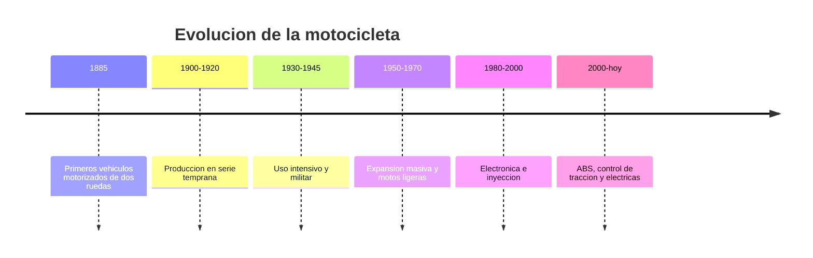

# 📜 Historia de la moto

[🏠 Inicio](../../../README.md) · [🏍️ Curso: Motos](../README.md) · 📜 Historia

## Origen

La motocicleta nace a finales del siglo XIX al montar un motor sobre un cuadro
derivado de la bicicleta. Los primeros modelos buscaban transporte individual
mas rapido que la traccion humana y mas economico que el automovil.

## Linea de tiempo

| Periodo | Hito | Importancia |
| --- | --- | --- |
| 1885 | Primeros vehiculos motorizados de dos ruedas | Prueba del concepto de moto. |
| 1900-1920 | Produccion en serie temprana | La moto se vuelve transporte real. |
| 1930-1945 | Uso intensivo y militar | Impulsa robustez y estandarizacion. |
| 1950-1970 | Expansion masiva y motos ligeras | Movilidad accesible a gran escala. |
| 1980-2000 | Electronica e inyeccion | Mejora eficiencia y control. |
| 2000-presente | ABS, control de traccion, electricas | Mas seguridad y nuevas propulsiones. |

## Evolucion tecnologica

- **Materiales**: del acero pesado a aleaciones y compuestos mas ligeros.
- **Propulsion**: de motores simples a inyeccion electronica y motores electricos.
- **Mandos**: controles cada vez mas integrados en el manillar.
- **Instrumentos**: de relojes analogicos a tableros digitales y conectados.
- **Seguridad**: frenos ABS, control de traccion, iluminacion LED.
- **Automatizacion**: cambios asistidos y modos de conduccion seleccionables.

## Tipos representativos

| Tipo | Uso tipico | Caracteristica destacada |
| --- | --- | --- |
| Urbana ligera | Ciudad y trayectos cortos | Facil de manejar, baja cilindrada. |
| Scooter | Movilidad urbana | Transmision automatica, plataforma. |
| Deportiva | Circuito y carretera | Alta potencia y posicion agresiva. |
| Trail / adventure | Mixto y viaje | Versatil en distintos terrenos. |
| Custom / crucero | Carretera relajada | Posicion comoda, par a bajas vueltas. |
| Electrica | Ciudad y reparto | Cero emisiones locales, entrega inmediata. |

## Impacto social y economico

La moto democratizo la movilidad individual, especialmente donde el automovil
resultaba caro. Es clave en reparto urbano y en transporte diario de millones de
personas, con un fuerte foco actual en seguridad vial y electrificacion.

## Fuentes

- Registrar aqui las fuentes publicas consultadas.
- Enlazar cada fuente tambien en [`manuales/fuentes.md`](../../../manuales/fuentes.md).

---

[🎓 Portada del curso](../README.md) · [➡️ Siguiente: Caracteristicas](../operacion/caracteristicas-moto.md)
