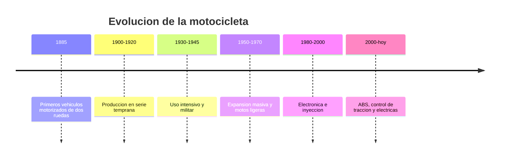

# 📜 Historia de la moto

[🏠 Inicio](../../../README.md) · [🏍️ Curso: Motos](../README.md) · 📜 Historia

```mermaid
timeline
    title Evolucion de la motocicleta
    1885 : Primeros vehiculos motorizados de dos ruedas
    1900-1920 : Produccion en serie temprana
    1930-1945 : Uso intensivo y militar
    1950-1970 : Expansion masiva y motos ligeras
    1980-2000 : Electronica e inyeccion
    2000-hoy : ABS, control de traccion y electricas
```

## Origen

La motocicleta nace a finales del siglo XIX al montar un motor sobre un cuadro
derivado de la bicicleta. Los primeros modelos buscaban transporte individual
más rápido que la tracción humana y más económico que el automóvil.

## Línea de tiempo

| Periodo | Hito | Importancia |
| --- | --- | --- |
| 1885 | Primeros vehículos motorizados de dos ruedas | Prueba del concepto de moto. |
| 1900-1920 | Producción en serie temprana | La moto se vuelve transporte real. |
| 1930-1945 | Uso intensivo y militar | Impulsa robustez y estandarización. |
| 1950-1970 | Expansión masiva y motos ligeras | Movilidad accesible a gran escala. |
| 1980-2000 | Electrónica e inyección | Mejora eficiencia y control. |
| 2000-presente | ABS, control de tracción, eléctricas | Más seguridad y nuevas propulsiones. |

## Evolución tecnológica

- **Materiales**: del acero pesado a aleaciones y compuestos más ligeros.
- **Propulsión**: de motores simples a inyección electrónica y motores eléctricos.
- **Mandos**: controles cada vez más integrados en el manillar.
- **Instrumentos**: de relojes analogicos a tableros digitales y conectados.
- **Seguridad**: frenos ABS, control de tracción, iluminación LED.
- **Automatización**: cambios asistidos y modos de conducción seleccionables.

## Tipos representativos

| Tipo | Uso típico | Característica destacada |
| --- | --- | --- |
| Urbana ligera | Ciudad y trayectos cortos | Fácil de manejar, baja cilindrada. |
| Scooter | Movilidad urbana | Transmisión automática, plataforma. |
| Deportiva | Circuito y carretera | Alta potencia y posición agresiva. |
| Trail / adventure | Mixto y viaje | Versátil en distintos terrenos. |
| Custom / crucero | Carretera relajada | Posición cómoda, par a bajas vueltas. |
| Eléctrica | Ciudad y reparto | Cero emisiones locales, entrega inmediata. |

## Impacto social y económico

La moto democratizo la movilidad individual, especialmente donde el automóvil
resultaba caro. Es clave en reparto urbano y en transporte diario de millones de
personas, con un fuerte foco actual en seguridad vial y electrificación.

## Fuentes

- Registrar aquí las fuentes públicas consultadas.
- Enlazar cada fuente también en [`manuales/fuentes.md`](../../../manuales/fuentes.md).

## 🎓 Cierre de clase

- **Actividad:** Construye una línea de tiempo de Motocicletas y explica cómo dos cambios históricos transformaron su función o su puesto de mando.
- **Evidencia:** Línea de tiempo comentada con cuatro hitos o más.
- **Criterio de aprobación:** Los hitos están ordenados, son pertinentes y dos relaciones de causa y efecto quedan justificadas.
- **Transferencia:** explica qué cambiaría al pasar a otra variante de esta máquina.

### Fuentes de esta clase

- [CL-LEY-18290](https://www.bcn.cl/leychile/navegar?idNorma=29708): Ley de Tránsito 18.290, BCN Chile. Uso: marco legal chileno.
- [CL-CONASET](https://www.conaset.cl/manuales/): Manuales para conductores, CONASET. Uso: formación vial y seguridad.
- [US-NHTSA-MOTO](https://www.nhtsa.gov/road-safety/motorcycles): Motorcycle Safety, NHTSA. Uso: riesgos, equipo y conducción segura.
- [MSF-BRC](https://msf-usa.org/library/): Motorcycle Safety Foundation Library, MSF. Uso: formación inicial y ejercicios.

> Las fuentes sostienen el marco conceptual y normativo; esta clase no reemplaza el manual
> del fabricante, la formación certificada ni la habilitación exigida para operar equipos reales.

---

[🎓 Portada del curso](../README.md) · [➡️ Siguiente: Características](../operacion/caracteristicas-moto.md)
