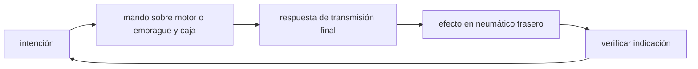

<!-- clase-meta
tipo_documento: clase
clase: 5
codigo: MOTOS-05
curso: motos
titulo: "Mandos e instrumentos de la moto"
modalidad: "taller de simulación"
duracion_minutos: 60
nivel: introductorio
prerrequisito: MOTOS-04
competencia: "lectura_y_mando"
resultados_aprendizaje:
  - "Explicar controles, instrumentos, entradas y estados del sistema con vocabulario propio de Motocicletas."
  - "Aplicar esos conceptos a una decisión segura o a un escenario de simulación de Motocicletas."
evidencia: "Mapa de mandos y resolución de dos estados del tablero."
criterio_aprobacion: "Reconoce los controles críticos y responde a los estados sin introducir acciones inseguras."
fuentes: manuales/fuentes.md
ultima_revision: 2026-09-10
-->

# 🎛️ Mandos e instrumentos de la moto

[🏠 Inicio](../../../README.md) · [🏍️ Curso: Motos](../README.md) · 🎛️ Mandos

## Vista general

El puesto de mando de una motocicleta se concentra en el manillar y en los
apoyos para pies. A diferencia de un automóvil, casi todos los controles se
operan con las manos y los pies sin soltar la posición de conducción. El
tablero, hoy digital o mixto, se ubica al centro sobre la horquilla.

## Mapa de controles

| Zona | Control | Tipo | Función | Prioridad | Comentarios |
| --- | --- | --- | --- | --- | --- |
| Puño derecho | Acelerador | Puño giratorio | Regular potencia del motor | Alta | Se acciona girando hacia el conductor. |
| Puño derecho | Freno delantero | Maneta | Frenar rueda delantera | Alta | Aporta la mayor capacidad de frenado. |
| Puño izquierdo | Embrague | Maneta | Desconectar motor y transmisión | Alta | Necesario para cambiar de marcha. |
| Pie derecho | Freno trasero | Pedal | Frenar rueda trasera | Alta | Estabiliza y complementa al delantero. |
| Pie izquierdo | Cambio de marchas | Palanca | Subir o bajar de marcha | Alta | Patrón típico 1-N-2-3-4-5-6. |
| Manillar izquierdo | Luces e intermitentes | Botones | Señalizar y alumbrar | Media | Incluye luces de cruce y carretera. |
| Manillar izquierdo | Bocina | Botón | Advertir | Media | Uso de seguridad. |
| Manillar derecho | Arranque y paro | Botones | Encender o cortar motor | Alta | Incluye corte de emergencia. |
| Tablero | Instrumentos | Pantalla | Mostrar estado | Alta | Ver sección de instrumentos. |
| Lateral | Caballete | Palanca | Estacionar | Baja | Puede tener corte de encendido asociado. |

## Instrumentos principales

| Instrumento | Mide o muestra | Unidad | Importancia | Notas |
| --- | --- | --- | --- | --- |
| Velocímetro | Velocidad | km/h | Alta | Central para circulación segura. |
| Tacómetro | Régimen del motor | rpm | Media | Ayuda a elegir la marcha. |
| Indicador de marcha | Marcha actual | número/N | Media | Común en modelos modernos. |
| Nivel de combustible | Combustible restante | fracción | Alta | Puede incluir reserva. |
| Testigos | Estado de sistemas | luz | Alta | Aceite, neutro, intermitentes, ABS. |
| Odómetro | Distancia recorrida | km | Baja | Total y parcial. |

## Entradas de simulación

| Acción | Teclado | Controlador | Pantalla táctil | Comentarios |
| --- | --- | --- | --- | --- |
| Acelerar | Flecha arriba | Gatillo derecho | Zona derecha | Progresivo, no on/off. |
| Frenar delante | Tecla J | Gatillo izquierdo | Botón freno | Modula fuerza. |
| Frenar detrás | Tecla K | Botón inferior | Botón freno trasero | Complementa al delantero. |
| Embragar | Shift | Botón lateral | Botón embrague | Requerido para cambiar. |
| Subir marcha | E | Cruceta arriba | Botón más | Con embrague en niveles altos. |
| Bajar marcha | Q | Cruceta abajo | Botón menos | Reducir antes de curva. |
| Girar | Flechas izq/der | Stick izquierdo | Inclinación | Combina giro e inclinación. |

## Estados del sistema

| Estado | Descripción | Indicadores | Acciones disponibles |
| --- | --- | --- | --- |
| Apagado | Motor detenido | Tablero off | Encender, mover en punto muerto. |
| Preparado | Motor encendido, detenida | Testigo de neutro | Embragar, meter primera. |
| En movimiento | Circulando | Velocímetro activo | Acelerar, frenar, cambiar, girar. |
| Emergencia | Riesgo o falla | Testigos de alerta | Frenar, orillar, cortar motor. |

## Observaciones ergonomicas

- El velocímetro y los testigos deben verse siempre.
- Acelerador y freno delantero conviven en la mano derecha: la interfaz debe
  dejar claro que no se accionan a la vez con la misma intensidad.
- El corte de motor de emergencia debe ser accesible y reconocible.
- La interfaz de simulación debería prevenir cambios de marcha sin embrague en
  los niveles de realismo más altos.

## 🧭 Guía de estudio aplicada

### Pregunta guía

¿Cómo ayuda **Vista general, Mapa de controles, Instrumentos principales y Entradas de simulación** a **interpretar mandos e indicaciones durante aproximación a una curva urbana mojada con visibilidad parcial**?

### Explicación razonada

Un mando no se aprende memorizando su nombre, sino recorriendo el ciclo intención → acción → indicación → verificación. En Motocicletas, el operador actúa sobre motor o embrague y caja, observa la respuesta en transmisión final y confirma el efecto en neumático trasero. Una indicación inesperada exige detener la secuencia mental, identificar el modo activo y evitar una segunda orden que agrave el estado.

Esta clase se conecta con el resto del curso mediante **equilibrio entre inclinación, velocidad, radio y adherencia disponible**. El hilo de
seguridad consiste en reconocer a tiempo **agotar adherencia por frenar o acelerar bruscamente con la moto inclinada** y poder justificar la decisión
**ajustar velocidad, trayectoria y suavidad de los mandos antes de inclinar**; en clases posteriores cambiará el ángulo de análisis, no esa relación causal.
La lectura funcional común sigue **motor → embrague y caja → transmisión final → neumático trasero**, de modo que cada concepto pueda
ubicarse dentro del funcionamiento completo y no quede como un dato aislado.

**Apoyo documental:** [Ley de Tránsito 18.290](https://www.bcn.cl/leychile/navegar?idNorma=29708) aporta marco legal chileno;
[Manuales para conductores](https://www.conaset.cl/manuales/) se usa para formación vial y seguridad. Estas fuentes
se contrastan con el alcance de la clase y no sustituyen un manual de equipo concreto.

### Caso resuelto: de la observación a la decisión

1. **Intención:** formula qué cambio se necesita durante **aproximación a una curva urbana mojada con visibilidad parcial**.
2. **Mando:** identifica el control que actúa sobre **motor** o **embrague y caja** y el modo que debe estar activo.
3. **Lectura:** localiza la indicación que confirma la respuesta de **transmisión final** y el efecto en **neumático trasero**.
4. **Verificación:** si la lectura no coincide, no acumules órdenes; estabiliza e investiga el estado.

### Comprueba tu comprensión

1. ¿Qué mando inicia la respuesta y qué instrumento confirma que el modo correcto está activo?
2. ¿Qué indicación temprana advertiría **agotar adherencia por frenar o acelerar bruscamente con la moto inclinada**?
3. ¿Qué secuencia usarías si la respuesta de **neumático trasero** no coincide con la orden?

Orientación para revisar tus respuestas

- La primera respuesta debe relacionar el eslabón elegido con un efecto posterior, no solo nombrarlo.
- La segunda debe proponer una señal medible u observable y explicar qué tendencia sería preocupante.
- La tercera debe cambiar al menos una variable de capacidad, mando, entorno o margen de seguridad.

## 🎓 Cierre de clase

- **Actividad:** Recorre el puesto de mando simulado de Motocicletas: localiza los controles de controles, instrumentos, entradas y estados del sistema y asocia cada indicación con una decisión.
- **Evidencia:** Mapa de mandos y resolución de dos estados del tablero.
- **Criterio de aprobación:** Reconoce los controles críticos y responde a los estados sin introducir acciones inseguras.
- **Transferencia:** explica qué cambiaría al pasar a otra variante de esta máquina.

### Fuentes de esta clase

- [CL-LEY-18290](https://www.bcn.cl/leychile/navegar?idNorma=29708): Ley de Tránsito 18.290, BCN Chile. Uso: marco legal chileno.
- [CL-CONASET](https://www.conaset.cl/manuales/): Manuales para conductores, CONASET. Uso: formación vial y seguridad.
- [US-NHTSA-MOTO](https://www.nhtsa.gov/road-safety/motorcycles): Motorcycle Safety, NHTSA. Uso: riesgos, equipo y conducción segura.
- [MSF-BRC](https://msf-usa.org/library/): Motorcycle Safety Foundation Library, MSF. Uso: formación inicial y ejercicios.

> Las fuentes sostienen el marco conceptual y normativo; esta clase no reemplaza el manual
> del fabricante, la formación certificada ni la habilitación exigida para operar equipos reales.

---

[⬅️ Anterior: Sistemas mecánicos](../operacion/sistemas-mecanicos-moto.md) · [➡️ Siguiente: Principios y operación](../operacion/principios-moto.md)
