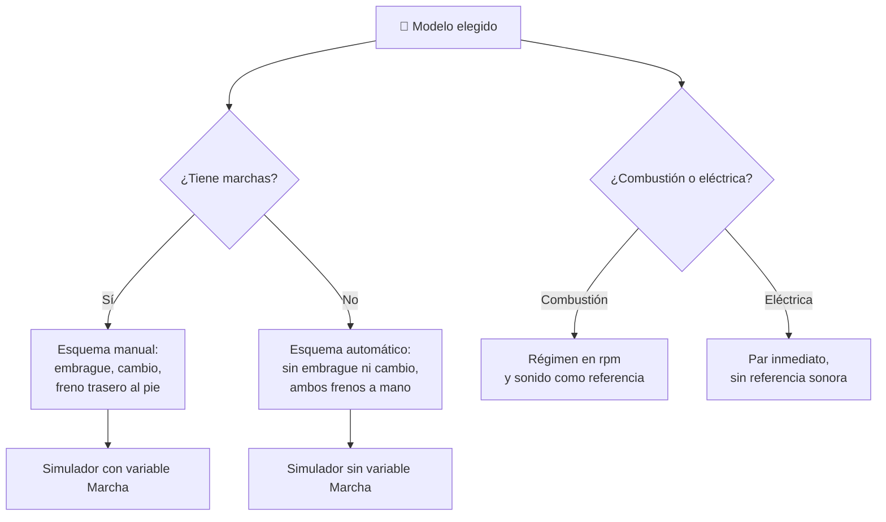

# 🧩 Modelos y variantes de la moto

[🏠 Inicio](../../../README.md) · [🏍️ Curso: Motos](../README.md) · 🧩 Modelos

El [Módulo 2](../operacion/caracteristicas-moto.md) ya dijo qué tipos de moto
existen y para qué sirve cada uno. Este módulo responde a lo siguiente: **no
todas se pilotan igual**, y esa diferencia no es de matiz. Cambia qué mandos
tiene la máquina y, por tanto, qué debe modelar el simulador.

> 🎯 **La idea que sostiene el módulo.** "Una moto" no es una sola máquina desde
> el punto de vista del mando. Un scooter no tiene embrague ni palanca de cambio:
> no es que los tenga más fáciles, es que **no existen**. Un simulador que
> presente un solo esquema de control está representando una moto concreta
> aunque diga representarlas todas.

---

## 🧭 Por qué el modelo decide el simulador

El [Módulo 5](../mandos/manual-mandos-moto.md) describe un puesto de mando con
embrague en la maneta izquierda y cambio en el pie izquierdo. El
[Módulo 9](../simulacion/diseno-simulador-moto.md) expone una variable `Marcha`
con rango `N,1..6`. Ambos describen una moto **de transmisión manual**.

En un scooter esa maneta izquierda no es el embrague: es el freno trasero. Y la
variable `Marcha` sencillamente no tiene valores que tomar. Si el simulador se
construye sobre el esquema manual y luego se le "añade" un scooter, el resultado
es un scooter con embrague, que no existe.

---

## 🗂️ Qué cambia en el manejo

| Modelo | Qué cambia al pilotarla |
| --- | --- |
| Urbana / naked | La referencia del curso: posición erguida, peso contenido, comportamiento neutro. |
| Scooter | Sin gestión de marchas, la atención se libera hacia el tráfico. Ruedas pequeñas: más nervioso ante baches y juntas. |
| Deportiva | Peso adelantado sobre las muñecas y mucha potencia: la transferencia de peso es más brusca y el margen de error se acorta. |
| Crucero / custom | Centro de gravedad bajo y par a bajas vueltas: estable y cómoda en recta, pero toca antes en las curvas cerradas. |
| Trail / adventure | Suspensión larga y rueda delantera grande: absorbe el terreno irregular y se hunde más al frenar. |
| Eléctrica | Entrega de par inmediata desde parado y sin ruido de motor: se pierde la referencia sonora del régimen. |
| Reparto / trabajo | La carga cambia durante la jornada: el mismo vehículo se comporta distinto al principio y al final del reparto. |

---

## 🎛️ Qué cambia en el mando

| Modelo | Qué mando aparece o desaparece | Consecuencia |
| --- | --- | --- |
| Urbana / naked, Deportiva, Crucero, Trail | Ninguno: el mapa de controles del Módulo 5 aplica tal cual. | Cambian los rangos, no los controles. |
| Scooter | **Desaparecen** el embrague y la palanca de cambio. El freno trasero **se muda** del pedal a la maneta izquierda. | El pie izquierdo deja de tener función y ambos frenos se accionan con las manos. |
| Eléctrica | **Desaparecen** el embrague y el cambio en la mayoría. El acelerador pasa a mandar par directo. | El tacómetro pierde sentido; el freno regenerativo se solapa con el freno trasero. |
| Reparto / trabajo | **Aparece** el portaequipajes o el baúl como masa que el piloto gestiona. | No es un mando, pero altera el resultado de todos los demás. |

---

## 🎮 Qué cambia en el simulador

Contrastado con las variables del
[Módulo 9](../simulacion/diseno-simulador-moto.md):

| Modelo | Variables que cambian | Esquema de control |
| --- | --- | --- |
| Urbana / naked | Ninguna: es el caso base. | El del Módulo 5. |
| Scooter | `Marcha` **se elimina**. `Régimen del motor` se desacopla de la marcha y pasa a depender solo del acelerador. | Sin entrada de embrague ni de cambio; dos frenos en las manos. |
| Deportiva | `Régimen` e `Inclinación` amplían rango; la transferencia de peso pesa más en el cálculo. | El mismo, con respuesta más sensible. |
| Crucero / custom | `Inclinación` **reduce** su rango útil: toca suelo antes. | El mismo. |
| Trail / adventure | `Adherencia` deja de ser un valor de asfalto y depende del terreno. | El mismo. |
| Eléctrica | `Régimen del motor` **desaparece** o se sustituye por par disponible. `Combustible/energía` pasa a ser carga de batería, y se degrada con la temperatura. | Sin embrague ni cambio; frenada regenerativa. |
| Reparto / trabajo | `Peso del conjunto` deja de ser fijo y pasa a variar durante la partida. | El mismo. |

---

## 🗺️ Del modelo al esquema de control

---

## ⚠️ Qué modelos no comparten simulador

Dos familias no se resuelven con un ajuste de parámetros, porque su esquema de
control es otro:

- **El scooter y la eléctrica sin marchas** frente al resto: faltan dos entradas
  y una tercera cambia de sitio. Es un modo de control distinto, no una
  dificultad distinta.
- **El reparto con carga variable** frente a los demás: obliga a que el peso sea
  una variable viva durante la partida, no una constante que se fija al empezar.

El resto de modelos sí caben en un mismo simulador ajustando rangos, tal como
plantean los [niveles de realismo](../../../docs/03-niveles-de-realismo.md): en
el nivel 1 casi todos se comportan igual, y las diferencias emergen a medida que
el nivel sube.

> ⚖️ **El principio detrás de todo esto.** Cuánto pesa la carga y dónde va no cambia
> solo los números: cambia qué puede hacer el operador. La física común a todas las
> máquinas del catálogo —sostener, girar, equilibrar y la masa que cambia en
> marcha— está en [⚖️ carga y manejo](../../../docs/09-carga-y-manejo.md).

---

[⬅️ Anterior: Características](../operacion/caracteristicas-moto.md) · [➡️ Siguiente: Sistemas mecánicos](../operacion/sistemas-mecanicos-moto.md)
