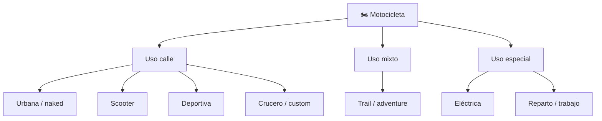

# 📋 Características funcionales de la moto

[🏠 Inicio](../../../README.md) · [🏍️ Curso: Motos](../README.md) · 📋 Características

Que es una moto, que tipos existen y para que sirve cada uno. Este módulo da el
contexto antes de abrir la mecánica (Módulo 4).

---

## 🧭 Definición

Una motocicleta es un vehículo motorizado de dos ruedas en línea que se equilibra
en movimiento. El piloto forma parte activa del equilibrio y de la dirección, a
diferencia de un automóvil donde va "dentro" del vehículo.

---

## 🧬 Características clave

| Característica | Descripción |
| --- | --- |
| Equilibrio dinámico | Se estabiliza al avanzar; a baja velocidad exige más destreza. |
| Relación peso/potencia | Alta; acelera rápido para su tamaño. |
| Exposición del piloto | Sin carrocería; la protección depende del equipo. |
| Agilidad | Fácil de mover en tráfico y espacios estrechos. |
| Eficiencia | Bajo consumo y fácil estacionamiento. |
| Inclinación en curva | Gira apoyandose en la inclinación, no solo en el manillar. |

---

## 🗂️ Tipos de moto

| Tipo | Uso típico | Rasgo destacado |
| --- | --- | --- |
| Urbana / naked | Ciudad y trayectos cortos | Ligera, posición erguida. |
| Scooter | Movilidad urbana | Transmisión automática, plataforma. |
| Deportiva | Carretera y circuito | Alta potencia, posición agresiva. |
| Crucero / custom | Carretera relajada | Par a bajas vueltas, comodidad. |
| Trail / adventure | Mixto y viaje | Versátil en varios terrenos. |
| Eléctrica | Ciudad y reparto | Entrega inmediata, cero emisiones locales. |
| Reparto / trabajo | Uso profesional urbano | Robusta, con portaequipajes. |

---

## 🎯 Para qué se usa

- Transporte personal económico y ágil.
- Reparto urbano y mensajería.
- Turismo y viajes de carretera.
- Deporte y competición.
- Movilidad en zonas de tráfico denso.

---

[⬅️ Anterior: Historia](../historia/historia-moto.md) · [➡️ Siguiente: Modelos y variantes](../modelos/modelos-moto.md)
