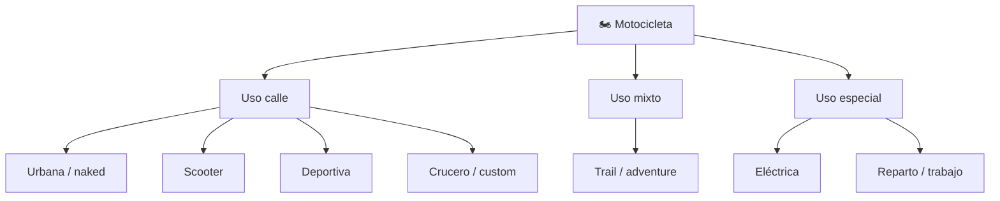

<!-- clase-meta
tipo_documento: clase
clase: 2
codigo: MOTOS-02
curso: motos
titulo: "Características funcionales de la moto"
modalidad: "teórica aplicada"
duracion_minutos: 45
nivel: introductorio
prerrequisito: MOTOS-01
competencia: "identificacion_funcional"
resultados_aprendizaje:
  - "Explicar definición, rasgos funcionales, tipos y usos con vocabulario propio de Motocicletas."
  - "Aplicar esos conceptos a una decisión segura o a un escenario de simulación de Motocicletas."
evidencia: "Matriz comparativa y decisión justificada."
criterio_aprobacion: "La elección considera función, límites, mando y efecto en la simulación; no se apoya solo en preferencias."
fuentes: manuales/fuentes.md
ultima_revision: 2026-09-10
-->

# 📋 Características funcionales de la moto

[🏠 Inicio](../../../README.md) · [🏍️ Curso: Motos](../README.md) · 📋 Características

Que es una moto, que tipos existen y para que sirve cada uno. Esta clase da el
contexto antes de abrir la mecánica (Clase 4).

---

## 🧭 Definición

Una motocicleta es un vehículo motorizado de dos ruedas en línea que se equilibra
en movimiento. El piloto forma parte activa del equilibrio y de la dirección, a
diferencia de un automóvil donde va "dentro" del vehículo.

---

## 🧬 Características clave

| Característica | Descripción |
| --- | --- |
| Equilibrio dinámico | Se estabiliza al avanzar; a baja velocidad exige más destreza. |
| Relación peso/potencia | Alta; acelera rápido para su tamaño. |
| Exposición del piloto | Sin carrocería; la protección depende del equipo. |
| Agilidad | Fácil de mover en tráfico y espacios estrechos. |
| Eficiencia | Bajo consumo y fácil estacionamiento. |
| Inclinación en curva | Gira apoyandose en la inclinación, no solo en el manillar. |

---

## 🗂️ Tipos de moto

```mermaid
flowchart TD
    Moto[🏍️ Motocicleta] --> Calle[Uso calle]
    Moto --> Mixto[Uso mixto]
    Moto --> Especial[Uso especial]
    Calle --> Urbana[Urbana / naked]
    Calle --> Scooter[Scooter]
    Calle --> Deportiva[Deportiva]
    Calle --> Crucero[Crucero / custom]
    Mixto --> Trail[Trail / adventure]
    Especial --> Electrica[Eléctrica]
    Especial --> Reparto[Reparto / trabajo]
```

| Tipo | Uso típico | Rasgo destacado |
| --- | --- | --- |
| Urbana / naked | Ciudad y trayectos cortos | Ligera, posición erguida. |
| Scooter | Movilidad urbana | Transmisión automática, plataforma. |
| Deportiva | Carretera y circuito | Alta potencia, posición agresiva. |
| Crucero / custom | Carretera relajada | Par a bajas vueltas, comodidad. |
| Trail / adventure | Mixto y viaje | Versátil en varios terrenos. |
| Eléctrica | Ciudad y reparto | Entrega inmediata, cero emisiones locales. |
| Reparto / trabajo | Uso profesional urbano | Robusta, con portaequipajes. |

---

## 🎯 Para qué se usa

- Transporte personal económico y ágil.
- Reparto urbano y mensajería.
- Turismo y viajes de carretera.
- Deporte y competición.
- Movilidad en zonas de tráfico denso.

## 🧭 Guía de estudio aplicada

### Pregunta guía

¿Cómo ayuda **Definición, Características clave, Tipos de moto y Para qué se usa** a **elegir una configuración adecuada para aproximación a una curva urbana mojada con visibilidad parcial**?

### Explicación razonada

Una característica solo es útil cuando permite anticipar comportamiento. En Motocicletas, la relación entre motor, embrague y caja, transmisión final y neumático trasero determina capacidad, respuesta y límites. Por eso «scooter urbano frente a motocicleta trail» no se compara por apariencia: se compara por misión, entorno, carga de trabajo y exposición al riesgo «agotar adherencia por frenar o acelerar bruscamente con la moto inclinada».

Esta clase se conecta con el resto del curso mediante **equilibrio entre inclinación, velocidad, radio y adherencia disponible**. El hilo de
seguridad consiste en reconocer a tiempo **agotar adherencia por frenar o acelerar bruscamente con la moto inclinada** y poder justificar la decisión
**ajustar velocidad, trayectoria y suavidad de los mandos antes de inclinar**; en clases posteriores cambiará el ángulo de análisis, no esa relación causal.
La lectura funcional común sigue **motor → embrague y caja → transmisión final → neumático trasero**, de modo que cada concepto pueda
ubicarse dentro del funcionamiento completo y no quede como un dato aislado.

**Apoyo documental:** [Ley de Tránsito 18.290](https://www.bcn.cl/leychile/navegar?idNorma=29708) aporta marco legal chileno;
[Manuales para conductores](https://www.conaset.cl/manuales/) se usa para formación vial y seguridad. Estas fuentes
se contrastan con el alcance de la clase y no sustituyen un manual de equipo concreto.

### Caso resuelto: de la observación a la decisión

1. **Definir la necesidad:** convierte «aproximación a una curva urbana mojada con visibilidad parcial» en requisitos de capacidad, entorno y respuesta.
2. **Comparar:** contrasta **scooter urbano frente a motocicleta trail** usando esos requisitos y la cadena **motor → embrague y caja → transmisión final → neumático trasero**.
3. **Descartar:** elimina la alternativa que deja menos margen frente a **agotar adherencia por frenar o acelerar bruscamente con la moto inclinada**.
4. **Elegir:** declara la variante escogida, la evidencia usada y una limitación que todavía debe respetarse.

### Comprueba tu comprensión

1. ¿Qué característica de **neumático trasero** condiciona primero el caso «aproximación a una curva urbana mojada con visibilidad parcial»?
2. ¿Qué requisito descartaría una de las alternativas **scooter urbano frente a motocicleta trail**?
3. ¿Qué límite debe declararse junto con la variante elegida?

Orientación para revisar tus respuestas

- La primera respuesta debe relacionar el eslabón elegido con un efecto posterior, no solo nombrarlo.
- La segunda debe proponer una señal medible u observable y explicar qué tendencia sería preocupante.
- La tercera debe cambiar al menos una variable de capacidad, mando, entorno o margen de seguridad.

## 🎓 Cierre de clase

- **Actividad:** Compara variantes de Motocicletas mediante los ejes «definición, rasgos funcionales, tipos y usos» y elige una para un caso de uso razonado.
- **Evidencia:** Matriz comparativa y decisión justificada.
- **Criterio de aprobación:** La elección considera función, límites, mando y efecto en la simulación; no se apoya solo en preferencias.
- **Transferencia:** explica qué cambiaría al pasar a otra variante de esta máquina.

### Fuentes de esta clase

- [CL-LEY-18290](https://www.bcn.cl/leychile/navegar?idNorma=29708): Ley de Tránsito 18.290, BCN Chile. Uso: marco legal chileno.
- [CL-CONASET](https://www.conaset.cl/manuales/): Manuales para conductores, CONASET. Uso: formación vial y seguridad.
- [US-NHTSA-MOTO](https://www.nhtsa.gov/road-safety/motorcycles): Motorcycle Safety, NHTSA. Uso: riesgos, equipo y conducción segura.
- [MSF-BRC](https://msf-usa.org/library/): Motorcycle Safety Foundation Library, MSF. Uso: formación inicial y ejercicios.

> Las fuentes sostienen el marco conceptual y normativo; esta clase no reemplaza el manual
> del fabricante, la formación certificada ni la habilitación exigida para operar equipos reales.

---

[⬅️ Anterior: Historia](../historia/historia-moto.md) · [➡️ Siguiente: Modelos y variantes](../modelos/modelos-moto.md)
