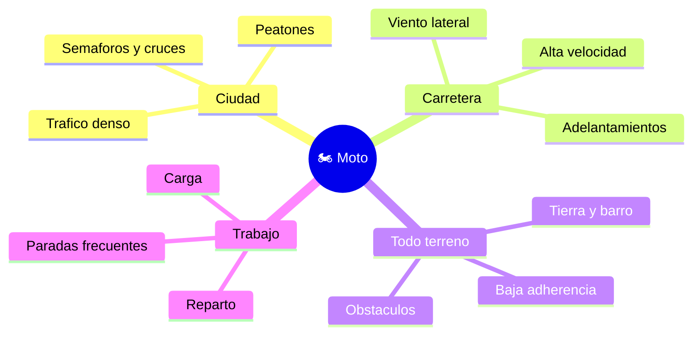

# 🌍 Entornos de trabajo de la moto

[🏠 Inicio](../../../README.md) · [🏍️ Curso: Motos](../README.md) · 🌍 Entornos

Donde opera una moto y como cambia la conduccion segun el entorno. Cada entorno
implica reglas, riesgos y ajustes distintos, y en simulacion se traduce en
escenarios diferentes.

---

## 🗺️ Entornos principales

| Entorno | Caracteristicas | Riesgos tipicos | Ajuste de conduccion |
| --- | --- | --- | --- |
| Ciudad | Trafico, cruces, peatones. | Puntos ciegos, puertas de autos. | Baja velocidad, anticipacion, frenada suave. |
| Carretera | Velocidad sostenida, curvas. | Viento, fatiga, adelantar. | Distancia amplia, curvas progresivas. |
| Todo terreno | Tierra, barro, piedras. | Perdida de adherencia. | Postura de pie, tacos, control de traccion. |
| Reparto / trabajo | Paradas y arranques. | Desgaste, distraccion. | Rutina de seguridad, carga bien fijada. |
| Lluvia / noche | Baja visibilidad y agarre. | Deslizamiento, no ser visto. | Luces, ropa reflectante, mayor distancia. |

---

## 🌦️ Factores del entorno

- **Clima**: lluvia y hielo reducen la adherencia; el viento afecta la
  estabilidad.
- **Superficie**: asfalto, adoquin, tierra o gravilla cambian el agarre.
- **Trafico**: mas vehiculos, mas puntos ciegos y decisiones.
- **Luz**: de noche o con niebla, ser visto es tan importante como ver.

---

## 🎮 Traduccion a simulacion

Cada entorno es un escenario con su superficie, clima y trafico. Ver como se
modela en el [Modulo 8: Diseno de simulacion](../simulacion/diseno-simulador-moto.md).

---

[⬅️ Anterior: Principios y operacion](principios-moto.md) · [➡️ Siguiente: Reglamentos](../reglamentos/reglamentos-moto.md)
