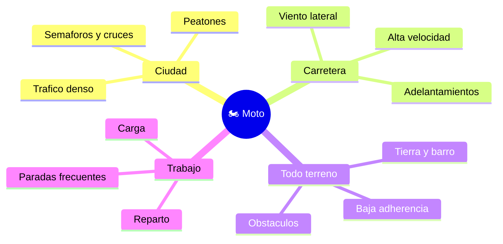

# 🌍 Entornos de trabajo de la moto

[🏠 Inicio](../../../README.md) · [🏍️ Curso: Motos](../README.md) · 🌍 Entornos

Dónde opera una moto y cómo cambia la conducción según el entorno. Cada entorno
implica reglas, riesgos y ajustes distintos, y en simulación se traduce en
escenarios diferentes.

---

## 🗺️ Entornos principales

```mermaid
mindmap
  root((🏍️ Moto))
    Ciudad
      Trafico denso
      Semaforos y cruces
      Peatones
    Carretera
      Alta velocidad
      Viento lateral
      Adelantamientos
    Todo terreno
      Tierra y barro
      Baja adherencia
      Obstaculos
    Trabajo
      Reparto
      Paradas frecuentes
      Carga
```

| Entorno | Características | Riesgos típicos | Ajuste de conducción |
| --- | --- | --- | --- |
| Ciudad | Tráfico, cruces, peatones. | Puntos ciegos, puertas de autos. | Baja velocidad, anticipación, frenada suave. |
| Carretera | Velocidad sostenida, curvas. | Viento, fatiga, adelantar. | Distancia amplia, curvas progresivas. |
| Todo terreno | Tierra, barro, piedras. | Pérdida de adherencia. | Postura de pie, tacos, control de tracción. |
| Reparto / trabajo | Paradas y arranques. | Desgaste, distracción. | Rutina de seguridad, carga bien fijada. |
| Lluvia / noche | Baja visibilidad y agarre. | Deslizamiento, no ser visto. | Luces, ropa reflectante, mayor distancia. |

---

## 🌦️ Factores del entorno

- **Clima**: lluvia y hielo reducen la adherencia; el viento afecta la
  estabilidad.
- **Superficie**: asfalto, adoquín, tierra o gravilla cambian el agarre.
- **Tráfico**: más vehículos, más puntos ciegos y decisiones.
- **Luz**: de noche o con niebla, ser visto es tan importante como ver.

---

## 🎮 Traducción a simulación

Cada entorno es un escenario con su superficie, clima y tráfico. Ver cómo se
modela en el [Módulo 9: Diseño de simulación](../simulacion/diseno-simulador-moto.md).

## 🎓 Cierre de clase

- **Actividad:** Contrasta tres entornos de Motocicletas a partir de entornos, factores ambientales, riesgos y respuesta de simulación y determina cómo cambian variables, percepción, riesgos y respuesta.
- **Evidencia:** Matriz entorno–cambio–riesgo–respuesta.
- **Criterio de aprobación:** Cada respuesta se adapta al entorno y distingue riesgos que no son intercambiables entre escenarios.
- **Transferencia:** explica qué cambiaría al pasar a otra variante de esta máquina.

### Fuentes de esta clase

- [CL-LEY-18290](https://www.bcn.cl/leychile/navegar?idNorma=29708): Ley de Tránsito 18.290, BCN Chile. Uso: marco legal chileno.
- [CL-CONASET](https://www.conaset.cl/manuales/): Manuales para conductores, CONASET. Uso: formación vial y seguridad.
- [US-NHTSA-MOTO](https://www.nhtsa.gov/road-safety/motorcycles): Motorcycle Safety, NHTSA. Uso: riesgos, equipo y conducción segura.
- [MSF-BRC](https://msf-usa.org/library/): Motorcycle Safety Foundation Library, MSF. Uso: formación inicial y ejercicios.

> Las fuentes sostienen el marco conceptual y normativo; esta clase no reemplaza el manual
> del fabricante, la formación certificada ni la habilitación exigida para operar equipos reales.

---

[⬅️ Anterior: Principios y operación](principios-moto.md) · [➡️ Siguiente: Reglamentos](../reglamentos/reglamentos-moto.md)
