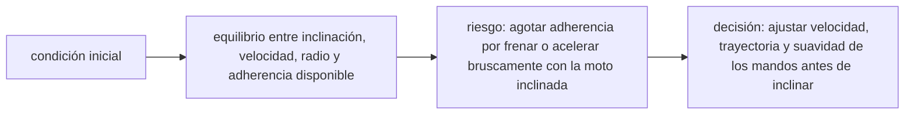

<!-- clase-meta
tipo_documento: clase
clase: 6
codigo: MOTOS-06
curso: motos
titulo: "Principios y operación de la moto"
modalidad: "resolución de problemas"
duracion_minutos: 90
nivel: introductorio
prerrequisito: MOTOS-05
competencia: "razonamiento_operacional"
resultados_aprendizaje:
  - "Explicar principios físicos, fases de operación, decisiones y errores frecuentes con vocabulario propio de Motocicletas."
  - "Aplicar esos conceptos a una decisión segura o a un escenario de simulación de Motocicletas."
evidencia: "Resolución argumentada de un escenario operacional."
criterio_aprobacion: "Aplica los principios correctos, anticipa consecuencias y respeta los límites del curso."
fuentes: manuales/fuentes.md
ultima_revision: 2026-09-10
-->

# 🧪 Principios y operación de la moto

[🏠 Inicio](../../../README.md) · [🏍️ Curso: Motos](../README.md) · 🧪 Principios

Documento general y educativo. No sustituye un curso de conducción certificado
ni el manual del fabricante. Describe cómo se opera una moto en simulación y que
principios físicos conviene representar.

## Principios de funcionamiento

- **Propulsión**: un motor (de combustión o eléctrico) entrega par a la rueda
  trasera a través de la transmisión. El acelerador regula esa entrega.
- **Dirección**: a baja velocidad se gira el manillar; a velocidad de marcha la
  moto cambia de rumbo sobre todo por inclinación y contramanillar.
- **Equilibrio**: la estabilidad aumenta con la velocidad por el efecto
  giroscópico de las ruedas y la geometría de la dirección.
- **Frenado**: el freno delantero aporta la mayor parte de la capacidad de
  detención porque el peso se transfiere hacia adelante al frenar.
- **Adherencia**: el agarre de los neumáticos limita cuanta aceleración,
  frenado e inclinación son posibles antes de perder control.

## Fases de operación

| Fase | Que ocurre | Puntos clave |
| --- | --- | --- |
| Inspección previa | Revisión básica | Neumáticos, luces, frenos, combustible, espejos. |
| Arranque | Encender el motor | Punto muerto o embrague, corte de motor desactivado. |
| Puesta en marcha | Iniciar movimiento | Primera marcha, soltar embrague mientras se acelera suave. |
| Conducción | Circular con seguridad | Mirar lejos, mantener distancia, usar ambos frenos. |
| Maniobras | Curvas y cambios | Reducir antes de la curva, inclinar, acelerar a la salida. |
| Detención | Parar de forma segura | Frenar progresivo, bajar marchas, dejar en primera o neutro. |
| Cierre | Dejar segura | Caballete, motor apagado, luces off. |

## Curvas: idea general

1. Ajustar la velocidad **antes** de entrar a la curva.
2. Mirar hacia la salida, no a la rueda delantera.
3. Inclinar la moto de forma progresiva.
4. Mantener o abrir suavemente el acelerador dentro de la curva.
5. Enderezar y acelerar a la salida.

## Errores comunes que la simulación puede enseñar a evitar

- Usar solo el freno trasero en una detención fuerte.
- Cerrar el acelerador de golpe en plena curva.
- Cambiar de marcha sin embrague en niveles realistas.
- Mirar demasiado cerca en vez de anticipar.
- Ignorar la transferencia de peso al frenar o acelerar.

## Relación con los niveles de realismo

- **Nivel 1 (educativo)**: acelerar, frenar, girar y respetar señales.
- **Nivel 2 (simplificado)**: agregar inercia, transferencia de peso y límite
  de adherencia.
- **Nivel 3 (técnico)**: sumar embrague, marchas, régimen del motor y frenada
  combinada.

Ver [`docs/03-niveles-de-realismo.md`](../../../docs/03-niveles-de-realismo.md) para el detalle de cada nivel.

## 🧭 Guía de estudio aplicada

### Pregunta guía

¿Cómo ayuda **Principios de funcionamiento, Fases de operación, Curvas: idea general y Errores comunes que la simulación puede enseñar a evitar** a **resolver aproximación a una curva urbana mojada con visibilidad parcial sin agotar el margen operacional**?

### Explicación razonada

El principio rector puede resumirse así: equilibrio entre inclinación, velocidad, radio y adherencia disponible. Esto explica por qué una misma orden produce resultados distintos cuando cambian velocidad, carga, configuración o entorno. Operar bien consiste en leer la tendencia antes de agotar el margen y tomar esta decisión: ajustar velocidad, trayectoria y suavidad de los mandos antes de inclinar.

Esta clase se conecta con el resto del curso mediante **equilibrio entre inclinación, velocidad, radio y adherencia disponible**. El hilo de
seguridad consiste en reconocer a tiempo **agotar adherencia por frenar o acelerar bruscamente con la moto inclinada** y poder justificar la decisión
**ajustar velocidad, trayectoria y suavidad de los mandos antes de inclinar**; en clases posteriores cambiará el ángulo de análisis, no esa relación causal.
La lectura funcional común sigue **motor → embrague y caja → transmisión final → neumático trasero**, de modo que cada concepto pueda
ubicarse dentro del funcionamiento completo y no quede como un dato aislado.

**Apoyo documental:** [Ley de Tránsito 18.290](https://www.bcn.cl/leychile/navegar?idNorma=29708) aporta marco legal chileno;
[Manuales para conductores](https://www.conaset.cl/manuales/) se usa para formación vial y seguridad. Estas fuentes
se contrastan con el alcance de la clase y no sustituyen un manual de equipo concreto.

### Caso resuelto: de la observación a la decisión

1. **Datos:** reconoce condiciones, configuración y margen disponibles en **aproximación a una curva urbana mojada con visibilidad parcial**.
2. **Modelo:** aplica **equilibrio entre inclinación, velocidad, radio y adherencia disponible** para predecir una tendencia antes de actuar.
3. **Riesgo:** explica mediante qué cadena de causas podría ocurrir **agotar adherencia por frenar o acelerar bruscamente con la moto inclinada**.
4. **Decisión:** ejecuta mentalmente **ajustar velocidad, trayectoria y suavidad de los mandos antes de inclinar** y define qué observación confirmaría que funcionó.

### Comprueba tu comprensión

1. ¿Qué variable del principio «equilibrio entre inclinación, velocidad, radio y adherencia disponible» cambia primero en el caso?
2. ¿Cómo se propaga ese cambio hasta **neumático trasero**?
3. ¿Qué evidencia confirmaría que **ajustar velocidad, trayectoria y suavidad de los mandos antes de inclinar** conservó margen operacional?

Orientación para revisar tus respuestas

- La primera respuesta debe relacionar el eslabón elegido con un efecto posterior, no solo nombrarlo.
- La segunda debe proponer una señal medible u observable y explicar qué tendencia sería preocupante.
- La tercera debe cambiar al menos una variable de capacidad, mando, entorno o margen de seguridad.

## 🎓 Cierre de clase

- **Actividad:** Resuelve un escenario de Motocicletas explicando, paso a paso, cómo intervienen principios físicos, fases de operación, decisiones y errores frecuentes.
- **Evidencia:** Resolución argumentada de un escenario operacional.
- **Criterio de aprobación:** Aplica los principios correctos, anticipa consecuencias y respeta los límites del curso.
- **Transferencia:** explica qué cambiaría al pasar a otra variante de esta máquina.

### Fuentes de esta clase

- [CL-LEY-18290](https://www.bcn.cl/leychile/navegar?idNorma=29708): Ley de Tránsito 18.290, BCN Chile. Uso: marco legal chileno.
- [CL-CONASET](https://www.conaset.cl/manuales/): Manuales para conductores, CONASET. Uso: formación vial y seguridad.
- [US-NHTSA-MOTO](https://www.nhtsa.gov/road-safety/motorcycles): Motorcycle Safety, NHTSA. Uso: riesgos, equipo y conducción segura.
- [MSF-BRC](https://msf-usa.org/library/): Motorcycle Safety Foundation Library, MSF. Uso: formación inicial y ejercicios.

> Las fuentes sostienen el marco conceptual y normativo; esta clase no reemplaza el manual
> del fabricante, la formación certificada ni la habilitación exigida para operar equipos reales.

---

[⬅️ Anterior: Mandos](../mandos/manual-mandos-moto.md) · [➡️ Siguiente: Entornos de trabajo](entornos-moto.md)
