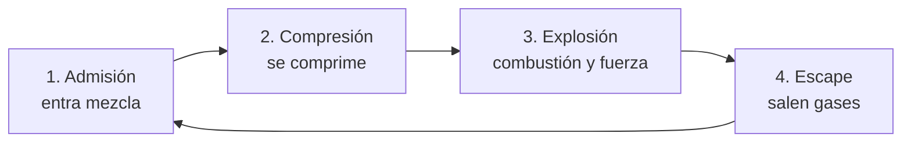
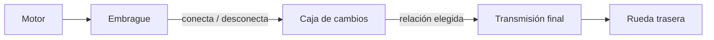
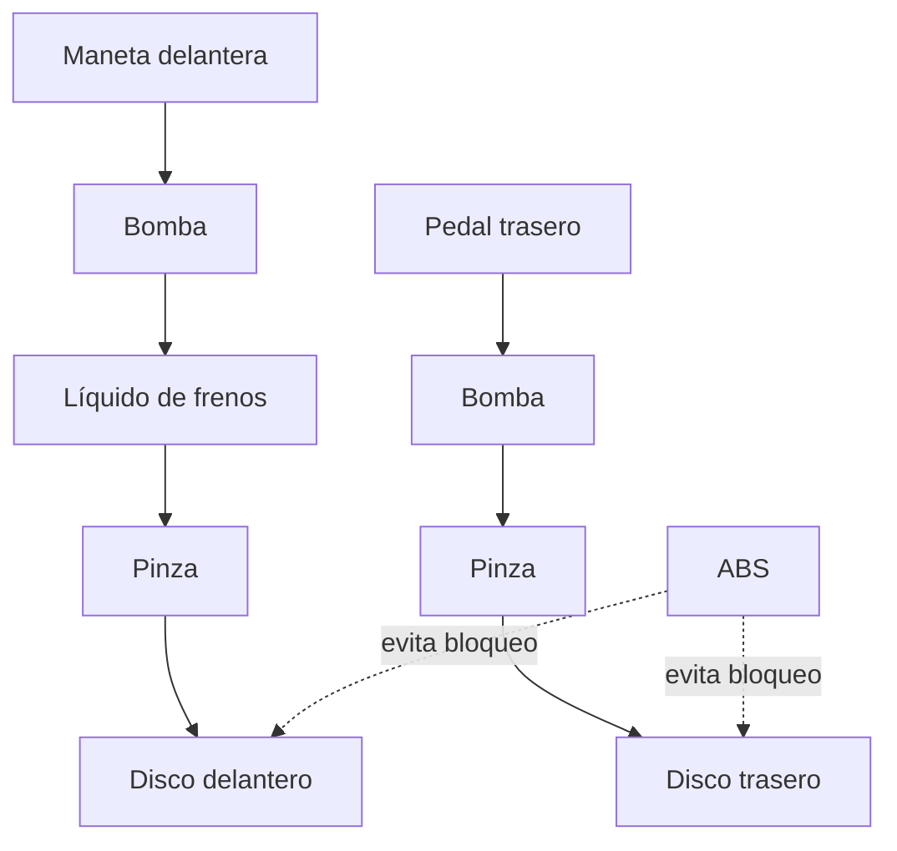

# 🔧 Sistemas mecánicos de la moto

[🏠 Inicio](../../../README.md) · [🏍️ Curso: Motos](../README.md) · 🔧 Sistemas mecánicos

Este módulo abre la moto por dentro. Explica cada sistema, como funciona y como
se conecta con los demás. Es la base técnica para entender los mandos (Módulo 4)
y la física de la conducción (Módulo 5).

---

## 1. ⚙️ Motor

El motor transforma energía (combustible o electricidad) en movimiento de giro.

### Motor de cuatro tiempos (4T)

El más común. Completa el ciclo en cuatro carreras del pistón:

| Parámetro | Efecto en la moto |
| --- | --- |
| Cilindrada (cc) | Mayor cilindrada, más potencia y par potenciales. |
| Número de cilindros | Suavidad y carácter (monocilindrico, bicilindrico, en línea). |
| Régimen (rpm) | Zona de potencia; el tacómetro lo muestra. |
| Par (torque) | Fuerza de empuje, importante a baja velocidad. |
| Potencia (kW/CV) | Capacidad de trabajo por unidad de tiempo. |

### Motor de dos tiempos (2T)

Completa el ciclo en dos carreras: más simple y ligero, históricamente común en
motos pequeñas, hoy en retroceso por emisiones.

### Motor eléctrico

Un motor alimentado por batería entrega par de forma inmediata, sin caja de
cambios en la mayoría de los casos. Cambia el mantenimiento y la autonomía.

### Sistemas de apoyo del motor

- **Alimentación**: carburador (clásico) o inyección electrónica (moderno).
- **Refrigeración**: por aire, por aceite o por líquido (radiador).
- **Lubricación**: el aceite reduce el desgaste y ayuda a disipar calor.
- **Encendido**: la bujía inflama la mezcla en el momento justo.

---

## 2. 🔗 Transmisión

Lleva la fuerza del motor a la rueda trasera y adapta fuerza y velocidad.

- **Embrague**: conecta y desconecta el motor de la caja para arrancar y
  cambiar de marcha sin detener el motor.
- **Caja de cambios**: juego de engranajes (marchas). Las marchas cortas dan
  fuerza; las largas dan velocidad. Patrón típico: 1 - N - 2 - 3 - 4 - 5 - 6.
- **Transmisión final**: entrega el giro a la rueda. Tres tipos:

| Tipo | Ventaja | Desventaja |
| --- | --- | --- |
| Cadena | Ligera, eficiente, económica. | Requiere lubricación y ajuste. |
| Correa | Silenciosa y limpia. | Menos tolerante a mucha potencia. |
| Cardan | Muy duradera, sin mantenimiento frecuente. | Más pesada y cara. |

---

## 3. 🏗️ Chasis

Es la estructura que une todo y define la geometría de la dirección.

- **Cuadro**: soporta motor, suspensión y piloto.
- **Geometría** (ángulo de lanzamiento y avance): influye en si la moto es ágil
  o estable.
- **Distribución de peso**: afecta el agarre delantero/trasero.

---

## 4. 🌊 Suspensión

Mantiene los neumáticos en contacto con el suelo y absorbe irregularidades.

- **Delantera**: normalmente una horquilla telescópica.
- **Trasera**: uno o dos amortiguadores conectados al basculante.
- **Parámetros**: precarga, compresión y rebote regulan el comportamiento.

Sin buena suspensión, la rueda "salta" y pierde adherencia, reduciendo el
control al frenar y en curva.

---

## 5. 🛑 Frenos

Convierten la energía de movimiento en calor para reducir la velocidad.

- **Freno delantero**: aporta la mayor parte de la capacidad de frenado porque
  el peso se transfiere hacia adelante al frenar.
- **Freno trasero**: estabiliza y complementa.
- **ABS**: evita el bloqueo de la rueda; mejora el control en frenadas fuertes o
  con poca adherencia.

---

## 6. ⭕ Neumáticos

El único contacto con el suelo. Todo (acelerar, frenar, girar) pasa por ellos.

- **Adherencia**: limita cuanta fuerza se puede aplicar antes de deslizar.
- **Dibujo**: evacua agua y da agarre según el uso (calle, mixto, taco).
- **Presión**: incorrecta afecta agarre, desgaste y consumo.
- **Perfil**: la forma redondeada permite inclinar la moto en curva.

---

## 🔁 Cómo se conecta todo

1. El **motor** genera fuerza.
2. El **embrague** y la **caja** adaptan esa fuerza.
3. La **transmisión final** la lleva a la **rueda** trasera.
4. El **chasis** y la **suspensión** mantienen la geometría y el contacto.
5. Los **neumáticos** convierten todo en movimiento real.
6. Los **frenos** devuelven el control reduciendo la velocidad.

Con esto entendido, el [Módulo 4: Mandos](../mandos/manual-mandos-moto.md) muestra
como el piloto opera cada uno de estos sistemas.

---

[⬅️ Anterior: Características](caracteristicas-moto.md) · [➡️ Siguiente: Mandos e instrumentos](../mandos/manual-mandos-moto.md)
