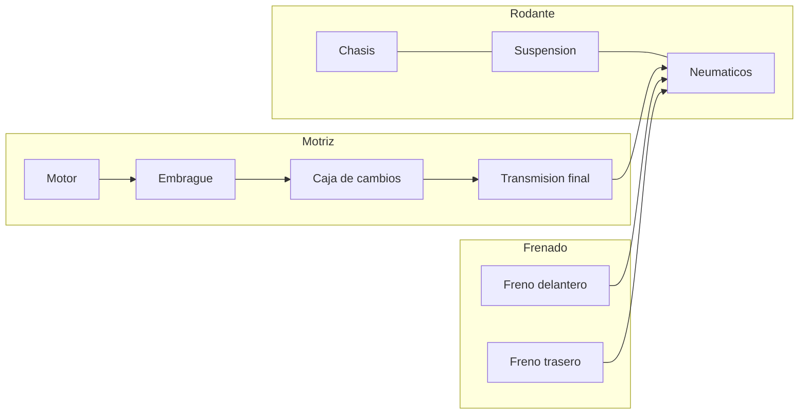
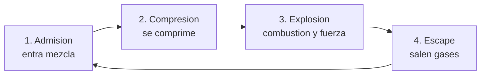
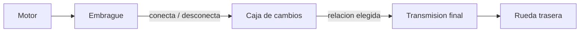
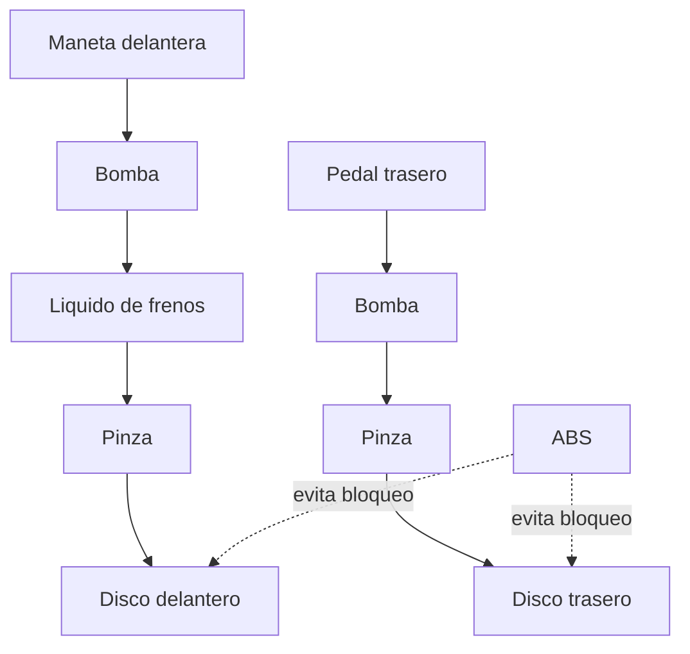

# 🔧 Sistemas mecanicos de la moto

[🏠 Inicio](../../../README.md) · [🏍️ Curso: Motos](../README.md) · 🔧 Sistemas mecanicos

Este modulo abre la moto por dentro. Explica cada sistema, como funciona y como
se conecta con los demas. Es la base tecnica para entender los mandos (Modulo 4)
y la fisica de la conduccion (Modulo 5).

---

## 1. ⚙️ Motor

El motor transforma energia (combustible o electricidad) en movimiento de giro.

### Motor de cuatro tiempos (4T)

El mas comun. Completa el ciclo en cuatro carreras del piston:

| Parametro | Efecto en la moto |
| --- | --- |
| Cilindrada (cc) | Mayor cilindrada, mas potencia y par potenciales. |
| Numero de cilindros | Suavidad y caracter (monocilindrico, bicilindrico, en linea). |
| Regimen (rpm) | Zona de potencia; el tacometro lo muestra. |
| Par (torque) | Fuerza de empuje, importante a baja velocidad. |
| Potencia (kW/CV) | Capacidad de trabajo por unidad de tiempo. |

### Motor de dos tiempos (2T)

Completa el ciclo en dos carreras: mas simple y ligero, historicamente comun en
motos pequenas, hoy en retroceso por emisiones.

### Motor electrico

Un motor alimentado por bateria entrega par de forma inmediata, sin caja de
cambios en la mayoria de los casos. Cambia el mantenimiento y la autonomia.

### Sistemas de apoyo del motor

- **Alimentacion**: carburador (clasico) o inyeccion electronica (moderno).
- **Refrigeracion**: por aire, por aceite o por liquido (radiador).
- **Lubricacion**: el aceite reduce el desgaste y ayuda a disipar calor.
- **Encendido**: la bujia inflama la mezcla en el momento justo.

---

## 2. 🔗 Transmision

Lleva la fuerza del motor a la rueda trasera y adapta fuerza y velocidad.

- **Embrague**: conecta y desconecta el motor de la caja para arrancar y
  cambiar de marcha sin detener el motor.
- **Caja de cambios**: juego de engranajes (marchas). Las marchas cortas dan
  fuerza; las largas dan velocidad. Patron tipico: 1 - N - 2 - 3 - 4 - 5 - 6.
- **Transmision final**: entrega el giro a la rueda. Tres tipos:

| Tipo | Ventaja | Desventaja |
| --- | --- | --- |
| Cadena | Ligera, eficiente, economica. | Requiere lubricacion y ajuste. |
| Correa | Silenciosa y limpia. | Menos tolerante a mucha potencia. |
| Cardan | Muy duradera, sin mantenimiento frecuente. | Mas pesada y cara. |

---

## 3. 🏗️ Chasis

Es la estructura que une todo y define la geometria de la direccion.

- **Cuadro**: soporta motor, suspension y piloto.
- **Geometria** (angulo de lanzamiento y avance): influye en si la moto es agil
  o estable.
- **Distribucion de peso**: afecta el agarre delantero/trasero.

---

## 4. 🌊 Suspension

Mantiene los neumaticos en contacto con el suelo y absorbe irregularidades.

- **Delantera**: normalmente una horquilla telescopica.
- **Trasera**: uno o dos amortiguadores conectados al basculante.
- **Parametros**: precarga, compresion y rebote regulan el comportamiento.

Sin buena suspension, la rueda "salta" y pierde adherencia, reduciendo el
control al frenar y en curva.

---

## 5. 🛑 Frenos

Convierten la energia de movimiento en calor para reducir la velocidad.

- **Freno delantero**: aporta la mayor parte de la capacidad de frenado porque
  el peso se transfiere hacia adelante al frenar.
- **Freno trasero**: estabiliza y complementa.
- **ABS**: evita el bloqueo de la rueda; mejora el control en frenadas fuertes o
  con poca adherencia.

---

## 6. ⭕ Neumaticos

El unico contacto con el suelo. Todo (acelerar, frenar, girar) pasa por ellos.

- **Adherencia**: limita cuanta fuerza se puede aplicar antes de deslizar.
- **Dibujo**: evacua agua y da agarre segun el uso (calle, mixto, taco).
- **Presion**: incorrecta afecta agarre, desgaste y consumo.
- **Perfil**: la forma redondeada permite inclinar la moto en curva.

---

## 🔁 Como se conecta todo

1. El **motor** genera fuerza.
2. El **embrague** y la **caja** adaptan esa fuerza.
3. La **transmision final** la lleva a la **rueda** trasera.
4. El **chasis** y la **suspension** mantienen la geometria y el contacto.
5. Los **neumaticos** convierten todo en movimiento real.
6. Los **frenos** devuelven el control reduciendo la velocidad.

Con esto entendido, el [Modulo 4: Mandos](../mandos/manual-mandos-moto.md) muestra
como el piloto opera cada uno de estos sistemas.

---

[⬅️ Anterior: Caracteristicas](caracteristicas-moto.md) · [➡️ Siguiente: Mandos e instrumentos](../mandos/manual-mandos-moto.md)
