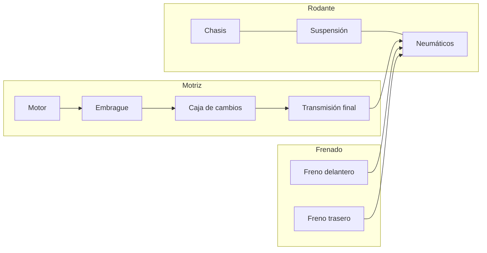
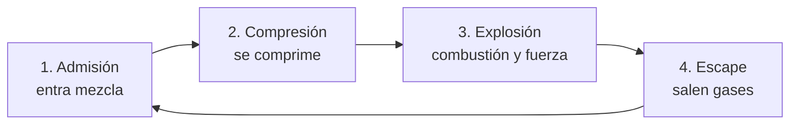
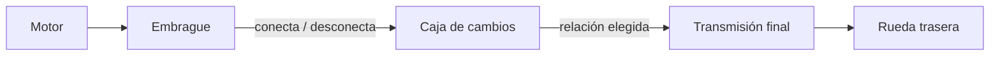
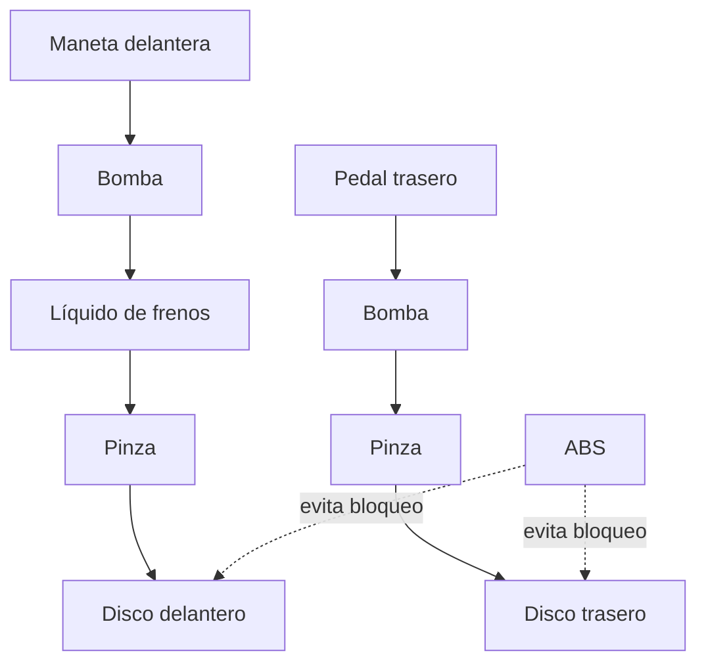
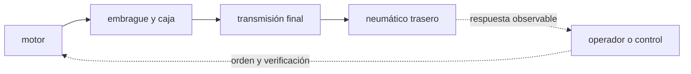

<!-- clase-meta
tipo_documento: clase
clase: 4
codigo: MOTOS-04
curso: motos
titulo: "Sistemas mecánicos de la moto"
modalidad: "teórica aplicada"
duracion_minutos: 90
nivel: introductorio
prerrequisito: MOTOS-03
competencia: "comprension_de_sistemas"
resultados_aprendizaje:
  - "Explicar Motor, Transmisión, Chasis y Suspensión con vocabulario propio de Motocicletas."
  - "Aplicar esos conceptos a una decisión segura o a un escenario de simulación de Motocicletas."
evidencia: "Esquema con flujos de energía, materia o información anotados."
criterio_aprobacion: "Las conexiones esenciales son correctas y la consecuencia de la falla se propaga de manera coherente."
fuentes: manuales/fuentes.md
ultima_revision: 2026-09-10
-->

# 🔧 Sistemas mecánicos de la moto

[🏠 Inicio](../../../README.md) · [🏍️ Curso: Motos](../README.md) · 🔧 Sistemas mecánicos

Esta clase abre la moto por dentro. Explica cada sistema, como funciona y como
se conecta con los demás. Es la base técnica para entender los mandos (Clase 5)
y la física de la conducción (Clase 6).

```mermaid
flowchart LR
    subgraph Motriz
        M[Motor] --> E[Embrague] --> C[Caja de cambios] --> T[Transmisión final]
    end
    subgraph Rodante
        Ch[Chasis] --- Su[Suspensión]
        Su --- N[Neumáticos]
    end
    subgraph Frenado
        Fd[Freno delantero]
        Ft[Freno trasero]
    end
    T --> N
    Fd --> N
    Ft --> N
```

---

## 1. ⚙️ Motor

El motor transforma energía (combustible o electricidad) en movimiento de giro.

### Motor de cuatro tiempos (4T)

El más común. Completa el ciclo en cuatro carreras del pistón:

```mermaid
flowchart LR
    A[1. Admisión<br/>entra mezcla] --> B[2. Compresión<br/>se comprime]
    B --> C[3. Explosión<br/>combustión y fuerza]
    C --> D[4. Escape<br/>salen gases]
    D --> A
```

| Parámetro | Efecto en la moto |
| --- | --- |
| Cilindrada (cc) | Mayor cilindrada, más potencia y par potenciales. |
| Número de cilindros | Suavidad y carácter (monocilindrico, bicilindrico, en línea). |
| Régimen (rpm) | Zona de potencia; el tacómetro lo muestra. |
| Par (torque) | Fuerza de empuje, importante a baja velocidad. |
| Potencia (kW/CV) | Capacidad de trabajo por unidad de tiempo. |

### Motor de dos tiempos (2T)

Completa el ciclo en dos carreras: más simple y ligero, históricamente común en
motos pequeñas, hoy en retroceso por emisiones.

### Motor eléctrico

Un motor alimentado por batería entrega par de forma inmediata, sin caja de
cambios en la mayoría de los casos. Cambia el mantenimiento y la autonomía.

### Sistemas de apoyo del motor

- **Alimentación**: carburador (clásico) o inyección electrónica (moderno).
- **Refrigeración**: por aire, por aceite o por líquido (radiador).
- **Lubricación**: el aceite reduce el desgaste y ayuda a disipar calor.
- **Encendido**: la bujía inflama la mezcla en el momento justo.

---

## 2. 🔗 Transmisión

Lleva la fuerza del motor a la rueda trasera y adapta fuerza y velocidad.

```mermaid
flowchart LR
    Motor --> Embrague
    Embrague -->|conecta / desconecta| Caja[Caja de cambios]
    Caja -->|relación elegida| Final[Transmisión final]
    Final --> Rueda[Rueda trasera]
```

- **Embrague**: conecta y desconecta el motor de la caja para arrancar y
  cambiar de marcha sin detener el motor.
- **Caja de cambios**: juego de engranajes (marchas). Las marchas cortas dan
  fuerza; las largas dan velocidad. Patrón típico: 1 - N - 2 - 3 - 4 - 5 - 6.
- **Transmisión final**: entrega el giro a la rueda. Tres tipos:

| Tipo | Ventaja | Desventaja |
| --- | --- | --- |
| Cadena | Ligera, eficiente, económica. | Requiere lubricación y ajuste. |
| Correa | Silenciosa y limpia. | Menos tolerante a mucha potencia. |
| Cardan | Muy duradera, sin mantenimiento frecuente. | Más pesada y cara. |

---

## 3. 🏗️ Chasis

Es la estructura que une todo y define la geometría de la dirección.

- **Cuadro**: soporta motor, suspensión y piloto.
- **Geometría** (ángulo de lanzamiento y avance): influye en si la moto es ágil
  o estable.
- **Distribución de peso**: afecta el agarre delantero/trasero.

---

## 4. 🌊 Suspensión

Mantiene los neumáticos en contacto con el suelo y absorbe irregularidades.

- **Delantera**: normalmente una horquilla telescópica.
- **Trasera**: uno o dos amortiguadores conectados al basculante.
- **Parámetros**: precarga, compresión y rebote regulan el comportamiento.

Sin buena suspensión, la rueda "salta" y pierde adherencia, reduciendo el
control al frenar y en curva.

---

## 5. 🛑 Frenos

Convierten la energía de movimiento en calor para reducir la velocidad.

```mermaid
flowchart TD
    Maneta[Maneta delantera] --> BombaD[Bomba] --> LiquidoD[Líquido de frenos]
    LiquidoD --> PinzaD[Pinza] --> DiscoD[Disco delantero]
    Pedal[Pedal trasero] --> BombaT[Bomba] --> PinzaT[Pinza] --> DiscoT[Disco trasero]
    ABS[ABS] -. evita bloqueo .-> DiscoD
    ABS -. evita bloqueo .-> DiscoT
```

- **Freno delantero**: aporta la mayor parte de la capacidad de frenado porque
  el peso se transfiere hacia adelante al frenar.
- **Freno trasero**: estabiliza y complementa.
- **ABS**: evita el bloqueo de la rueda; mejora el control en frenadas fuertes o
  con poca adherencia.

---

## 6. ⭕ Neumáticos

El único contacto con el suelo. Todo (acelerar, frenar, girar) pasa por ellos.

- **Adherencia**: limita cuanta fuerza se puede aplicar antes de deslizar.
- **Dibujo**: evacua agua y da agarre según el uso (calle, mixto, taco).
- **Presión**: incorrecta afecta agarre, desgaste y consumo.
- **Perfil**: la forma redondeada permite inclinar la moto en curva.

---

## 🔁 Cómo se conecta todo

1. El **motor** genera fuerza.
2. El **embrague** y la **caja** adaptan esa fuerza.
3. La **transmisión final** la lleva a la **rueda** trasera.
4. El **chasis** y la **suspensión** mantienen la geometría y el contacto.
5. Los **neumáticos** convierten todo en movimiento real.
6. Los **frenos** devuelven el control reduciendo la velocidad.

Con esto entendido, el [Clase 5: Mandos](../mandos/manual-mandos-moto.md) muestra
como el piloto opera cada uno de estos sistemas.

## 🧭 Guía de estudio aplicada

### Pregunta guía

¿Cómo ayuda **Motor, Transmisión, Chasis y Suspensión** a **seguir una alteración desde motor hasta neumático trasero durante aproximación a una curva urbana mojada con visibilidad parcial**?

### Explicación razonada

El funcionamiento puede leerse como una cadena causal: motor entrega o transforma energía; embrague y caja la adapta; transmisión final la transmite o gobierna; y neumático trasero produce el efecto observable. La cadena no es lineal en sentido estricto: sensores, estructura y operador cierran el lazo. Si un eslabón se degrada, la señal importante es cómo cambia el estado de neumático trasero y qué margen queda.

```mermaid
flowchart LR
    A["motor"] --> B["embrague y caja"] --> C["transmisión final"] --> D["neumático trasero"]
    D -. respuesta observable .-> O["operador o control"]
    O -. orden y verificación .-> A
```

Esta clase se conecta con el resto del curso mediante **equilibrio entre inclinación, velocidad, radio y adherencia disponible**. El hilo de
seguridad consiste en reconocer a tiempo **agotar adherencia por frenar o acelerar bruscamente con la moto inclinada** y poder justificar la decisión
**ajustar velocidad, trayectoria y suavidad de los mandos antes de inclinar**; en clases posteriores cambiará el ángulo de análisis, no esa relación causal.
La lectura funcional común sigue **motor → embrague y caja → transmisión final → neumático trasero**, de modo que cada concepto pueda
ubicarse dentro del funcionamiento completo y no quede como un dato aislado.

**Apoyo documental:** [Ley de Tránsito 18.290](https://www.bcn.cl/leychile/navegar?idNorma=29708) aporta marco legal chileno;
[Manuales para conductores](https://www.conaset.cl/manuales/) se usa para formación vial y seguridad. Estas fuentes
se contrastan con el alcance de la clase y no sustituyen un manual de equipo concreto.

### Caso resuelto: de la observación a la decisión

1. **Entrada:** identifica el estado inicial de **motor** durante **aproximación a una curva urbana mojada con visibilidad parcial**.
2. **Transformación:** explica qué hacen **embrague y caja** y **transmisión final**, y qué magnitud cambia en cada paso.
3. **Salida:** comprueba el efecto esperado en **neumático trasero** y busca una desviación temprana.
4. **Falla razonada:** si aparece **agotar adherencia por frenar o acelerar bruscamente con la moto inclinada**, retrocede por la cadena antes de ordenar otra acción.

### Comprueba tu comprensión

1. Si se degrada **embrague y caja**, ¿qué efecto esperarías primero en **transmisión final** y después en **neumático trasero**?
2. ¿Qué observación ayudaría a diferenciar una falla de **motor** de una falla de **transmisión final**?
3. ¿Por qué una segunda orden podría agravar **agotar adherencia por frenar o acelerar bruscamente con la moto inclinada**?

Orientación para revisar tus respuestas

- La primera respuesta debe relacionar el eslabón elegido con un efecto posterior, no solo nombrarlo.
- La segunda debe proponer una señal medible u observable y explicar qué tendencia sería preocupante.
- La tercera debe cambiar al menos una variable de capacidad, mando, entorno o margen de seguridad.

## 🎓 Cierre de clase

- **Actividad:** Dibuja un esquema funcional de Motocicletas que conecte Motor, Transmisión, Chasis y Suspensión; después predice el efecto de una falla simulada.
- **Evidencia:** Esquema con flujos de energía, materia o información anotados.
- **Criterio de aprobación:** Las conexiones esenciales son correctas y la consecuencia de la falla se propaga de manera coherente.
- **Transferencia:** explica qué cambiaría al pasar a otra variante de esta máquina.

### Fuentes de esta clase

- [CL-LEY-18290](https://www.bcn.cl/leychile/navegar?idNorma=29708): Ley de Tránsito 18.290, BCN Chile. Uso: marco legal chileno.
- [CL-CONASET](https://www.conaset.cl/manuales/): Manuales para conductores, CONASET. Uso: formación vial y seguridad.
- [US-NHTSA-MOTO](https://www.nhtsa.gov/road-safety/motorcycles): Motorcycle Safety, NHTSA. Uso: riesgos, equipo y conducción segura.
- [MSF-BRC](https://msf-usa.org/library/): Motorcycle Safety Foundation Library, MSF. Uso: formación inicial y ejercicios.

> Las fuentes sostienen el marco conceptual y normativo; esta clase no reemplaza el manual
> del fabricante, la formación certificada ni la habilitación exigida para operar equipos reales.

---

[⬅️ Anterior: Modelos y variantes](../modelos/modelos-moto.md) · [➡️ Siguiente: Mandos e instrumentos](../mandos/manual-mandos-moto.md)
