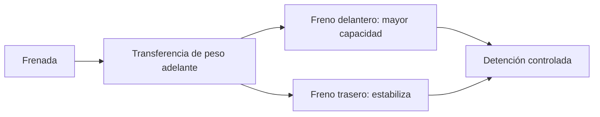

# 🧰 Recursos de la moto

[🏠 Inicio](../../../README.md) · [🏍️ Curso: Motos](../README.md) · 🧰 Recursos

Glosario específico, enlaces y diagramas de apoyo del curso de motos. Amplia el
[glosario general](../../../docs/05-glosario-general.md).

---

## 📖 Glosario específico

| Término | Definición |
| --- | --- |
| Contramanillar | Empujar el manillar hacia el lado contrario para iniciar la inclinación en curva a velocidad. |
| Transferencia de peso | Desplazamiento de la carga entre ruedas al frenar o acelerar. |
| Punto de amordace | Momento en que el embrague empieza a transmitir fuerza. |
| Freno motor | Retención que produce el motor al soltar el acelerador. |
| Adherencia | Agarre disponible del neumático antes de deslizar. |
| Cilindrada | Volumen total de los cilindros del motor, en cc. |
| Régimen | Velocidad de giro del motor, en rpm. |

---

## 🗺️ Diagrama de reparto de frenado

---

## 🔗 Enlaces y fuentes

- Marco legal: [⚖️ docs/07-marco-legal-chile.md](../../../docs/07-marco-legal-chile.md)
- Registro de fuentes: [📚 manuales/fuentes.md](../../../manuales/fuentes.md)
- Manuales oficiales del conductor (CONASET): ver el registro de fuentes.

Registrar cada recurso nuevo con su origen y licencia, siguiendo
[`recursos/README.md`](../../../recursos/README.md).

---

[🎓 Portada del curso](../README.md) · [⬅️ Anterior: Diseño de simulación](../simulacion/diseno-simulador-moto.md)
