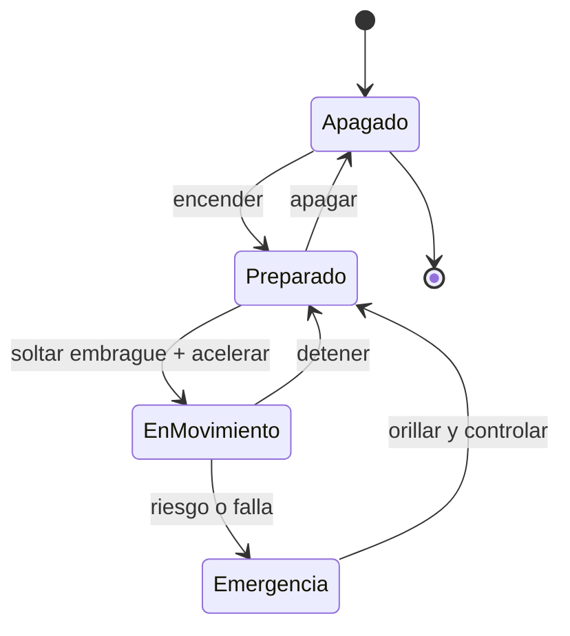

# 🎮 Diseno de simulacion de la moto

[🏠 Inicio](../../../README.md) · [🏍️ Curso: Motos](../README.md) · 🎮 Simulacion

## Objetivo de la simulacion

Que el usuario aprenda a acelerar, frenar con ambos frenos, cambiar de marcha,
tomar curvas por inclinacion y respetar normas basicas de transito, de forma
segura y progresiva.

## Nivel de realismo

- Nivel elegido: se ofrece del 1 al 3 (ver `docs/03-niveles-de-realismo.md`).
- Justificacion: la moto permite ensenar equilibrio, frenado y cambios con una
  complejidad menor que un buque o una aeronave, por eso es el vehiculo inicial.

## Variables principales

| Variable | Tipo | Rango | Afecta a | Comentarios |
| --- | --- | --- | --- | --- |
| Velocidad | numerica | 0-180 km/h | Movimiento y estabilidad | Central para todo. |
| Regimen del motor | numerica | 0-12000 rpm | Potencia disponible | Ligado a la marcha. |
| Marcha | discreta | N,1..6 | Aceleracion y freno motor | Requiere embrague. |
| Inclinacion | numerica | -50..50 grados | Radio de giro | Limitada por adherencia. |
| Adherencia | numerica | 0-1 | Freno, giro, aceleracion | Baja con lluvia. |
| Combustible/energia | numerica | 0-100% | Autonomia | Incluye reserva. |
| Peso del conjunto | numerica | fijo + carga | Inercia y frenado | Afecta transferencia de peso. |

## Ciclo basico

1. Leer entrada del usuario (acelerador, frenos, embrague, marcha, direccion).
2. Actualizar estado del motor y la transmision.
3. Calcular fuerzas: propulsion, frenado, gravedad y adherencia.
4. Aplicar restricciones del entorno (piso, pendiente, clima).
5. Actualizar velocidad, posicion e inclinacion.
6. Refrescar instrumentos y retroalimentacion (sonido, vibracion, testigos).

## Modos de juego futuros

- Tutorial guiado de mandos.
- Practica libre en circuito cerrado.
- Misiones educativas de transito urbano.
- Desafios de frenado y precision.
- Situaciones de riesgo controladas (piso mojado, obstaculo) sin contenido sensible.

## Elementos fuera de alcance

- Maniobras acrobaticas peligrosas presentadas como recomendables.
- Reproduccion de conduccion temeraria como objetivo del juego.
- Datos tecnicos que permitan alterar sistemas reales de una moto.

## Pendientes

- [ ] Definir valores por defecto de cada variable por tipo de moto.
- [ ] Prototipar el ciclo basico en un motor simple.
- [ ] Ajustar el modelo de adherencia con lluvia.
- [ ] Agregar fuentes tecnicas publicas a [`manuales/fuentes.md`](../../../manuales/fuentes.md).

---

[⬅️ Anterior: Reglamentos](../reglamentos/reglamentos-moto.md) · [➡️ Siguiente: Recursos](../recursos/recursos-moto.md)
