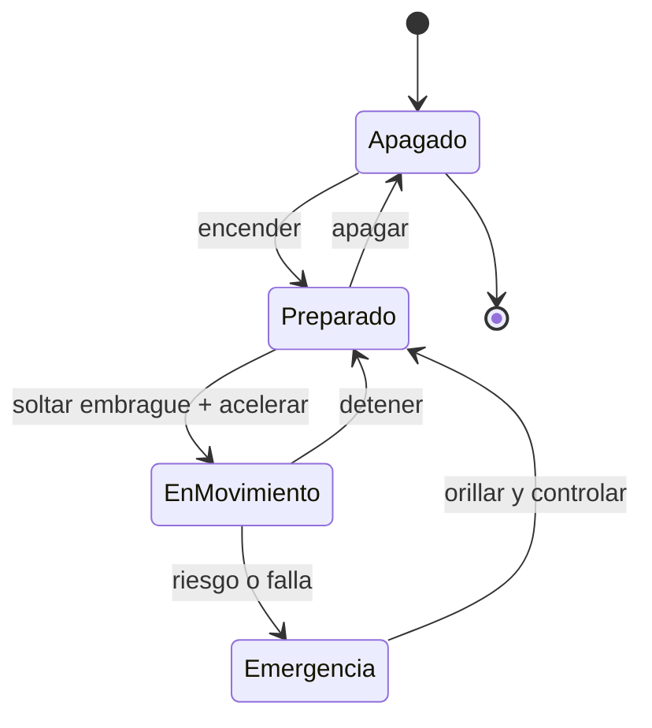

# 🎮 Diseño de simulación de la moto

[🏠 Inicio](../../../README.md) · [🏍️ Curso: Motos](../README.md) · 🎮 Simulación

## Objetivo de la simulación

Que el usuario aprenda a acelerar, frenar con ambos frenos, cambiar de marcha,
tomar curvas por inclinación y respetar normas básicas de tránsito, de forma
segura y progresiva.

## Nivel de realismo

- Nivel elegido: se ofrece del 1 al 3 (ver `docs/03-niveles-de-realismo.md`).
- Justificación: la moto permite enseñar equilibrio, frenado y cambios con una
  complejidad menor que un buque o una aeronave, por eso es el vehículo inicial.

## Variables principales

| Variable | Tipo | Rango | Afecta a | Comentarios |
| --- | --- | --- | --- | --- |
| Velocidad | numérica | 0-180 km/h | Movimiento y estabilidad | Central para todo. |
| Régimen del motor | numérica | 0-12000 rpm | Potencia disponible | Ligado a la marcha. |
| Marcha | discreta | N,1..6 | Aceleración y freno motor | Requiere embrague. |
| Inclinación | numérica | -50..50 grados | Radio de giro | Limitada por adherencia. |
| Adherencia | numérica | 0-1 | Freno, giro, aceleración | Baja con lluvia. |
| Combustible/energía | numérica | 0-100% | Autonomía | Incluye reserva. |
| Peso del conjunto | numérica | fijo + carga | Inercia y frenado | Afecta transferencia de peso. |

## Ciclo básico

1. Leer entrada del usuario (acelerador, frenos, embrague, marcha, dirección).
2. Actualizar estado del motor y la transmisión.
3. Calcular fuerzas: propulsión, frenado, gravedad y adherencia.
4. Aplicar restricciones del entorno (piso, pendiente, clima).
5. Actualizar velocidad, posición e inclinación.
6. Refrescar instrumentos y retroalimentación (sonido, vibración, testigos).

## Modos de juego futuros

- Tutorial guiado de mandos.
- Práctica libre en circuito cerrado.
- Misiones educativas de tránsito urbano.
- Desafíos de frenado y precisión.
- Situaciones de riesgo controladas (piso mojado, obstáculo) sin contenido sensible.

## Elementos fuera de alcance

- Maniobras acrobaticas peligrosas presentadas como recomendables.
- Reproducción de conducción temeraria como objetivo del juego.
- Datos técnicos que permitan alterar sistemas reales de una moto.

## Pendientes

- [ ] Definir valores por defecto de cada variable por tipo de moto.
- [ ] Prototipar el ciclo básico en un motor simple.
- [ ] Ajustar el modelo de adherencia con lluvia.
- [ ] Agregar fuentes técnicas públicas a [`manuales/fuentes.md`](../../../manuales/fuentes.md).

---

[⬅️ Anterior: Reglamentos](../reglamentos/reglamentos-moto.md) · [➡️ Siguiente: Recursos](../recursos/recursos-moto.md)
