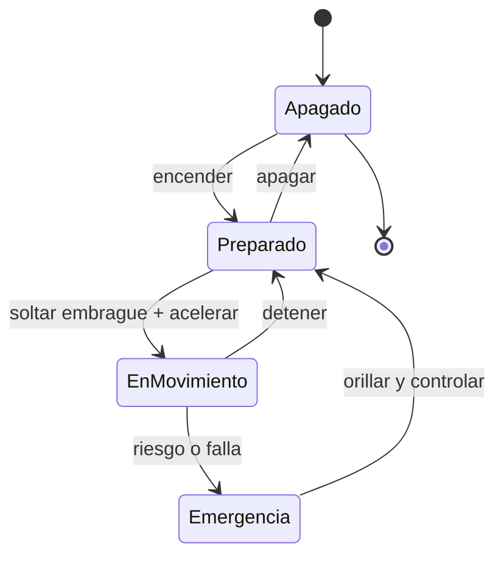
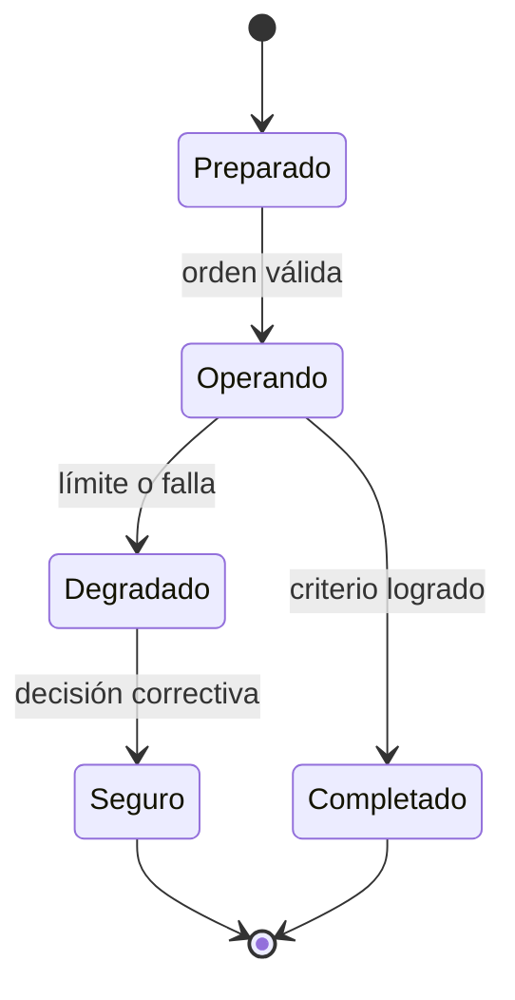

<!-- clase-meta
tipo_documento: clase
clase: 9
codigo: MOTOS-09
curso: motos
titulo: "Diseño de simulación de la moto"
modalidad: "laboratorio de diseño"
duracion_minutos: 90
nivel: introductorio
prerrequisito: MOTOS-08
competencia: "modelado_de_simulacion"
resultados_aprendizaje:
  - "Explicar objetivo, variables, estados, ciclo y escenarios de simulación con vocabulario propio de Motocicletas."
  - "Aplicar esos conceptos a una decisión segura o a un escenario de simulación de Motocicletas."
evidencia: "Ficha de escenario y diagrama de estados."
criterio_aprobacion: "El modelo es específico de la máquina, medible, seguro y trazable a clases anteriores."
fuentes: manuales/fuentes.md
ultima_revision: 2026-09-10
-->

# 🎮 Diseño de simulación de la moto

[🏠 Inicio](../../../README.md) · [🏍️ Curso: Motos](../README.md) · 🎮 Simulación

```mermaid
stateDiagram-v2
    [*] --> Apagado
    Apagado --> Preparado: encender
    Preparado --> EnMovimiento: soltar embrague + acelerar
    EnMovimiento --> Preparado: detener
    EnMovimiento --> Emergencia: riesgo o falla
    Emergencia --> Preparado: orillar y controlar
    Preparado --> Apagado: apagar
    Apagado --> [*]
```

## Objetivo de la simulación

Que el usuario aprenda a acelerar, frenar con ambos frenos, cambiar de marcha,
tomar curvas por inclinación y respetar normas básicas de tránsito, de forma
segura y progresiva.

## Nivel de realismo

- Nivel elegido: se ofrece del 1 al 3 (ver `docs/03-niveles-de-realismo.md`).
- Justificación: la moto permite enseñar equilibrio, frenado y cambios con una
  complejidad menor que un buque o una aeronave, por eso es el vehículo inicial.

## Variables principales

| Variable | Tipo | Rango | Afecta a | Comentarios |
| --- | --- | --- | --- | --- |
| Velocidad | numérica | 0-180 km/h | Movimiento y estabilidad | Central para todo. |
| Régimen del motor | numérica | 0-12000 rpm | Potencia disponible | Ligado a la marcha. |
| Marcha | discreta | N,1..6 | Aceleración y freno motor | Requiere embrague. |
| Inclinación | numérica | -50..50 grados | Radio de giro | Limitada por adherencia. |
| Adherencia | numérica | 0-1 | Freno, giro, aceleración | Baja con lluvia. |
| Combustible/energía | numérica | 0-100% | Autonomía | Incluye reserva. |
| Peso del conjunto | numérica | fijo + carga | Inercia y frenado | Afecta transferencia de peso. |

## Ciclo básico

1. Leer entrada del usuario (acelerador, frenos, embrague, marcha, dirección).
2. Actualizar estado del motor y la transmisión.
3. Calcular fuerzas: propulsión, frenado, gravedad y adherencia.
4. Aplicar restricciones del entorno (piso, pendiente, clima).
5. Actualizar velocidad, posición e inclinación.
6. Refrescar instrumentos y retroalimentación (sonido, vibración, testigos).

## Modos de juego futuros

- Tutorial guiado de mandos.
- Práctica libre en circuito cerrado.
- Misiones educativas de tránsito urbano.
- Desafíos de frenado y precisión.
- Situaciones de riesgo controladas (piso mojado, obstáculo) sin contenido sensible.

## Elementos fuera de alcance

- Maniobras acrobaticas peligrosas presentadas como recomendables.
- Reproducción de conducción temeraria como objetivo del juego.
- Datos técnicos que permitan alterar sistemas reales de una moto.

## Pendientes

- [ ] Definir valores por defecto de cada variable por tipo de moto.
- [ ] Prototipar el ciclo básico en un motor simple.
- [ ] Ajustar el modelo de adherencia con lluvia.
- [ ] Agregar fuentes técnicas públicas a [`manuales/fuentes.md`](../../../manuales/fuentes.md).

## 🧭 Guía de estudio aplicada

### Pregunta guía

¿Cómo ayuda **Objetivo de la simulación, Nivel de realismo, Variables principales y Ciclo básico** a **modelar aproximación a una curva urbana mojada con visibilidad parcial como estados, variables y decisiones observables**?

### Explicación razonada

Una simulación de Motocicletas es educativa si representa decisiones y consecuencias. Como mínimo debe modelar el estado de motor, la respuesta de embrague y caja, la transición en transmisión final y el resultado en neumático trasero. El escenario «aproximación a una curva urbana mojada con visibilidad parcial» es valioso porque obliga a observar, formular una hipótesis, actuar y comprobar.

```mermaid
stateDiagram-v2
    [*] --> Preparado
    Preparado --> Operando: orden válida
    Operando --> Degradado: límite o falla
    Degradado --> Seguro: decisión correctiva
    Operando --> Completado: criterio logrado
    Seguro --> [*]
    Completado --> [*]
```

Esta clase se conecta con el resto del curso mediante **equilibrio entre inclinación, velocidad, radio y adherencia disponible**. El hilo de
seguridad consiste en reconocer a tiempo **agotar adherencia por frenar o acelerar bruscamente con la moto inclinada** y poder justificar la decisión
**ajustar velocidad, trayectoria y suavidad de los mandos antes de inclinar**; en clases posteriores cambiará el ángulo de análisis, no esa relación causal.
La lectura funcional común sigue **motor → embrague y caja → transmisión final → neumático trasero**, de modo que cada concepto pueda
ubicarse dentro del funcionamiento completo y no quede como un dato aislado.

**Apoyo documental:** [Ley de Tránsito 18.290](https://www.bcn.cl/leychile/navegar?idNorma=29708) aporta marco legal chileno;
[Manuales para conductores](https://www.conaset.cl/manuales/) se usa para formación vial y seguridad. Estas fuentes
se contrastan con el alcance de la clase y no sustituyen un manual de equipo concreto.

### Caso resuelto: de la observación a la decisión

1. **Estado inicial:** representa aproximación a una curva urbana mojada con visibilidad parcial con valores observables para **motor**, **embrague y caja**, **transmisión final** y **neumático trasero**.
2. **Decisión del estudiante:** ofrece una elección que cambie el estado, no una animación automática.
3. **Consecuencia:** modela la tendencia hacia **agotar adherencia por frenar o acelerar bruscamente con la moto inclinada** y una señal previa que permita corregir.
4. **Cierre:** evalúa la explicación de la decisión, además de si el estudiante “ganó” el escenario.

### Comprueba tu comprensión

1. ¿Qué cuatro estados mínimos necesita el escenario «aproximación a una curva urbana mojada con visibilidad parcial»?
2. ¿Qué variable anticipa **agotar adherencia por frenar o acelerar bruscamente con la moto inclinada** antes de llegar al estado de falla?
3. ¿Cómo evaluarías la explicación del estudiante y no solo el resultado final?

Orientación para revisar tus respuestas

- La primera respuesta debe relacionar el eslabón elegido con un efecto posterior, no solo nombrarlo.
- La segunda debe proponer una señal medible u observable y explicar qué tendencia sería preocupante.
- La tercera debe cambiar al menos una variable de capacidad, mando, entorno o margen de seguridad.

## 🎓 Cierre de clase

- **Actividad:** Diseña un escenario educativo de Motocicletas basado en objetivo, variables, estados, ciclo y escenarios de simulación, con entradas, estados, variables y criterio de cierre.
- **Evidencia:** Ficha de escenario y diagrama de estados.
- **Criterio de aprobación:** El modelo es específico de la máquina, medible, seguro y trazable a clases anteriores.
- **Transferencia:** explica qué cambiaría al pasar a otra variante de esta máquina.

### Fuentes de esta clase

- [CL-LEY-18290](https://www.bcn.cl/leychile/navegar?idNorma=29708): Ley de Tránsito 18.290, BCN Chile. Uso: marco legal chileno.
- [CL-CONASET](https://www.conaset.cl/manuales/): Manuales para conductores, CONASET. Uso: formación vial y seguridad.
- [US-NHTSA-MOTO](https://www.nhtsa.gov/road-safety/motorcycles): Motorcycle Safety, NHTSA. Uso: riesgos, equipo y conducción segura.
- [MSF-BRC](https://msf-usa.org/library/): Motorcycle Safety Foundation Library, MSF. Uso: formación inicial y ejercicios.

> Las fuentes sostienen el marco conceptual y normativo; esta clase no reemplaza el manual
> del fabricante, la formación certificada ni la habilitación exigida para operar equipos reales.

---

[⬅️ Anterior: Reglamentos](../reglamentos/reglamentos-moto.md) · [➡️ Siguiente: Recursos](../recursos/recursos-moto.md)
