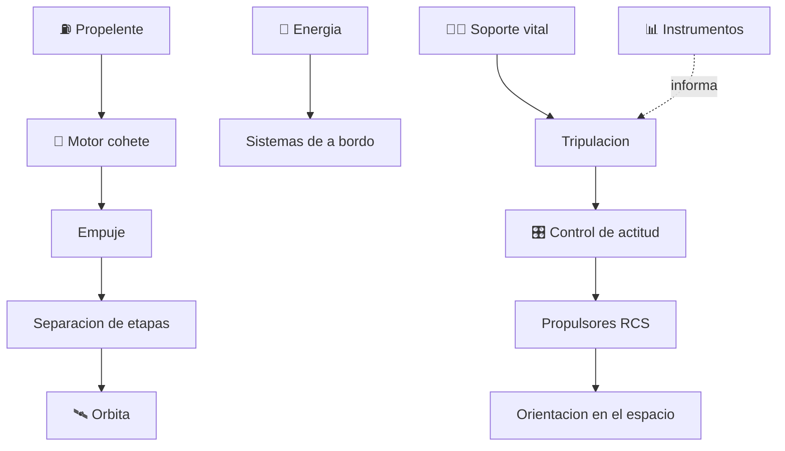

# 🚀 Curso: Naves espaciales

[🏠 Inicio](../../README.md) · [🚙 Catalogo de vehiculos](../README.md) · [🎓 Guia de curso](../../docs/08-guia-de-estilo-y-curso.md)

> **Curso de vuelo espacial.** Documenta la nave espacial de principio a fin:
> historia, caracteristicas, sistemas (propulsion, etapas, soporte vital,
> energia, control de actitud), cabina y mandos, fisica orbital, entornos del
> espacio, marco legal internacional y diseno de simulacion. **Distingue siempre
> la ciencia real de la ciencia ficcion.**

---

## 🎯 Objetivos de aprendizaje

Al terminar este curso deberias poder:

- Explicar como una nave alcanza la orbita, se mantiene en ella y reingresa.
- Identificar propulsion cohete, etapas, soporte vital, energia y control de actitud.
- Reconocer los mandos e instrumentos de una cabina espacial.
- Comprender los principios fisicos del vuelo orbital (delta-v, microgravedad).
- Conocer el marco de tratados espaciales que aplica a la actividad espacial.
- Traducir todo lo anterior en variables de un simulador, separando ciencia y ficcion.

---

## 🔬 Ciencia real y ficcion

Este curso marca siempre la diferencia entre lo que la fisica actual permite
(**ciencia real**) y lo que pertenece a la imaginacion (**ficcion plausible**).
Cada modulo lo senala de forma explicita para no confundir aprendizaje con relato.

---

## 🗺️ Mapa del vehiculo

---

## 📚 Modulos del curso

| # | Modulo | Contenido | Enlace |
| :-: | --- | --- | --- |
| 1 | 📜 Historia | Historia de la exploracion espacial, linea de tiempo. | [Abrir](historia/historia-nave-espacial.md) |
| 2 | 📋 Caracteristicas | Que es, tipos de nave y para que sirve cada uno. | [Abrir](operacion/caracteristicas-nave-espacial.md) |
| 3 | 🔧 Sistemas mecanicos | Propulsion, etapas, soporte vital, energia, control de actitud. | [Abrir](operacion/sistemas-mecanicos-nave-espacial.md) |
| 4 | 🎛️ Mandos e instrumentos | Cabina, controles y panel de la nave. | [Abrir](mandos/manual-mandos-nave-espacial.md) |
| 5 | 🧪 Principios y operacion | Fisica orbital y fases de la mision. | [Abrir](operacion/principios-nave-espacial.md) |
| 6 | 🌍 Entornos de trabajo | Orbita baja, espacio profundo y reentrada. | [Abrir](operacion/entornos-nave-espacial.md) |
| 7 | ⚖️ Reglamentos | Tratados espaciales y marco nacional. | [Abrir](reglamentos/reglamentos-nave-espacial.md) |
| 8 | 🎮 Diseno de simulacion | Variables, ciclo y modos de juego. | [Abrir](simulacion/diseno-simulador-nave-espacial.md) |
| 9 | 🧰 Recursos | Glosario, enlaces y diagramas. | [Abrir](recursos/recursos-nave-espacial.md) |

---

## 🧩 Requisitos previos

Se recomienda haber revisado antes los cursos de aviacion
([🛩️ aviones pequenos](../aviones-pequenos/README.md)), que introducen empuje,
sustentacion y control. La nave espacial reemplaza la sustentacion por la
mecanica orbital y agrega el soporte vital. Marco legal comun en
[⚖️ docs/07-marco-legal-chile.md](../../docs/07-marco-legal-chile.md).

---

[➡️ Empezar por el Modulo 1: Historia](historia/historia-nave-espacial.md)
