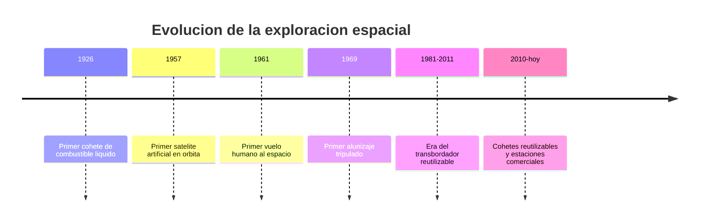

# 📜 Historia de la nave espacial

[🏠 Inicio](../../../README.md) · [🚀 Curso: Naves espaciales](../README.md) · 📜 Historia

## Origen

La nave espacial nace de la física del cohete: para salir de la atmósfera y
alcanzar la órbita hace falta expulsar masa a gran velocidad. En 1926 volo el
primer cohete de combustible líquido, y en pocas decadas la humanidad puso
satélites, personas y sondas más allá de la atmósfera. Esta es historia de
**ciencia real**.

## Línea de tiempo

| Periodo | Hito | Importancia |
| --- | --- | --- |
| 1926 | Primer cohete de combustible líquido | Prueba del principio de propulsión cohete. |
| 1957 | Primer satélite artificial | Comienza la era espacial. |
| 1961 | Primer vuelo humano al espacio | El ser humano llega a la órbita. |
| 1969 | Primer alunizaje tripulado | Viaje humano a otro cuerpo celeste. |
| 1981-2011 | Transbordador reutilizable | Nave espacial parcialmente reutilizable. |
| 2010-presente | Cohetes reutilizables | Baja el costo de acceso al espacio. |

## Evolución tecnológica

- **Propulsión**: de cohetes simples a motores reutilizables y de alta eficiencia.
- **Estructura**: materiales ligeros y escudos térmicos para la reentrada.
- **Energía**: de baterías a paneles solares y sistemas nucleares en sondas.
- **Control**: de la guía analógica a computadores de vuelo autónomos.
- **Soporte vital**: sistemas que reciclan aire y agua en misiones largas.
- **Reutilización**: recuperar etapas para bajar el costo de cada lanzamiento.

## Tipos representativos

| Tipo | Uso típico | Característica destacada |
| --- | --- | --- |
| Cohete lanzador | Poner carga en órbita | Múltiples etapas, gran empuje. |
| Cápsula tripulada | Llevar personas | Escudo térmico para la reentrada. |
| Satélite | Comunicación y observación | Permanece en órbita, sin tripulación. |
| Sonda interplanetaria | Explorar otros mundos | Autonomía y comunicación a gran distancia. |
| Estación espacial | Habitat en órbita | Soporte vital de larga duración. |

## Ciencia real frente a ficción

- **Real hoy**: cohetes quimicos, órbitas, microgravedad, reentrada, estaciones.
- **En desarrollo**: propulsión eléctrica avanzada, misiones tripuladas lejanas.
- **Ficción**: motores de "curvatura", gravedad artificial simple, viajes instantáneos.

Este curso usa la ficción solo como escenario, siempre marcada como tal.

## Impacto social y económico

La actividad espacial dio satélites de comunicación, navegación (GPS),
observación de la Tierra y predicción del clima. Para países como Chile, con
cielos ideales para la astronomía, el espacio es también ciencia, economía y
cooperación internacional.

## Fuentes

- Registrar aquí las fuentes públicas consultadas.
- Enlazar cada fuente también en [`manuales/fuentes.md`](../../../manuales/fuentes.md).

---

[🎓 Portada del curso](../README.md) · [➡️ Siguiente: Características](../operacion/caracteristicas-nave-espacial.md)
